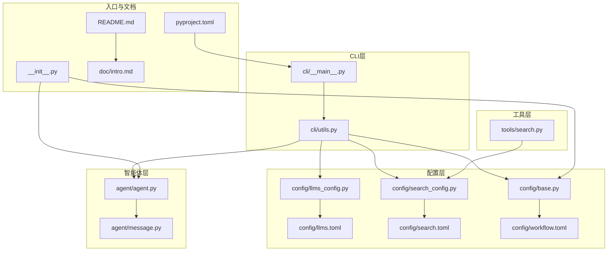
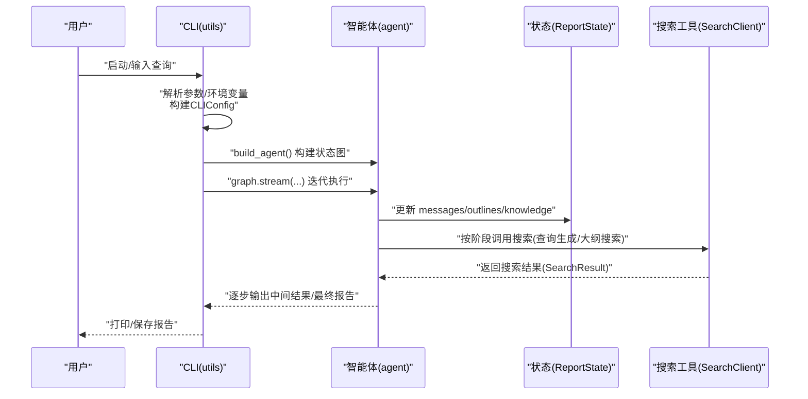
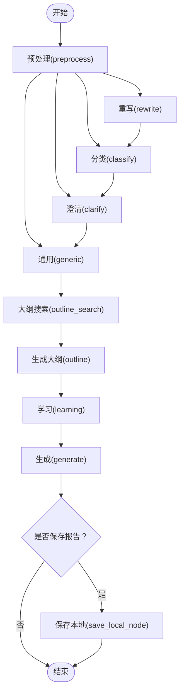
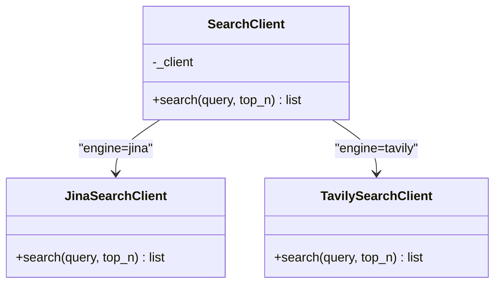
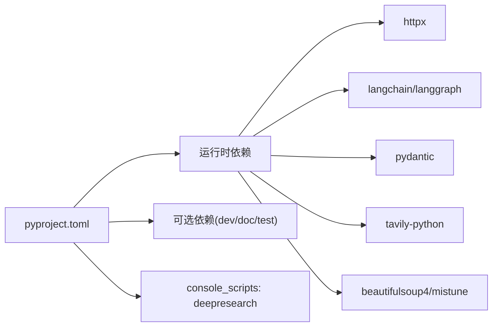

# 示例与最佳实践

<cite>
**本文引用的文件**
- [README.md](file://README.md)
- [doc/intro.md](file://doc/intro.md)
- [pyproject.toml](file://pyproject.toml)
- [src/deepresearch/__init__.py](file://src/deepresearch/__init__.py)
- [src/deepresearch/agent/agent.py](file://src/deepresearch/agent/agent.py)
- [src/deepresearch/agent/message.py](file://src/deepresearch/agent/message.py)
- [src/deepresearch/cli/utils.py](file://src/deepresearch/cli/utils.py)
- [src/deepresearch/cli/__main__.py](file://src/deepresearch/cli/__main__.py)
- [src/deepresearch/config/base.py](file://src/deepresearch/config/base.py)
- [src/deepresearch/config/llms_config.py](file://src/deepresearch/config/llms_config.py)
- [src/deepresearch/config/search_config.py](file://src/deepresearch/config/search_config.py)
- [src/deepresearch/tools/search.py](file://src/deepresearch/tools/search.py)
- [config/llms.toml](file://config/llms.toml)
- [config/search.toml](file://config/search.toml)
- [config/workflow.toml](file://config/workflow.toml)
</cite>

## 目录
1. [简介](#简介)
2. [项目结构](#项目结构)
3. [核心组件](#核心组件)
4. [架构总览](#架构总览)
5. [详细组件分析](#详细组件分析)
6. [依赖关系分析](#依赖关系分析)
7. [性能考虑](#性能考虑)
8. [故障排除指南](#故障排除指南)
9. [结论](#结论)
10. [附录](#附录)

## 简介
DeepResearch 是一个基于“渐进式搜索与交叉评估”的轻量级深度研究框架，通过多智能体协作与搜索工具集成，实现从任务规划、工具调用到评估与迭代的完整研究工作流。其目标是在不进行模型微调的前提下，提供高质量的研究报告，降低大模型在长上下文中的注意力分散与信息丢失风险，并支持小模型与大模型协同以提升效率与成本控制。

- 快速开始与在线体验入口见项目根说明与在线体验链接。
- 详细使用说明与部署指南见用户手册与部署文档。

章节来源
- [README.md:15-69](file://README.md#L15-L69)
- [doc/intro.md:20-47](file://doc/intro.md#L20-L47)

## 项目结构
项目采用模块化组织，围绕“配置管理、CLI入口、智能体编排、提示词模板、搜索工具”等维度划分目录与职责：
- 配置层：集中于 config 子包，提供 LLM、搜索与工作流配置的加载与校验。
- CLI 层：提供命令行入口与交互式/单次查询两种模式。
- 智能体层：以 LangGraph 编排状态图，串联预处理、重写、分类、澄清、通用处理、大纲搜索与生成、学习与保存等节点。
- 工具层：封装 Jina/Tavily 搜索客户端，统一对外接口。
- 提示词层：按阶段拆分模板，覆盖需求澄清、查询生成、学习评估、大纲生成与报告生成等。
- 数据与日志：提供报告状态模型与日志配置入口。

图表来源
- [src/deepresearch/cli/__main__.py:1-7](file://src/deepresearch/cli/__main__.py#L1-L7)
- [src/deepresearch/cli/utils.py:1-575](file://src/deepresearch/cli/utils.py#L1-L575)
- [src/deepresearch/agent/agent.py:1-45](file://src/deepresearch/agent/agent.py#L1-L45)
- [src/deepresearch/agent/message.py:1-112](file://src/deepresearch/agent/message.py#L1-L112)
- [src/deepresearch/config/base.py:1-590](file://src/deepresearch/config/base.py#L1-L590)
- [src/deepresearch/config/llms_config.py:1-115](file://src/deepresearch/config/llms_config.py#L1-L115)
- [src/deepresearch/config/search_config.py:1-82](file://src/deepresearch/config/search_config.py#L1-L82)
- [src/deepresearch/tools/search.py:1-46](file://src/deepresearch/tools/search.py#L1-L46)
- [src/deepresearch/__init__.py:1-30](file://src/deepresearch/__init__.py#L1-L30)
- [pyproject.toml:1-93](file://pyproject.toml#L1-L93)
- [README.md:15-69](file://README.md#L15-L69)
- [doc/intro.md:48-146](file://doc/intro.md#L48-L146)

章节来源
- [pyproject.toml:1-93](file://pyproject.toml#L1-L93)
- [doc/intro.md:48-146](file://doc/intro.md#L48-L146)

## 核心组件
- 配置管理与加载
  - 统一的配置基类与管理器，支持从文件、环境变量与代码注入合并，具备字段校验、敏感信息脱敏与缓存清理能力。
  - LLM 配置按模块段落加载，搜索配置限定 engine 与超时范围。
- CLI 与运行模式
  - 支持交互式对话与单次查询；通过命令行参数与环境变量覆盖默认配置；内置信号处理与异常捕获。
- 智能体编排
  - 基于 LangGraph 的状态图，节点包括预处理、重写、分类、澄清、通用处理、大纲搜索、大纲生成、学习、生成与本地保存。
- 搜索工具
  - 统一工厂类，按配置选择 Jina 或 Tavily 客户端，屏蔽引擎差异。

章节来源
- [src/deepresearch/config/base.py:190-590](file://src/deepresearch/config/base.py#L190-L590)
- [src/deepresearch/config/llms_config.py:46-115](file://src/deepresearch/config/llms_config.py#L46-L115)
- [src/deepresearch/config/search_config.py:56-82](file://src/deepresearch/config/search_config.py#L56-L82)
- [src/deepresearch/cli/utils.py:106-384](file://src/deepresearch/cli/utils.py#L106-L384)
- [src/deepresearch/agent/agent.py:19-45](file://src/deepresearch/agent/agent.py#L19-L45)
- [src/deepresearch/tools/search.py:12-37](file://src/deepresearch/tools/search.py#L12-L37)

## 架构总览
下图展示了从 CLI 到智能体再到搜索工具的整体调用链路与数据流。

图表来源
- [src/deepresearch/cli/utils.py:106-193](file://src/deepresearch/cli/utils.py#L106-L193)
- [src/deepresearch/agent/agent.py:19-45](file://src/deepresearch/agent/agent.py#L19-L45)
- [src/deepresearch/agent/message.py:101-112](file://src/deepresearch/agent/message.py#L101-L112)
- [src/deepresearch/tools/search.py:25-36](file://src/deepresearch/tools/search.py#L25-L36)

## 详细组件分析

### 配置系统与最佳实践
- 配置来源与优先级
  - 代码注入 > 环境变量 > 配置文件 > 默认值。可通过环境变量前缀覆盖默认值，便于容器化与多环境部署。
- 字段校验与敏感信息
  - 支持范围、类型与枚举校验；敏感字段自动脱敏输出；可扩展敏感键集合。
- LLM 配置模板
  - 建议为 Planner 使用更强推理模型，其他模块可按成本与速度平衡选择；保持 api_base、api_key、model 三要素齐全。
- 搜索配置模板
  - engine 选择 jina/tavily；timeout 控制在 1~300 秒之间；仅启用对应引擎的 API Key。
- 工作流配置
  - topN 控制每轮检索条目数量，结合成本与质量权衡。

章节来源
- [src/deepresearch/config/base.py:542-590](file://src/deepresearch/config/base.py#L542-L590)
- [src/deepresearch/config/llms_config.py:46-115](file://src/deepresearch/config/llms_config.py#L46-L115)
- [src/deepresearch/config/search_config.py:56-82](file://src/deepresearch/config/search_config.py#L56-L82)
- [config/llms.toml:1-29](file://config/llms.toml#L1-L29)
- [config/search.toml:1-6](file://config/search.toml#L1-L6)
- [config/workflow.toml:1-3](file://config/workflow.toml#L1-L3)

### CLI 与运行模式
- 交互式模式
  - 支持 help/history/clear/search 等命令；Ctrl+C 中断；异常隔离与历史记录持久化。
- 单次查询模式
  - 直接返回报告文本；适合脚本化与流水线集成。
- 参数与环境变量
  - 支持深度、HTML 输出开关、输出路径、日志级别/文件、主题、配置目录等；环境变量前缀统一。

章节来源
- [src/deepresearch/cli/utils.py:195-304](file://src/deepresearch/cli/utils.py#L195-L304)
- [src/deepresearch/cli/utils.py:357-384](file://src/deepresearch/cli/utils.py#L357-L384)
- [src/deepresearch/cli/utils.py:386-483](file://src/deepresearch/cli/utils.py#L386-L483)
- [src/deepresearch/cli/utils.py:485-575](file://src/deepresearch/cli/utils.py#L485-L575)

### 智能体编排与状态
- 节点关系
  - 预处理 → 重写/分类/澄清/通用 → 大纲搜索 → 大纲 → 学习 → 生成 → 保存本地 → 结束。
- 条件边
  - 生成节点根据是否保存报告决定下一跳。
- 状态模型
  - 包含 messages、outline、topic/domain/logic/details、output/knowledge/final_report、search_id 等字段，支撑跨节点传递与持久化。

图表来源
- [src/deepresearch/agent/agent.py:19-45](file://src/deepresearch/agent/agent.py#L19-L45)
- [src/deepresearch/agent/message.py:101-112](file://src/deepresearch/agent/message.py#L101-L112)

章节来源
- [src/deepresearch/agent/agent.py:19-45](file://src/deepresearch/agent/agent.py#L19-L45)
- [src/deepresearch/agent/message.py:12-112](file://src/deepresearch/agent/message.py#L12-L112)

### 搜索工具与扩展
- 工厂模式
  - 根据配置 engine 动态选择 Jina 或 Tavily 客户端；统一 search 接口。
- 扩展新搜索引擎
  - 新增客户端类并实现相同接口；在工厂中增加分支；更新配置与校验逻辑；确保 SearchResult 结构一致。

图表来源
- [src/deepresearch/tools/search.py:12-37](file://src/deepresearch/tools/search.py#L12-L37)

章节来源
- [src/deepresearch/tools/search.py:12-37](file://src/deepresearch/tools/search.py#L12-L37)
- [src/deepresearch/config/search_config.py:12-54](file://src/deepresearch/config/search_config.py#L12-L54)

### 提示词模板与定制
- 模板分层
  - prep/outline/generate/learning 等子目录按阶段组织，便于维护与复用。
- 定制建议
  - 明确角色与约束；针对不同领域调整术语与语气；通过条件分支适配多语言与多格式输出。

章节来源
- [src/deepresearch/prompts/prep/clarify.py](file://src/deepresearch/prompts/prep/clarify.py)
- [src/deepresearch/prompts/outline/outline.py](file://src/deepresearch/prompts/outline/outline.py)
- [src/deepresearch/prompts/generate/generate.py](file://src/deepresearch/prompts/generate/generate.py)
- [src/deepresearch/prompts/learning/research_query.py](file://src/deepresearch/prompts/learning/research_query.py)

## 依赖关系分析
- 运行时依赖
  - httpx、langchain、langgraph、pydantic、tavily-python、beautifulsoup4、mistune 等，支撑网络请求、LLM 交互、状态图编排与报告渲染。
- 可选依赖
  - 文档构建与开发工具链，便于本地文档生成与代码规范检查。
- 入口脚本
  - 通过 console script 暴露命令行入口，便于全局安装与调用。

图表来源
- [pyproject.toml:12-26](file://pyproject.toml#L12-L26)
- [pyproject.toml:28-52](file://pyproject.toml#L28-L52)
- [pyproject.toml:79-80](file://pyproject.toml#L79-L80)

章节来源
- [pyproject.toml:1-93](file://pyproject.toml#L1-L93)

## 性能考虑
- 搜索深度与条目数
  - 通过 CLI 的 depth 与 workflow 的 topN 控制搜索广度与深度，避免过度检索导致延迟与成本上升。
- 模型选择与成本
  - Planner 使用更强模型，其他模块可选用性价比更高的模型；合理分配 token 与并发。
- 流式输出与中断
  - CLI 支持流式输出与信号中断，提升交互体验与资源回收。
- 缓存与重载
  - 配置读取带缓存，必要时可清理缓存以热更新；LLM 配置支持重新加载。

章节来源
- [src/deepresearch/cli/utils.py:106-193](file://src/deepresearch/cli/utils.py#L106-L193)
- [src/deepresearch/config/base.py:513-516](file://src/deepresearch/config/base.py#L513-L516)
- [src/deepresearch/config/llms_config.py:70-86](file://src/deepresearch/config/llms_config.py#L70-L86)

## 故障排除指南
- 配置相关
  - 配置文件缺失或格式错误：检查 TOML 结构与必需字段；确认环境变量前缀与命名。
  - 字段校验失败：依据报错修正类型、范围或枚举值。
- 搜索引擎
  - 引擎不可识别：检查 engine 值；确保启用对应 API Key。
  - 超时异常：适当增大 timeout；检查网络连通性。
- 智能体执行
  - 构建失败：检查节点依赖与状态字段；确认 LangGraph 版本兼容。
  - 执行异常：查看日志级别与文件；利用中断信号安全退出。
- CLI 使用
  - 参数冲突：确认命令行参数与环境变量覆盖顺序；避免重复设置。
  - 交互异常：检查终端编码与 UI 主题；尝试最小化主题。

章节来源
- [src/deepresearch/config/base.py:15-24](file://src/deepresearch/config/base.py#L15-L24)
- [src/deepresearch/config/search_config.py:35-54](file://src/deepresearch/config/search_config.py#L35-L54)
- [src/deepresearch/cli/utils.py:41-67](file://src/deepresearch/cli/utils.py#L41-L67)
- [src/deepresearch/cli/utils.py:147-152](file://src/deepresearch/cli/utils.py#L147-L152)

## 结论
本指南提供了从配置、运行到扩展与优化的全栈实践路径。通过合理的配置模板、清晰的运行模式与可扩展的搜索与提示词体系，DeepResearch 能够在多场景下稳定产出高质量研究报告。建议在生产环境中结合成本与性能目标，持续迭代模型与工作流配置，并通过日志与监控完善可观测性。

## 附录

### 常用示例与最佳实践清单
- 基础使用
  - 交互式模式：启动后输入问题，等待报告生成；支持 clear/history/search 命令。
  - 单次查询：直接传入问题，获取文本结果；适合脚本化集成。
- 高级配置
  - 深度与条目：根据主题复杂度调整 depth 与 topN；平衡质量与成本。
  - 模型选择：Planner 使用强推理模型，其他模块按需降级。
  - 搜索引擎：按需启用 jina/tavily，确保 API Key 正确且未过期。
- 复杂工作流
  - 分阶段调试：先验证 prep/outline/learning，再进入 generate/save。
  - 条件保存：根据业务需要开启/关闭 HTML 保存。
- 扩展实践
  - 新搜索引擎：新增客户端类并在工厂中注册；完善配置校验与异常处理。
  - 提示词模板：按阶段拆分，明确角色与约束；支持多语言与多格式输出。
- 最佳实践
  - 性能：控制并发与深度，启用流式输出与中断；定期清理缓存。
  - 成本：选择合适模型与引擎；限制 topN 与超时；批量任务合并。
  - 质量：交叉评估与知识抽取；定期校准提示词与评估指标。

章节来源
- [doc/intro.md:48-146](file://doc/intro.md#L48-L146)
- [src/deepresearch/cli/utils.py:386-483](file://src/deepresearch/cli/utils.py#L386-L483)
- [src/deepresearch/tools/search.py:12-37](file://src/deepresearch/tools/search.py#L12-L37)