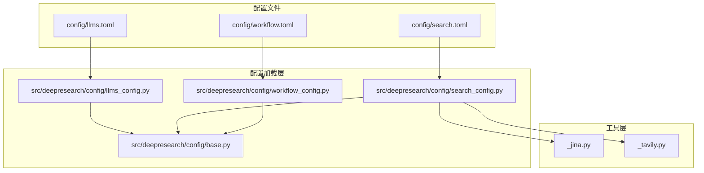
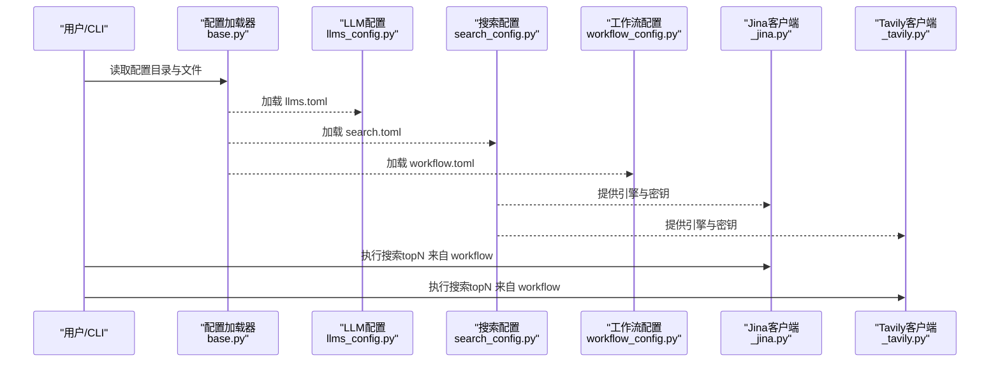
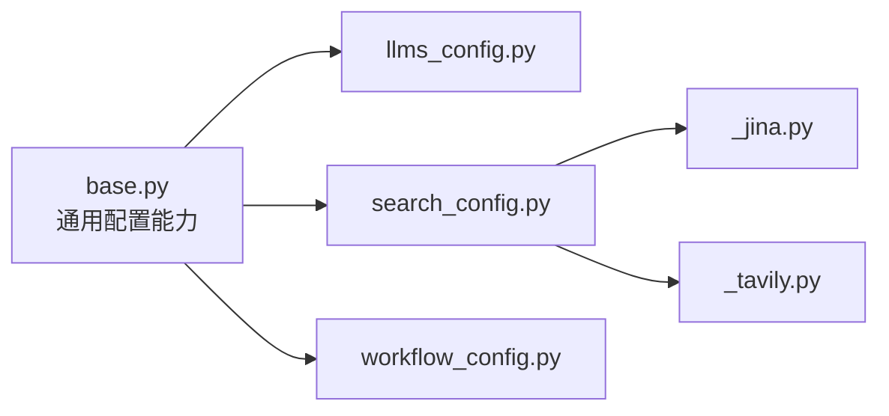

# 配置示例

<cite>
**本文引用的文件**
- [llms.toml](file://config/llms.toml)
- [search.toml](file://config/search.toml)
- [workflow.toml](file://config/workflow.toml)
- [llms_config.py](file://src/deepresearch/config/llms_config.py)
- [search_config.py](file://src/deepresearch/config/search_config.py)
- [workflow_config.py](file://src/deepresearch/config/workflow_config.py)
- [base.py](file://src/deepresearch/config/base.py)
- [_jina.py](file://src/deepresearch/tools/_jina.py)
- [_tavily.py](file://src/deepresearch/tools/_tavily.py)
- [config.py](file://src/deepresearch/cli/config.py)
- [test_base.py](file://tests/unit/config/test_base.py)
- [test_config.py](file://tests/unit/cli/test_config.py)
</cite>

## 目录
1. [简介](#简介)
2. [项目结构](#项目结构)
3. [核心组件](#核心组件)
4. [架构总览](#架构总览)
5. [详细组件分析](#详细组件分析)
6. [依赖分析](#依赖分析)
7. [性能考虑](#性能考虑)
8. [故障排查指南](#故障排查指南)
9. [结论](#结论)
10. [附录](#附录)

## 简介
本文件面向不同使用场景，提供 DeepResearch 的配置示例与最佳实践，涵盖 LLM 服务配置、搜索引擎配置以及工作流参数配置。内容包括：
- 配置文件结构说明与参数含义
- 场景化配置模板与参数调优建议
- 配置加载优先级与安全脱敏机制
- 性能与稳定性优化要点
- 常见问题定位与排错方法

## 项目结构
DeepResearch 的配置由三类文件组成：
- LLM 服务配置：按角色划分多个 LLM 实例，便于在不同阶段使用不同模型
- 搜索引擎配置：选择搜索服务与密钥，并设置超时等参数
- 工作流配置：控制检索结果数量等流程参数

图表来源
- [llms.toml:1-29](file://config/llms.toml#L1-L29)
- [search.toml:1-6](file://config/search.toml#L1-L6)
- [workflow.toml:1-3](file://config/workflow.toml#L1-L3)
- [llms_config.py:46-115](file://src/deepresearch/config/llms_config.py#L46-L115)
- [search_config.py:56-82](file://src/deepresearch/config/search_config.py#L56-L82)
- [workflow_config.py:7-28](file://src/deepresearch/config/workflow_config.py#L7-L28)
- [base.py:479-590](file://src/deepresearch/config/base.py#L479-L590)
- [_jina.py:15-92](file://src/deepresearch/tools/_jina.py#L15-L92)
- [_tavily.py:15-72](file://src/deepresearch/tools/_tavily.py#L15-L72)

章节来源
- [llms.toml:1-29](file://config/llms.toml#L1-L29)
- [search.toml:1-6](file://config/search.toml#L1-L6)
- [workflow.toml:1-3](file://config/workflow.toml#L1-L3)
- [llms_config.py:46-115](file://src/deepresearch/config/llms_config.py#L46-L115)
- [search_config.py:56-82](file://src/deepresearch/config/search_config.py#L56-L82)
- [workflow_config.py:7-28](file://src/deepresearch/config/workflow_config.py#L7-L28)
- [base.py:479-590](file://src/deepresearch/config/base.py#L479-L590)

## 核心组件
- LLM 配置加载：按角色（如 basic、clarify、planner、query_generation、evaluate、report）分别加载对应 LLM 的 base_url、api_base、model、api_key
- 搜索引擎配置：支持 Jina 与 Tavily 两种引擎，需提供对应 API Key；可设置超时时间
- 工作流配置：控制检索返回条目数量 topN（通过 workflow.toml 中的 search.topN）

章节来源
- [llms_config.py:46-115](file://src/deepresearch/config/llms_config.py#L46-L115)
- [search_config.py:56-82](file://src/deepresearch/config/search_config.py#L56-L82)
- [workflow_config.py:7-28](file://src/deepresearch/config/workflow_config.py#L7-L28)

## 架构总览
下图展示了配置从文件到运行时对象的加载与使用路径，以及搜索客户端如何消费配置。

图表来源
- [base.py:479-590](file://src/deepresearch/config/base.py#L479-L590)
- [llms_config.py:46-115](file://src/deepresearch/config/llms_config.py#L46-L115)
- [search_config.py:56-82](file://src/deepresearch/config/search_config.py#L56-L82)
- [workflow_config.py:7-28](file://src/deepresearch/config/workflow_config.py#L7-L28)
- [_jina.py:15-92](file://src/deepresearch/tools/_jina.py#L15-L92)
- [_tavily.py:15-72](file://src/deepresearch/tools/_tavily.py#L15-L72)

## 详细组件分析

### LLM 服务配置（llms.toml）
- 结构说明
  - 每个角色（basic、clarify、planner、query_generation、evaluate、report）对应一组 LLM 参数
  - 关键字段：base_url、api_base、model、api_key
- 参数作用与影响
  - base_url/api_base：决定 LLM 接口地址
  - model：指定具体模型名称
  - api_key：访问凭证，缺失会导致请求失败
- 最佳实践
  - 不同角色使用不同模型以平衡成本与质量
  - 在 CI/CD 中通过环境变量覆盖敏感字段，避免硬编码
  - 使用脱敏输出查看配置，避免泄露
- 场景化模板
  - 开发调试：使用较小模型，降低延迟
  - 生产稳定：使用更强模型，适当提高超时
  - 成本敏感：在非关键节点使用轻量模型

章节来源
- [llms.toml:1-29](file://config/llms.toml#L1-L29)
- [llms_config.py:46-115](file://src/deepresearch/config/llms_config.py#L46-L115)
- [base.py:487-510](file://src/deepresearch/config/base.py#L487-L510)

### 搜索引擎配置（search.toml）
- 结构说明
  - 引擎选择：engine 支持 "jina" 或 "tavily"
  - 超时：timeout（秒），默认 30，范围 1~300
  - 密钥：jina_api_key 或 tavily_api_key，二选一
- 参数作用与影响
  - engine：决定使用哪个搜索服务
  - timeout：影响请求等待时间与整体吞吐
  - API Key：缺失或无效会导致搜索失败
- 最佳实践
  - 根据网络与合规要求选择引擎
  - 合理设置超时，避免阻塞主流程
  - 在生产中使用环境变量注入密钥
- 场景化模板
  - 国内网络：优先 Jina，设置合理超时
  - 需要原始内容：优先 Tavily
  - 高并发：适当降低超时，提升吞吐

章节来源
- [search.toml:1-6](file://config/search.toml#L1-L6)
- [search_config.py:56-82](file://src/deepresearch/config/search_config.py#L56-L82)
- [_jina.py:15-92](file://src/deepresearch/tools/_jina.py#L15-L92)
- [_tavily.py:15-72](file://src/deepresearch/tools/_tavily.py#L15-L72)

### 工作流参数配置（workflow.toml）
- 结构说明
  - 顶层 section：search
  - 参数：topN（整数），控制检索返回条目数量
- 参数作用与影响
  - topN：直接影响检索阶段的数据规模与后续处理成本
- 最佳实践
  - 适度增加 topN 提升召回，但注意 LLM 生成阶段的输入长度限制
  - 与 LLM 模型上下文长度匹配，避免截断
- 场景化模板
  - 精准摘要：较小 topN，聚焦高质量结果
  - 综合分析：较大 topN，提升覆盖面

章节来源
- [workflow.toml:1-3](file://config/workflow.toml#L1-L3)
- [workflow_config.py:7-28](file://src/deepresearch/config/workflow_config.py#L7-L28)

### CLI 配置（可选）
- 适用场景：命令行运行时的控制参数（如日志级别、保存路径、主题等）
- 关键点：可通过环境变量覆盖，支持范围校验与默认值
- 与配置文件的关系：CLI 配置独立于 llms/search/workflow，但可配合使用

章节来源
- [config.py:15-101](file://src/deepresearch/cli/config.py#L15-L101)
- [test_config.py:15-175](file://tests/unit/cli/test_config.py#L15-L175)

## 依赖分析
- 配置加载链路
  - base.py 提供通用加载、脱敏、缓存与环境变量解析能力
  - llms_config.py、search_config.py、workflow_config.py 分别解析对应配置文件
  - 搜索客户端（_jina.py、_tavily.py）直接消费 search_config
- 耦合度与内聚性
  - 配置文件与解析器耦合度低，便于扩展新配置
  - 搜索客户端与配置解耦，通过配置对象传递参数
- 外部依赖
  - Jina 客户端依赖 HTTP 请求库与 search_config
  - Tavily 客户端依赖 tavily SDK 与 search_config

图表来源
- [base.py:479-590](file://src/deepresearch/config/base.py#L479-L590)
- [llms_config.py:46-115](file://src/deepresearch/config/llms_config.py#L46-L115)
- [search_config.py:56-82](file://src/deepresearch/config/search_config.py#L56-L82)
- [workflow_config.py:7-28](file://src/deepresearch/config/workflow_config.py#L7-L28)
- [_jina.py:15-92](file://src/deepresearch/tools/_jina.py#L15-L92)
- [_tavily.py:15-72](file://src/deepresearch/tools/_tavily.py#L15-L72)

## 性能考虑
- 搜索超时与吞吐
  - 合理设置 timeout，避免长尾请求拖慢整体流程
  - 在高并发场景下，适当降低超时并增加重试策略（如外部实现）
- 检索规模与成本
  - topN 过大可能导致 LLM 输入过长，增加成本与耗时
  - 建议结合模型上下文长度与任务目标设定上限
- 模型选择与成本
  - 在非关键节点使用轻量模型，关键节点使用更强模型
  - 通过角色化配置实现差异化模型策略

## 故障排查指南
- 配置加载失败
  - 检查配置文件是否存在、格式是否正确
  - 使用脱敏输出确认敏感字段是否被正确隐藏
- 引擎请求异常
  - 校验 API Key 是否有效、是否与引擎匹配
  - 检查网络连通性与超时设置
- 参数越界
  - timeout 必须在 1~300 秒范围内
  - CLI 配置中的数值参数存在范围约束
- 单元测试参考
  - 配置加载与验证逻辑可参考单元测试用例

章节来源
- [search_config.py:40-53](file://src/deepresearch/config/search_config.py#L40-L53)
- [test_base.py:40-98](file://tests/unit/config/test_base.py#L40-L98)
- [test_config.py:45-80](file://tests/unit/cli/test_config.py#L45-L80)

## 结论
通过分层配置与清晰的角色化 LLM 设计，DeepResearch 能够在不同场景下灵活调整性能与成本。建议：
- 明确各阶段职责，为不同角色配置合适模型
- 依据网络与合规要求选择搜索引擎，并合理设置超时
- 控制检索规模，避免不必要的成本与延迟
- 使用环境变量与脱敏机制保障安全与可维护性

## 附录

### 配置文件结构与参数说明
- llms.toml
  - 角色：basic、clarify、planner、query_generation、evaluate、report
  - 字段：base_url、api_base、model、api_key
- search.toml
  - 字段：engine、timeout、jina_api_key、tavily_api_key
- workflow.toml
  - 字段：search.topN

章节来源
- [llms.toml:1-29](file://config/llms.toml#L1-L29)
- [search.toml:1-6](file://config/search.toml#L1-L6)
- [workflow.toml:1-3](file://config/workflow.toml#L1-L3)

### 配置加载与覆盖优先级
- 优先级（从高到低）：代码参数 → 环境变量 → 配置文件 → 默认值
- 环境变量前缀：DEEPRESEARCH_（如 DEEPRESEARCH_TIMEOUT）
- 配置目录优先级：自定义目录 → 环境变量 DEEPRESEARCH_CONFIG_DIR → 项目内 config 目录

章节来源
- [base.py:536-590](file://src/deepresearch/config/base.py#L536-L590)
- [config.py:34-64](file://src/deepresearch/cli/config.py#L34-L64)

### 场景化配置模板与建议
- 开发调试
  - llms.toml：使用较小模型，缩短响应时间
  - search.toml：engine 任选，timeout 适中
  - workflow.toml：topN 较小，快速迭代
- 生产稳定
  - llms.toml：关键角色使用更强模型
  - search.toml：根据网络情况选择引擎，适当提高超时
  - workflow.toml：适度增大 topN，提升召回
- 成本敏感
  - llms.toml：非关键节点使用轻量模型
  - search.toml：优先 Jina，减少第三方依赖
  - workflow.toml：严格控制 topN，避免冗余