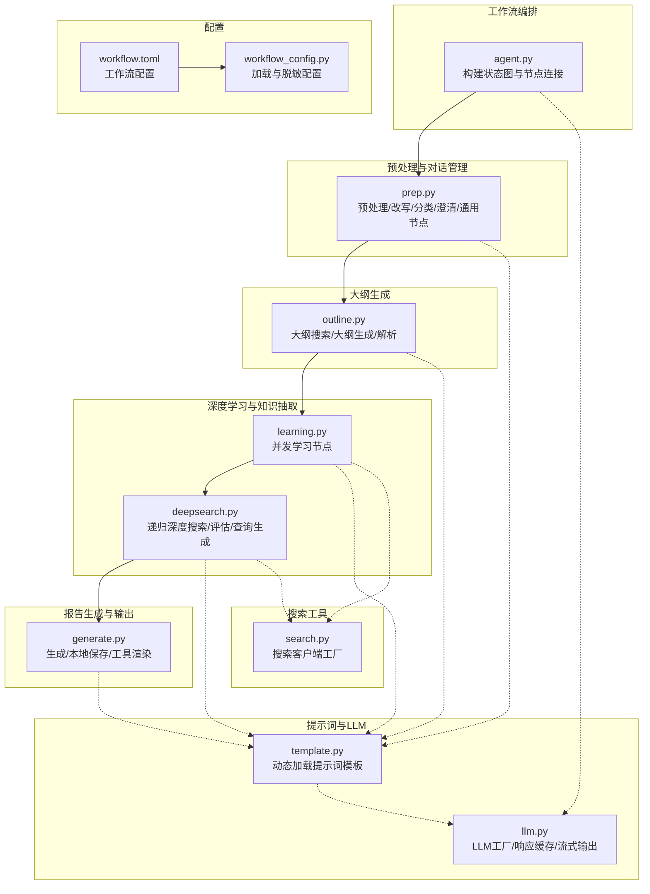
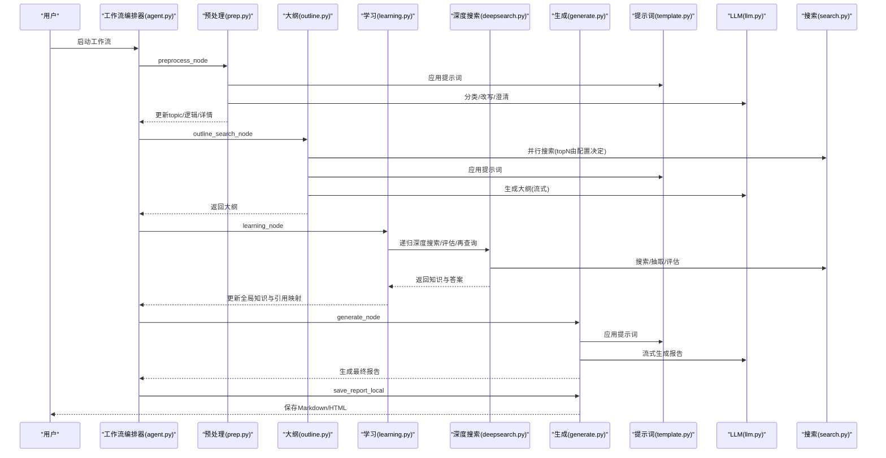
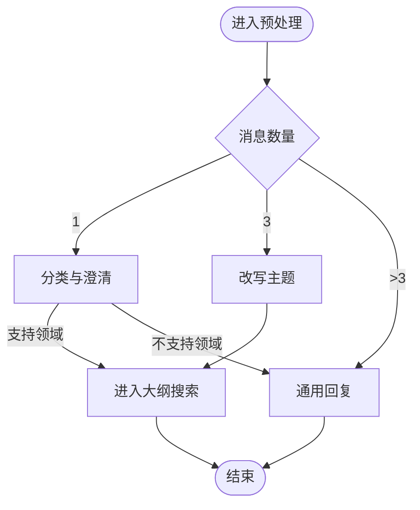
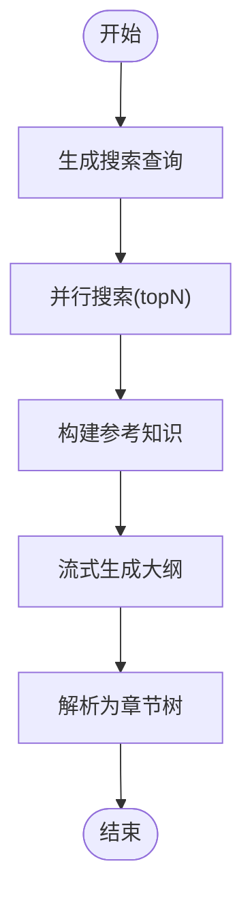
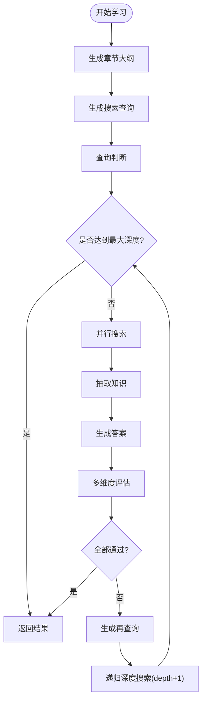
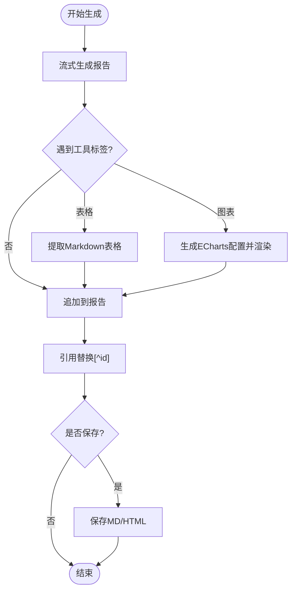
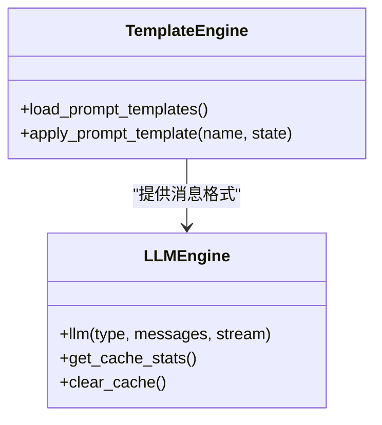
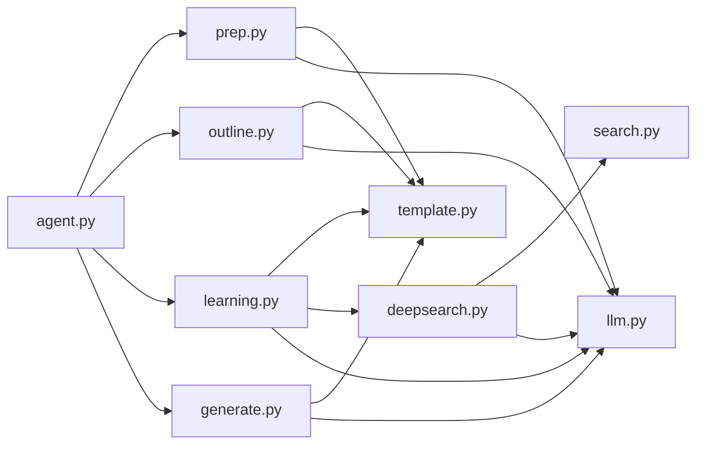

# 高级工作流示例

<cite>
**本文档引用的文件**
- [README.md](file://README.md)
- [workflow.toml](file://config/workflow.toml)
- [workflow_config.py](file://src/deepresearch/config/workflow_config.py)
- [agent.py](file://src/deepresearch/agent/agent.py)
- [prep.py](file://src/deepresearch/agent/prep.py)
- [outline.py](file://src/deepresearch/agent/outline.py)
- [learning.py](file://src/deepresearch/agent/learning.py)
- [deepsearch.py](file://src/deepresearch/agent/deepsearch.py)
- [generate.py](file://src/deepresearch/agent/generate.py)
- [message.py](file://src/deepresearch/agent/message.py)
- [template.py](file://src/deepresearch/prompts/template.py)
- [llm.py](file://src/deepresearch/llms/llm.py)
- [search.py](file://src/deepresearch/tools/search.py)
</cite>

## 目录
1. [简介](#简介)
2. [项目结构](#项目结构)
3. [核心组件](#核心组件)
4. [架构总览](#架构总览)
5. [详细组件分析](#详细组件分析)
6. [依赖分析](#依赖分析)
7. [性能考虑](#性能考虑)
8. [故障排查指南](#故障排查指南)
9. [结论](#结论)
10. [附录](#附录)

## 简介
本文件面向需要在DeepResearch中实现“复杂多轮对话与迭代研究”的高级用户，系统性地展示从任务规划、搜索与交叉评估、知识抽取与深度学习，到报告生成与保存的完整工作流。文档提供可复用的研究案例模板、节点配置说明、自定义与扩展方法，以及性能优化与资源管理策略，帮助您在不同领域与场景下高效落地。

## 项目结构
DeepResearch采用“状态图驱动 + 多节点协作”的工作流架构：通过LangGraph的状态机串联预处理、大纲生成、学习与知识抽取、报告生成与本地保存等节点；结合提示词模板系统与LLM工厂缓存机制，实现高可配置、可扩展的研究流水线。

图表来源
- [agent.py:19-45](file://src/deepresearch/agent/agent.py#L19-L45)
- [prep.py:21-80](file://src/deepresearch/agent/prep.py#L21-L80)
- [outline.py:22-118](file://src/deepresearch/agent/outline.py#L22-L118)
- [learning.py:15-93](file://src/deepresearch/agent/learning.py#L15-L93)
- [deepsearch.py:55-150](file://src/deepresearch/agent/deepsearch.py#L55-L150)
- [generate.py:26-123](file://src/deepresearch/agent/generate.py#L26-L123)
- [template.py:90-129](file://src/deepresearch/prompts/template.py#L90-L129)
- [llm.py:146-184](file://src/deepresearch/llms/llm.py#L146-L184)
- [search.py:12-36](file://src/deepresearch/tools/search.py#L12-L36)
- [workflow.toml:1-3](file://config/workflow.toml#L1-L3)
- [workflow_config.py:7-27](file://src/deepresearch/config/workflow_config.py#L7-L27)

章节来源
- [README.md:15-32](file://README.md#L15-L32)
- [agent.py:19-45](file://src/deepresearch/agent/agent.py#L19-L45)

## 核心组件
- 工作流编排器：基于LangGraph构建状态图，定义节点与条件边，控制执行顺序与分支。
- 预处理与对话管理：统一消息类型、话题改写、领域分类、一次澄清、通用回复。
- 大纲生成：生成搜索查询、并行搜索、拼接参考、解析Markdown大纲。
- 深度学习与知识抽取：递归深度搜索、多维度评估（完整性/新鲜度/多元性）、查询再生成、知识抽取与引用映射。
- 报告生成与输出：流式生成、工具渲染（表格/图表）、引用替换、本地保存为Markdown与HTML。
- 提示词模板系统：按目录动态加载模板，支持系统消息与用户消息组合。
- LLM工厂与缓存：实例LRU缓存、响应LRU缓存、线程安全、流式/非流式输出。
- 搜索客户端：工厂模式切换Jina/Tavily引擎，统一接口。

章节来源
- [agent.py:19-45](file://src/deepresearch/agent/agent.py#L19-L45)
- [prep.py:21-80](file://src/deepresearch/agent/prep.py#L21-L80)
- [outline.py:22-118](file://src/deepresearch/agent/outline.py#L22-L118)
- [learning.py:15-93](file://src/deepresearch/agent/learning.py#L15-L93)
- [deepsearch.py:55-150](file://src/deepresearch/agent/deepsearch.py#L55-L150)
- [generate.py:26-123](file://src/deepresearch/agent/generate.py#L26-L123)
- [template.py:90-129](file://src/deepresearch/prompts/template.py#L90-L129)
- [llm.py:146-184](file://src/deepresearch/llms/llm.py#L146-L184)
- [search.py:12-36](file://src/deepresearch/tools/search.py#L12-L36)

## 架构总览
以下序列图展示了从输入到报告生成的关键调用链路与数据传递。

图表来源
- [agent.py:19-45](file://src/deepresearch/agent/agent.py#L19-L45)
- [prep.py:82-181](file://src/deepresearch/agent/prep.py#L82-L181)
- [outline.py:22-118](file://src/deepresearch/agent/outline.py#L22-L118)
- [learning.py:15-93](file://src/deepresearch/agent/learning.py#L15-L93)
- [deepsearch.py:74-150](file://src/deepresearch/agent/deepsearch.py#L74-L150)
- [generate.py:26-123](file://src/deepresearch/agent/generate.py#L26-L123)
- [template.py:90-129](file://src/deepresearch/prompts/template.py#L90-L129)
- [llm.py:146-184](file://src/deepresearch/llms/llm.py#L146-L184)
- [search.py:12-36](file://src/deepresearch/tools/search.py#L12-L36)

## 详细组件分析

### 预处理与对话管理（prep.py）
- 功能要点
  - 统一消息类型转换，支持单轮/多轮对话自动分流。
  - 话题改写：基于交互历史提炼研究主题。
  - 领域分类：根据主题映射到分析数据，若不支持则回退通用节点。
  - 一次澄清：确认或修正用户意图，必要时直接生成报告。
  - 通用节点：对非研究类对话进行标准回复。
- 关键路径
  - 预处理入口：[preprocess_node:21-80](file://src/deepresearch/agent/prep.py#L21-L80)
  - 话题改写：[rewrite_node:82-103](file://src/deepresearch/agent/prep.py#L82-L103)
  - 领域分类与澄清：[classify_node:105-150](file://src/deepresearch/agent/prep.py#L105-L150)、[clarify_node:153-181](file://src/deepresearch/agent/prep.py#L153-L181)
  - 通用回复：[generic_node:184-202](file://src/deepresearch/agent/prep.py#L184-L202)

图表来源
- [prep.py:21-80](file://src/deepresearch/agent/prep.py#L21-L80)
- [prep.py:82-181](file://src/deepresearch/agent/prep.py#L82-L181)

章节来源
- [prep.py:21-202](file://src/deepresearch/agent/prep.py#L21-L202)

### 大纲生成（outline.py）
- 功能要点
  - 生成大纲搜索查询，使用提示词模板与LLM。
  - 并行搜索，限制并发度，保证结果顺序一致性。
  - 将搜索结果转为参考知识，拼接到提示词中。
  - 流式生成大纲Markdown，解析为章节树结构。
- 关键路径
  - 大纲搜索：[outline_search_node:22-85](file://src/deepresearch/agent/outline.py#L22-L85)
  - 大纲生成与解析：[outline_node:88-118](file://src/deepresearch/agent/outline.py#L88-L118)、[parse_outline:158-220](file://src/deepresearch/agent/outline.py#L158-L220)

图表来源
- [outline.py:22-118](file://src/deepresearch/agent/outline.py#L22-L118)
- [outline.py:158-220](file://src/deepresearch/agent/outline.py#L158-L220)

章节来源
- [outline.py:22-227](file://src/deepresearch/agent/outline.py#L22-L227)

### 深度学习与知识抽取（learning.py + deepsearch.py）
- 功能要点
  - 学习节点：并发处理各章节，每个章节构造DeepSearch实例，执行递归深度搜索。
  - DeepSearch：生成搜索查询、判断查询、并行搜索、抽取知识、生成答案、多维度评估、再查询。
  - 引用映射：将抽取知识中的引用ID映射为全局知识表的真实ID，确保报告引用一致。
- 关键路径
  - 学习节点：[learning_node:15-93](file://src/deepresearch/agent/learning.py#L15-L93)
  - 深度搜索主流程：[deep_search:74-150](file://src/deepresearch/agent/deepsearch.py#L74-L150)
  - 查询生成/评估/再查询：[search_all:209-239](file://src/deepresearch/agent/deepsearch.py#L209-L239)、[extract_all_knowledge:241-267](file://src/deepresearch/agent/deepsearch.py#L241-L267)、[evaluate:351-390](file://src/deepresearch/agent/deepsearch.py#L351-L390)、[gen_research_query:392-418](file://src/deepresearch/agent/deepsearch.py#L392-L418)
  - 引用映射：[get_real_reference_ids:104-129](file://src/deepresearch/agent/learning.py#L104-L129)

图表来源
- [learning.py:15-93](file://src/deepresearch/agent/learning.py#L15-L93)
- [deepsearch.py:74-150](file://src/deepresearch/agent/deepsearch.py#L74-L150)
- [deepsearch.py:209-239](file://src/deepresearch/agent/deepsearch.py#L209-L239)
- [deepsearch.py:351-390](file://src/deepresearch/agent/deepsearch.py#L351-L390)
- [deepsearch.py:392-418](file://src/deepresearch/agent/deepsearch.py#L392-L418)

章节来源
- [learning.py:15-129](file://src/deepresearch/agent/learning.py#L15-L129)
- [deepsearch.py:55-489](file://src/deepresearch/agent/deepsearch.py#L55-L489)

### 报告生成与输出（generate.py）
- 功能要点
  - 流式生成报告，支持“思考/内容”分段输出。
  - 工具渲染：表格与图表，图表通过提示词生成ECharts配置并内嵌到HTML。
  - 引用替换：将占位引用[^id]替换为真实引用序号。
  - 本地保存：生成Markdown与HTML，并追加参考文献列表。
- 关键路径
  - 生成节点：[generate_node:26-111](file://src/deepresearch/agent/generate.py#L26-L111)
  - 保存决策与保存节点：[save_report_local:114-123](file://src/deepresearch/agent/generate.py#L114-L123)、[save_local_node:125-159](file://src/deepresearch/agent/generate.py#L125-L159)
  - 内容处理器与工具解析：[ContentProcessor:169-295](file://src/deepresearch/agent/generate.py#L169-L295)

图表来源
- [generate.py:26-159](file://src/deepresearch/agent/generate.py#L26-L159)
- [generate.py:169-295](file://src/deepresearch/agent/generate.py#L169-L295)

章节来源
- [generate.py:1-343](file://src/deepresearch/agent/generate.py#L1-L343)

### 提示词模板与LLM工厂（template.py + llm.py）
- 提示词模板
  - 动态扫描目录，导入模块并提取PROMPT与SYSTEM_PROMPT变量，支持系统消息与用户消息组合。
- LLM工厂
  - 实例LRU缓存（最多24个）与响应LRU缓存（最多100条），线程安全；支持流式/非流式输出；对空消息与异常进行健壮处理。
- 关键路径
  - 模板应用：[apply_prompt_template:90-129](file://src/deepresearch/prompts/template.py#L90-L129)
  - LLM调用与缓存：[llm:146-184](file://src/deepresearch/llms/llm.py#L146-L184)、[get_cache_stats:258-260](file://src/deepresearch/llms/llm.py#L258-L260)

图表来源
- [template.py:90-129](file://src/deepresearch/prompts/template.py#L90-L129)
- [llm.py:146-184](file://src/deepresearch/llms/llm.py#L146-L184)

章节来源
- [template.py:1-166](file://src/deepresearch/prompts/template.py#L1-L166)
- [llm.py:1-308](file://src/deepresearch/llms/llm.py#L1-L308)

### 搜索客户端（search.py）
- 功能要点
  - 工厂模式：根据配置选择Jina或Tavily搜索引擎，统一封装search接口。
- 关键路径
  - 客户端工厂：[SearchClient:12-36](file://src/deepresearch/tools/search.py#L12-L36)

章节来源
- [search.py:1-46](file://src/deepresearch/tools/search.py#L1-L46)

## 依赖分析
- 组件耦合
  - 工作流编排器通过节点函数与状态对象解耦，便于独立测试与替换。
  - 预处理与大纲生成依赖提示词模板与LLM；学习与生成依赖知识结构与引用映射。
  - 深度搜索与学习节点共享搜索客户端与配置；生成节点依赖工具渲染与引用替换。
- 外部依赖
  - LangGraph/LangChain用于状态管理与消息格式。
  - 搜索引擎客户端（Jina/Tavily）通过工厂注入。
  - LLM SDK（ChatDeepSeek）通过工厂与缓存封装。

图表来源
- [agent.py:19-45](file://src/deepresearch/agent/agent.py#L19-L45)
- [prep.py:82-181](file://src/deepresearch/agent/prep.py#L82-L181)
- [outline.py:22-118](file://src/deepresearch/agent/outline.py#L22-L118)
- [learning.py:15-93](file://src/deepresearch/agent/learning.py#L15-L93)
- [deepsearch.py:74-150](file://src/deepresearch/agent/deepsearch.py#L74-L150)
- [generate.py:26-159](file://src/deepresearch/agent/generate.py#L26-L159)
- [template.py:90-129](file://src/deepresearch/prompts/template.py#L90-L129)
- [llm.py:146-184](file://src/deepresearch/llms/llm.py#L146-L184)
- [search.py:12-36](file://src/deepresearch/tools/search.py#L12-L36)

## 性能考虑
- 并发与限流
  - 大纲搜索与学习节点均使用ThreadPoolExecutor，最大并发受查询数量与章节数量约束，避免LLM与搜索API过载。
  - 参考路径：[outline_search_node:42-67](file://src/deepresearch/agent/outline.py#L42-L67)、[learning_node:63-67](file://src/deepresearch/agent/learning.py#L63-L67)
- 缓存策略
  - LLM实例LRU缓存（最多24个），减少初始化开销；响应LRU缓存（最多100条），命中高时显著降低延迟。
  - 参考路径：[llm.py:44-66](file://src/deepresearch/llms/llm.py#L44-L66)、[llm.py:71-121](file://src/deepresearch/llms/llm.py#L71-L121)
- 流式输出
  - 报告生成与预处理均支持流式输出，提升用户体验与内存占用可控性。
  - 参考路径：[generate_node:72-100](file://src/deepresearch/agent/generate.py#L72-L100)、[generic_node:184-202](file://src/deepresearch/agent/prep.py#L184-L202)
- 配置优化
  - 搜索topN与递归深度可通过配置文件与运行时参数调整，平衡质量与成本。
  - 参考路径：[workflow.toml:1-3](file://config/workflow.toml#L1-L3)、[workflow_config.py:7-27](file://src/deepresearch/config/workflow_config.py#L7-L27)、[learning_node:31-33](file://src/deepresearch/agent/learning.py#L31-L33)

## 故障排查指南
- 常见问题与定位
  - 大纲无效：解析失败会回退到结束节点并输出原始大纲文本，检查提示词模板与LLM输出格式。
    - 参考路径：[outline_node:112-118](file://src/deepresearch/agent/outline.py#L112-L118)
  - 搜索异常：单查询失败不影响整体流程，日志记录错误并跳过该查询。
    - 参考路径：[outline_search_node:46-54](file://src/deepresearch/agent/outline.py#L46-L54)、[deepsearch.py:216-237](file://src/deepresearch/agent/deepsearch.py#L216-L237)
  - LLM调用异常：捕获异常并返回错误信息，同时记录调试堆栈。
    - 参考路径：[llm.py:215-217](file://src/deepresearch/llms/llm.py#L215-L217)、[llm.py:238-240](file://src/deepresearch/llms/llm.py#L238-L240)
  - 缓存统计：通过缓存统计接口查看命中率，指导调优。
    - 参考路径：[llm.py:258-260](file://src/deepresearch/llms/llm.py#L258-L260)
- 排查步骤建议
  - 开启详细日志，观察LLM与搜索调用链。
  - 逐步缩小问题范围：先验证提示词模板，再验证LLM工厂，最后验证节点编排。
  - 使用缓存清理接口重置状态，排除缓存干扰。

章节来源
- [outline.py:112-118](file://src/deepresearch/agent/outline.py#L112-L118)
- [outline.py:46-54](file://src/deepresearch/agent/outline.py#L46-L54)
- [deepsearch.py:216-237](file://src/deepresearch/agent/deepsearch.py#L216-L237)
- [llm.py:215-260](file://src/deepresearch/llms/llm.py#L215-L260)

## 结论
通过将“任务规划 → 工具调用 → 评估与迭代”有机融合，DeepResearch实现了可扩展、可配置的深度研究工作流。借助提示词模板与LLM工厂缓存，系统在保证质量的同时兼顾性能与成本；通过并行搜索与流式输出，显著提升了用户体验。建议在实际部署中结合业务场景调整搜索topN、递归深度与并发度，并持续监控缓存命中率与资源占用，以获得最佳效果。

## 附录

### A. 工作流节点配置与扩展
- 节点扩展
  - 在agent.py中新增节点与边，遵循StateGraph规范；确保状态字段覆盖生成节点所需数据。
  - 参考路径：[agent.py:19-45](file://src/deepresearch/agent/agent.py#L19-L45)
- 配置项
  - 搜索topN：通过[workflow.toml:1-3](file://config/workflow.toml#L1-L3)与[workflow_config.py:7-27](file://src/deepresearch/config/workflow_config.py#L7-L27)读取。
  - 递归深度：通过运行时configurable传入，例如[learning_node:31-33](file://src/deepresearch/agent/learning.py#L31-L33)。
- 自定义提示词
  - 在对应目录添加模板文件，模板系统会自动加载；注意提供PROMPT与SYSTEM_PROMPT变量。
  - 参考路径：[template.py:25-87](file://src/deepresearch/prompts/template.py#L25-L87)

章节来源
- [agent.py:19-45](file://src/deepresearch/agent/agent.py#L19-L45)
- [workflow.toml:1-3](file://config/workflow.toml#L1-L3)
- [workflow_config.py:7-27](file://src/deepresearch/config/workflow_config.py#L7-L27)
- [learning.py:31-33](file://src/deepresearch/agent/learning.py#L31-L33)
- [template.py:25-87](file://src/deepresearch/prompts/template.py#L25-L87)

### B. 研究案例模板（步骤化）
- 输入准备
  - 用户输入：主题、背景、目标领域、期望结构。
  - 参考路径：[prep.py:21-80](file://src/deepresearch/agent/prep.py#L21-L80)
- 大纲生成
  - 生成搜索查询并并行搜索，构建参考知识，流式生成大纲。
  - 参考路径：[outline.py:22-118](file://src/deepresearch/agent/outline.py#L22-L118)
- 深度学习
  - 对每个章节执行递归深度搜索，抽取知识并生成答案，多维度评估，必要时再查询。
  - 参考路径：[deepsearch.py:74-150](file://src/deepresearch/agent/deepsearch.py#L74-L150)、[learning.py:15-93](file://src/deepresearch/agent/learning.py#L15-L93)
- 报告生成
  - 流式生成报告，渲染表格/图表，替换引用，保存为Markdown与HTML。
  - 参考路径：[generate.py:26-159](file://src/deepresearch/agent/generate.py#L26-L159)

章节来源
- [prep.py:21-80](file://src/deepresearch/agent/prep.py#L21-L80)
- [outline.py:22-118](file://src/deepresearch/agent/outline.py#L22-L118)
- [deepsearch.py:74-150](file://src/deepresearch/agent/deepsearch.py#L74-L150)
- [learning.py:15-93](file://src/deepresearch/agent/learning.py#L15-L93)
- [generate.py:26-159](file://src/deepresearch/agent/generate.py#L26-L159)