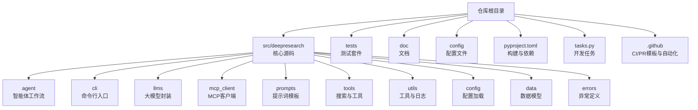
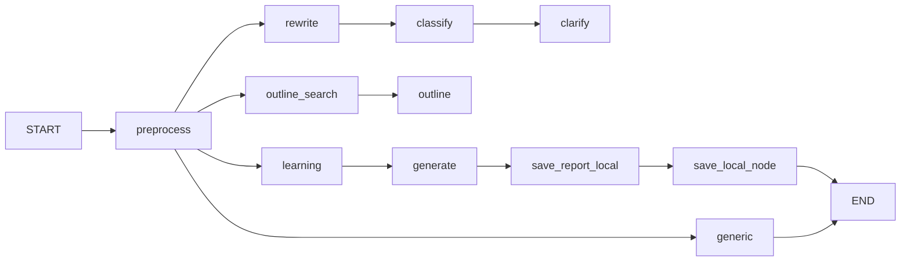
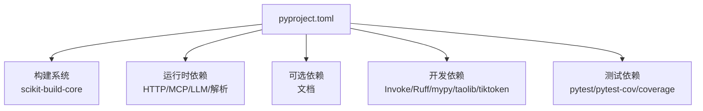

# 贡献与开发指南

<cite>
**本文引用的文件**
- [CONTRIBUTING.md](file://CONTRIBUTING.md)
- [README.md](file://README.md)
- [pyproject.toml](file://pyproject.toml)
- [tasks.py](file://tasks.py)
- [.github/PULL_REQUEST_TEMPLATE/pull_request_template.md](file://.github/PULL_REQUEST_TEMPLATE/pull_request_template.md)
- [.github/dependabot.yml](file://.github/dependabot.yml)
- [doc/contributing/documentation_guidelines.md](file://doc/contributing/documentation_guidelines.md)
- [tests/utils/testing_guidelines.md](file://tests/utils/testing_guidelines.md)
- [src/deepresearch/__init__.py](file://src/deepresearch/__init__.py)
- [src/deepresearch/agent/agent.py](file://src/deepresearch/agent/agent.py)
- [src/deepresearch/errors.py](file://src/deepresearch/errors.py)
- [src/deepresearch/cli/__main__.py](file://src/deepresearch/cli/__main__.py)
- [config/llms.toml](file://config/llms.toml)
- [config/workflow.toml](file://config/workflow.toml)
</cite>

## 目录
1. [简介](#简介)
2. [项目结构](#项目结构)
3. [核心组件](#核心组件)
4. [架构总览](#架构总览)
5. [详细组件分析](#详细组件分析)
6. [依赖分析](#依赖分析)
7. [性能考虑](#性能考虑)
8. [故障排查指南](#故障排查指南)
9. [结论](#结论)
10. [附录](#附录)

## 简介
本指南面向贡献者与开发者，系统阐述DeepResearch的代码规范、开发环境搭建、提交与评审流程、测试与质量门禁、文档贡献与社区参与方式，以及开发工具与调试技巧。内容基于仓库内现有贡献指南、构建配置、任务脚本、PR模板与测试规范整理而成。

## 项目结构
项目采用按功能域划分的包结构，核心源码位于src/deepresearch，测试位于tests，文档位于doc，配置位于config。构建与依赖由pyproject.toml与scikit-build-core驱动，开发任务通过Invoke任务脚本统一管理。

图表来源
- [pyproject.toml:1-93](file://pyproject.toml#L1-L93)
- [tasks.py:1-369](file://tasks.py#L1-L369)

章节来源
- [pyproject.toml:1-93](file://pyproject.toml#L1-L93)
- [tasks.py:1-369](file://tasks.py#L1-L369)

## 核心组件
- 构建与依赖
  - 构建系统：scikit-build-core，wheel安装目录指向src，版本由setuptools_scm提供。
  - 依赖：核心运行时依赖与可选依赖（文档、开发、测试）均在pyproject.toml中声明。
- CLI与入口
  - 命令行入口通过脚本注册，调用CLI工具模块的主函数。
- 异常体系
  - 统一的错误基类与细分异常类型，便于定位与处理。
- 配置
  - LLM与工作流配置通过TOML文件集中管理，便于切换与扩展。

章节来源
- [pyproject.toml:1-93](file://pyproject.toml#L1-L93)
- [src/deepresearch/cli/__main__.py:1-7](file://src/deepresearch/cli/__main__.py#L1-L7)
- [src/deepresearch/errors.py:1-26](file://src/deepresearch/errors.py#L1-L26)
- [config/llms.toml:1-29](file://config/llms.toml#L1-L29)
- [config/workflow.toml:1-3](file://config/workflow.toml#L1-L3)

## 架构总览
DeepResearch围绕“任务规划→工具调用→评估与迭代”的智能体工作流展开，通过LangGraph构建状态图，串联预处理、改写、分类、澄清、泛化、检索提纲、生成报告与本地保存等节点。

图表来源
- [src/deepresearch/agent/agent.py:19-45](file://src/deepresearch/agent/agent.py#L19-L45)

章节来源
- [src/deepresearch/agent/agent.py:1-45](file://src/deepresearch/agent/agent.py#L1-L45)

## 详细组件分析

### 代码规范与风格
- 编码标准
  - 使用Ruff进行代码格式化与风格检查，遵循PEP 8风格；行宽限制、目标版本与忽略规则在pyproject.toml中配置。
- 命名约定
  - Python模块与变量遵循PEP 8；文件名与目录名建议使用小写与连字符/单数形式（文档规范中给出建议）。
- 注释规范
  - 要求描述性docstring与复杂逻辑注释；保持函数单一职责。
- 版本要求
  - 项目要求Python版本满足动态版本声明与任务脚本中的3.14+约束。

章节来源
- [pyproject.toml:54-78](file://pyproject.toml#L54-L78)
- [CONTRIBUTING.md:113-118](file://CONTRIBUTING.md#L113-L118)
- [tasks.py:151-275](file://tasks.py#L151-L275)

### 开发环境搭建
- 环境要求
  - Python版本：>=3.14（任务脚本），或>=3.10（贡献指南）；构建系统：scikit-build-core。
- 安装步骤
  - 推荐使用虚拟环境；以可编辑模式安装项目及开发依赖。
  - 验证安装：导入包并打印版本；运行测试套件。
- 任务脚本
  - 通过Invoke任务统一执行测试、格式化、风格检查、类型检查与清理等操作。

章节来源
- [CONTRIBUTING.md:15-73](file://CONTRIBUTING.md#L15-L73)
- [pyproject.toml:82-93](file://pyproject.toml#L82-L93)
- [tasks.py:20-86](file://tasks.py#L20-L86)

### 提交流程与代码审查
- 分支策略
  - 建议以feature/前缀创建分支进行功能开发。
- 提交消息
  - 贡献指南未强制统一格式，建议遵循“类型: 内容”格式以便追踪。
- PR模板
  - PR模板包含变更类型、测试说明、Checklist、相关Issue与审查者标注，有助于标准化评审。
- 依赖更新
  - 依赖更新由Dependabot自动发起PR，设定周期、Reviewer与标签。

章节来源
- [CONTRIBUTING.md:74-112](file://CONTRIBUTING.md#L74-L112)
- [.github/PULL_REQUEST_TEMPLATE/pull_request_template.md:1-66](file://.github/PULL_REQUEST_TEMPLATE/pull_request_template.md#L1-L66)
- [.github/dependabot.yml:1-47](file://.github/dependabot.yml#L1-L47)

### 测试要求与质量门禁
- 测试类型
  - 单元测试、集成测试、性能测试、端到端测试四类，分别覆盖模块功能、多模块交互、性能指标与完整用户场景。
- 测试框架
  - 使用pytest与pytest-cov；使用mock模拟外部依赖。
- 覆盖率与报告
  - 目标覆盖率建议80%以上；报告包含摘要、覆盖率、性能与失败详情。
- 执行方式
  - 支持本地执行与CI自动执行；失败阻塞合并。

章节来源
- [tests/utils/testing_guidelines.md:1-201](file://tests/utils/testing_guidelines.md#L1-L201)
- [pyproject.toml:68-71](file://pyproject.toml#L68-L71)

### 文档贡献指南
- 目录与命名
  - 文档目录结构清晰；文件名与目录名建议小写与连字符/单数形式。
- 内容格式
  - 标题层级、代码块、链接与表格格式规范明确。
- 模板与最佳实践
  - 提供指南、API文档模板；强调文档与代码同步更新、国际化与版本控制一致性。

章节来源
- [doc/contributing/documentation_guidelines.md:1-162](file://doc/contributing/documentation_guidelines.md#L1-L162)

### 开发工具与调试技巧
- 工具链
  - Ruff负责格式化与检查；mypy进行类型检查；pytest与覆盖率工具保障质量。
- 调试建议
  - 使用CLI入口启动；结合日志配置与异常类型定位问题；在单元/集成测试中隔离与模拟外部依赖。

章节来源
- [pyproject.toml:40-52](file://pyproject.toml#L40-L52)
- [src/deepresearch/__init__.py:1-30](file://src/deepresearch/__init__.py#L1-L30)
- [src/deepresearch/errors.py:1-26](file://src/deepresearch/errors.py#L1-L26)

## 依赖分析
- 构建与元数据
  - scikit-build-core作为构建后端；wheel安装目录指向src；版本由setuptools_scm提供。
- 运行时依赖
  - 包含HTTP客户端、MCP、Pydantic、LangChain/LangGraph、搜索与解析工具等。
- 可选与开发依赖
  - 文档构建、开发工具（Invoke、Ruff、mypy、taolib、tiktoken）与测试工具（pytest、pytest-cov、coverage）。

图表来源
- [pyproject.toml:1-93](file://pyproject.toml#L1-L93)

章节来源
- [pyproject.toml:1-93](file://pyproject.toml#L1-L93)

## 性能考虑
- 性能测试
  - 提供性能测试与分析脚本，建议在不同负载下评估响应时间与资源使用。
- 并发与稳定性
  - 提供并发与稳定性测试文件，建议在CI中纳入回归评估。

章节来源
- [tests/utils/testing_guidelines.md:55-59](file://tests/utils/testing_guidelines.md#L55-L59)
- [tests/performance/concurrency_test.py](file://tests/performance/concurrency_test.py)
- [tests/performance/stability_test.py](file://tests/performance/stability_test.py)

## 故障排查指南
- 常见问题定位
  - 使用统一异常类型区分配置、搜索、LLM与报告生成错误，便于快速定位。
- 日志与入口
  - 通过日志配置与CLI入口启动，结合异常堆栈与测试报告定位问题。
- 依赖与版本
  - 若出现兼容性问题，优先核对Python版本与依赖版本，必要时重建虚拟环境。

章节来源
- [src/deepresearch/errors.py:1-26](file://src/deepresearch/errors.py#L1-L26)
- [src/deepresearch/__init__.py:1-30](file://src/deepresearch/__init__.py#L1-L30)
- [tasks.py:151-275](file://tasks.py#L151-L275)

## 结论
本指南整合了仓库内的贡献流程、构建配置、测试规范与文档标准，为贡献者提供了从环境搭建到代码审查、从测试质量到文档维护的全链路参考。建议在每次提交前执行格式化、风格检查与测试，并在PR中完整填写模板与Checklist，确保代码质量与可维护性。

## 附录
- 快速开始与安装
  - 参考贡献指南与README中的安装与运行说明。
- 配置参考
  - LLM与工作流配置位于config目录，便于按需调整。
- 社区与支持
  - 通过讨论区与问题跟踪渠道参与社区互动。

章节来源
- [README.md:39-69](file://README.md#L39-L69)
- [CONTRIBUTING.md:15-73](file://CONTRIBUTING.md#L15-L73)
- [config/llms.toml:1-29](file://config/llms.toml#L1-L29)
- [config/workflow.toml:1-3](file://config/workflow.toml#L1-L3)