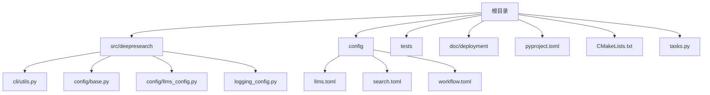
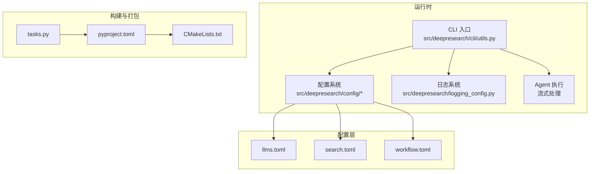
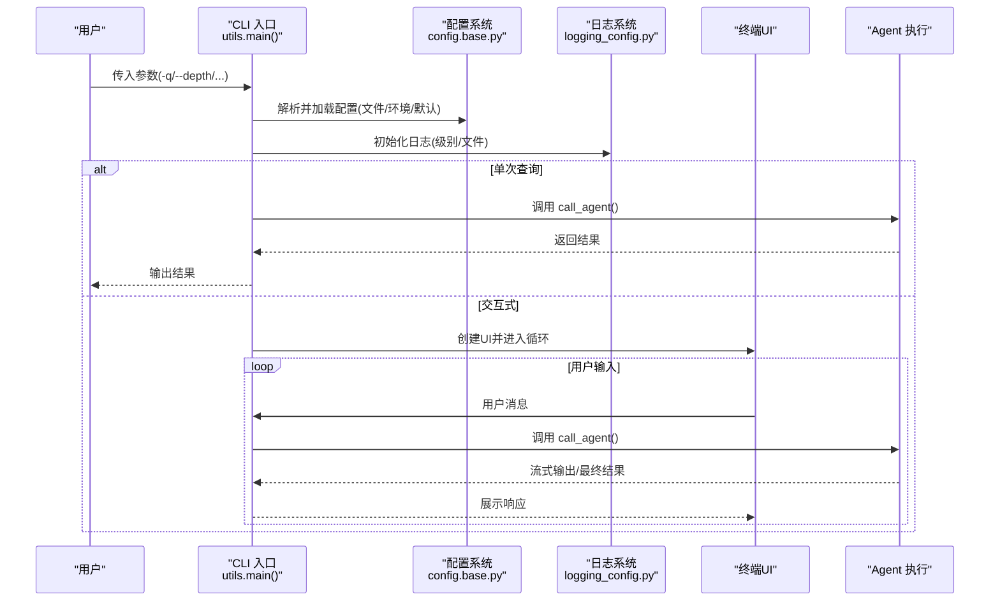
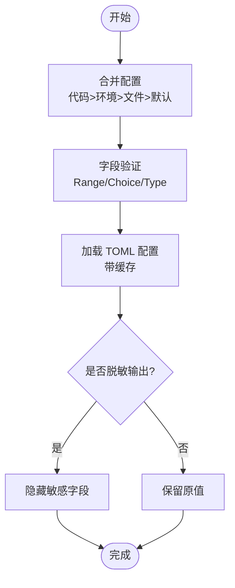
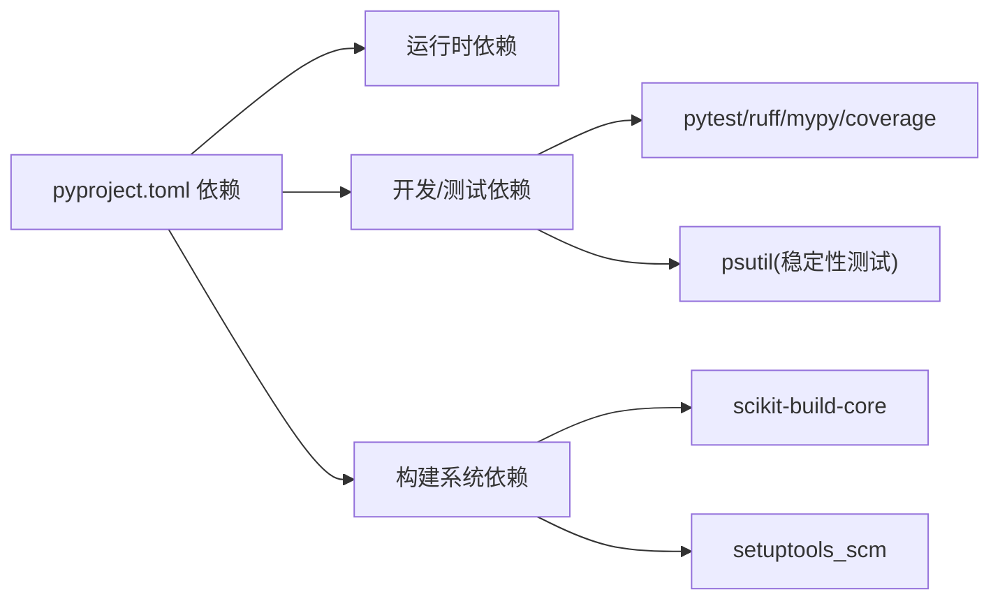
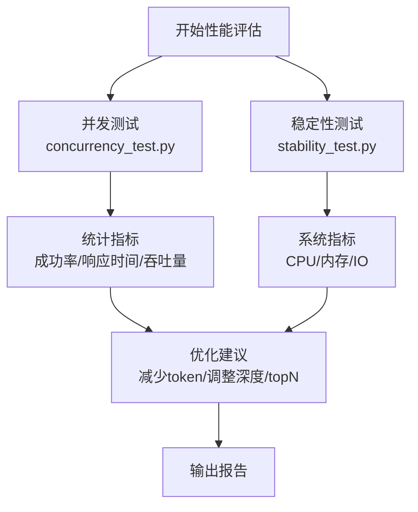

# 部署与运维

<cite>
**本文引用的文件**
- [README.md](file://README.md)
- [doc/部署文档.md](file://doc/deployment/deployment.md)
- [pyproject.toml](file://pyproject.toml)
- [CMakeLists.txt](file://CMakeLists.txt)
- [tasks.py](file://tasks.py)
- [config/llms.toml](file://config/llms.toml)
- [config/search.toml](file://config/search.toml)
- [config/workflow.toml](file://config/workflow.toml)
- [src/deepresearch/logging_config.py](file://src/deepresearch/logging_config.py)
- [src/deepresearch/cli/utils.py](file://src/deepresearch/cli/utils.py)
- [src/deepresearch/config/base.py](file://src/deepresearch/config/base.py)
- [src/deepresearch/config/llms_config.py](file://src/deepresearch/config/llms_config.py)
- [tests/performance/concurrency_test.py](file://tests/performance/concurrency_test.py)
- [tests/performance/stability_test.py](file://tests/performance/stability_test.py)
</cite>

## 目录
1. [简介](#简介)
2. [项目结构](#项目结构)
3. [核心组件](#核心组件)
4. [架构总览](#架构总览)
5. [详细组件分析](#详细组件分析)
6. [依赖关系分析](#依赖关系分析)
7. [性能考虑](#性能考虑)
8. [故障排除指南](#故障排除指南)
9. [结论](#结论)
10. [附录](#附录)

## 简介
本文件面向生产环境的部署与运维，围绕 DeepResearch 的安装、配置、运行、监控、日志、性能优化、故障排查、容器化与自动化部署、版本管理与运维脚本进行系统化说明。内容基于仓库内现有文档与代码实现，确保可操作与可追溯。

## 项目结构
项目采用“根目录 + 子模块”的组织方式，核心模块集中在 src/deepresearch 下，配置位于 config 目录，测试位于 tests 目录，部署与运维相关的关键文件包括：
- 构建与打包：pyproject.toml、CMakeLists.txt
- CLI 与运行入口：src/deepresearch/cli/utils.py
- 配置体系：src/deepresearch/config/*、config/*.toml
- 日志：src/deepresearch/logging_config.py
- 运维任务：tasks.py
- 部署与运维文档：doc/deployment/deployment.md

**图示来源**
- [pyproject.toml:1-93](file://pyproject.toml#L1-L93)
- [CMakeLists.txt:1-13](file://CMakeLists.txt#L1-L13)
- [tasks.py:1-369](file://tasks.py#L1-L369)

**章节来源**
- [README.md:1-69](file://README.md#L1-L69)
- [doc/部署文档.md:1-260](file://doc/deployment/deployment.md#L1-L260)

## 核心组件
- CLI 与运行入口：提供命令行交互、单次查询、信号处理、日志配置与异常处理。
- 配置体系：统一的 TOML 配置加载、环境变量覆盖、敏感信息脱敏与缓存。
- 日志系统：控制台与文件双通道输出，统一格式与级别控制。
- 运维任务：通过 Invoke 定义测试、格式化、检查、清理、虚拟环境创建与激活等任务。
- 构建与打包：scikit-build-core + setuptools_scm，wheel 安装目录指向 src。

**章节来源**
- [src/deepresearch/cli/utils.py:1-575](file://src/deepresearch/cli/utils.py#L1-L575)
- [src/deepresearch/config/base.py:1-590](file://src/deepresearch/config/base.py#L1-L590)
- [src/deepresearch/config/llms_config.py:1-115](file://src/deepresearch/config/llms_config.py#L1-L115)
- [src/deepresearch/logging_config.py:1-67](file://src/deepresearch/logging_config.py#L1-L67)
- [tasks.py:1-369](file://tasks.py#L1-L369)
- [pyproject.toml:1-93](file://pyproject.toml#L1-L93)

## 架构总览
DeepResearch 的生产部署由“构建系统 + 配置系统 + CLI 运行 + 日志监控 + 运维任务”构成。CLI 作为入口，负责参数解析、配置加载、Agent 调用与流式输出；配置系统支持文件与环境变量两级覆盖；日志系统同时输出到控制台与文件；运维任务提供测试、格式化、清理与虚拟环境管理能力。

**图示来源**
- [src/deepresearch/cli/utils.py:485-575](file://src/deepresearch/cli/utils.py#L485-L575)
- [src/deepresearch/config/base.py:373-456](file://src/deepresearch/config/base.py#L373-L456)
- [src/deepresearch/logging_config.py:15-67](file://src/deepresearch/logging_config.py#L15-L67)
- [config/llms.toml:1-29](file://config/llms.toml#L1-L29)
- [config/search.toml:1-6](file://config/search.toml#L1-L6)
- [config/workflow.toml:1-3](file://config/workflow.toml#L1-L3)
- [pyproject.toml:82-93](file://pyproject.toml#L82-L93)
- [CMakeLists.txt:1-13](file://CMakeLists.txt#L1-L13)
- [tasks.py:20-369](file://tasks.py#L20-L369)

## 详细组件分析

### CLI 与运行流程
- 参数解析与覆盖：支持 -q/--query、--depth、--no-html、-o/--output、--log-level、--log-file、--theme、-c/--config-dir、--version 等。
- 配置目录校验与切换：支持 -c 指定自定义配置目录，并重载 LLM 配置缓存。
- 交互式与单次查询模式：交互式模式提供帮助、清空、历史查询等命令；单次查询模式直接返回结果。
- 信号处理：捕获 SIGINT/SIGTERM，优雅中断 Agent 执行。
- 日志配置：启动时按配置级别与日志文件路径初始化日志。

**图示来源**
- [src/deepresearch/cli/utils.py:386-575](file://src/deepresearch/cli/utils.py#L386-L575)
- [src/deepresearch/config/base.py:536-590](file://src/deepresearch/config/base.py#L536-L590)
- [src/deepresearch/logging_config.py:15-67](file://src/deepresearch/logging_config.py#L15-L67)

**章节来源**
- [src/deepresearch/cli/utils.py:1-575](file://src/deepresearch/cli/utils.py#L1-L575)

### 配置系统与敏感信息脱敏
- 配置来源优先级：代码传入 > 环境变量 > 配置文件 > 默认值。
- 支持环境变量前缀与字段级元数据（如敏感字段、描述、环境变量名）。
- TOML 配置加载与缓存：LRU 缓存避免重复 IO；提供脱敏导出。
- LLM 配置：按模块化键加载，支持懒加载与全局缓存失效。

**图示来源**
- [src/deepresearch/config/base.py:536-590](file://src/deepresearch/config/base.py#L536-L590)
- [src/deepresearch/config/llms_config.py:46-86](file://src/deepresearch/config/llms_config.py#L46-L86)

**章节来源**
- [src/deepresearch/config/base.py:1-590](file://src/deepresearch/config/base.py#L1-L590)
- [src/deepresearch/config/llms_config.py:1-115](file://src/deepresearch/config/llms_config.py#L1-L115)
- [config/llms.toml:1-29](file://config/llms.toml#L1-L29)
- [config/search.toml:1-6](file://config/search.toml#L1-L6)
- [config/workflow.toml:1-3](file://config/workflow.toml#L1-L3)

### 日志系统
- 支持控制台与文件双通道，统一格式与日期格式。
- 可按级别与路径动态配置，适合生产环境落地。

**章节来源**
- [src/deepresearch/logging_config.py:1-67](file://src/deepresearch/logging_config.py#L1-L67)

### 运维任务与自动化
- 任务定义：test、format、lint、typecheck、clean、all、venv、activate。
- 一键全链路检查：clean + test + format + lint。
- 虚拟环境：自动检测 Python 版本、创建/重建 .venv、跨平台激活脚本提示与验证。
- 文档站点：通过 Invoke namespace 注册文档构建任务。

**章节来源**
- [tasks.py:1-369](file://tasks.py#L1-L369)

### 构建与打包
- 构建后端：scikit-build-core，版本要求与元数据提供者来自 setuptools_scm。
- wheel 安装目录：src，便于源码直装与开发调试。
- CMake：安装 Python 包至目标目录。

**章节来源**
- [pyproject.toml:82-93](file://pyproject.toml#L82-L93)
- [CMakeLists.txt:1-13](file://CMakeLists.txt#L1-L13)

## 依赖关系分析
- 运行时依赖：httpx、pydantic、langchain、langgraph、tavily-python、mcp、mistune 等。
- 开发与测试：pytest、ruff、mypy、coverage、psutil（稳定性测试）。
- 构建系统：scikit-build-core、setuptools_scm。
- 运维工具：Invoke、taolib（文档站点）。

**图示来源**
- [pyproject.toml:12-52](file://pyproject.toml#L12-L52)
- [pyproject.toml:82-93](file://pyproject.toml#L82-L93)

**章节来源**
- [pyproject.toml:1-93](file://pyproject.toml#L1-L93)

## 性能考虑
- 并发与吞吐：提供并发性能测试脚本，支持多并发用户、持续时间、统计指标（成功率、平均/最大/最小响应时间、吞吐量）。
- 稳定性与资源：提供长期稳定性测试脚本，采集 CPU、内存、磁盘与网络 IO 指标，支持内存泄漏趋势检测。
- 配置优化：通过减少 LLM 生成 token 数、选择高效搜索引擎、合理设置搜索深度与 topN，降低延迟与资源占用。
- 资源利用：结合系统监控（CPU/内存/IO）与应用日志，定位瓶颈。

**图示来源**
- [tests/performance/concurrency_test.py:16-184](file://tests/performance/concurrency_test.py#L16-L184)
- [tests/performance/stability_test.py:16-314](file://tests/performance/stability_test.py#L16-L314)

**章节来源**
- [tests/performance/concurrency_test.py:1-184](file://tests/performance/concurrency_test.py#L1-L184)
- [tests/performance/stability_test.py:1-314](file://tests/performance/stability_test.py#L1-L314)
- [config/workflow.toml:1-3](file://config/workflow.toml#L1-L3)

## 故障排除指南
- 安装依赖失败：确认 Python 版本满足 >=3.14，pip 版本满足要求；使用受支持的构建后端 scikit-build-core。
- LLM 调用失败：检查 api_base/model/api_key 是否正确且具备权限；必要时切换或轮换密钥。
- 搜索工具失败：检查 engine 与对应 API 密钥（jina/tavily），确认配额与网络连通性。
- 系统运行缓慢：增加资源、减少生成 token、优化搜索深度与 topN、更换更高效搜索引擎。
- 日志定位：查看 logs 目录日志文件；确认日志级别与输出路径配置。
- 配置检查：核对 llms.toml、search.toml、workflow.toml；必要时使用环境变量覆盖。
- 依赖一致性：确保依赖版本兼容，必要时重建虚拟环境并重新安装。

**章节来源**
- [doc/部署文档.md:178-220](file://doc/deployment/deployment.md#L178-L220)

## 结论
本部署与运维文档基于仓库现有实现，明确了生产环境的安装、配置、运行、监控、日志、性能评估与故障排查路径。建议在生产中结合日志与性能测试持续优化资源配置与算法参数，并通过运维任务与版本管理保障交付质量与可维护性。

## 附录

### 生产环境部署步骤与要求
- 硬件与软件要求：CPU≥4 核、内存≥8GB、磁盘≥20GB；Python≥3.14；pip≥20.0；Git≥2.0；CMake（scikit-build-core 要求）。
- 安装构建依赖：安装 scikit-build-core 与 setuptools_scm。
- 安装项目：使用 pip 安装（支持 editable 安装）。
- 配置系统：编辑 llms.toml、search.toml、workflow.toml；可通过环境变量覆盖。
- 运行方式：命令行运行或作为模块导入；支持交互式与单次查询模式。
- 测试：运行单元、集成与端到端测试，确保功能稳定。

**章节来源**
- [doc/部署文档.md:5-161](file://doc/deployment/deployment.md#L5-L161)

### 监控与日志配置
- 日志：控制台与文件双通道，统一格式与级别；支持动态配置日志文件路径。
- 关键指标：响应时间、成功率、吞吐量、CPU/内存/IO；结合稳定性测试脚本采集。
- 错误追踪：结合 CLI 异常类型与日志上下文定位问题。

**章节来源**
- [src/deepresearch/logging_config.py:15-67](file://src/deepresearch/logging_config.py#L15-L67)
- [src/deepresearch/cli/utils.py:106-193](file://src/deepresearch/cli/utils.py#L106-L193)
- [tests/performance/stability_test.py:42-222](file://tests/performance/stability_test.py#L42-L222)

### 容器化部署与自动化部署最佳实践
- 容器化建议：基于 Python 3.14 基础镜像，COPY 项目源码，安装构建依赖与项目；暴露 CLI 入口；挂载配置目录与日志目录。
- 自动化部署：使用 CI/CD 在流水线中执行 tasks.py 的 all 任务，确保格式、检查与测试通过后再打包发布。
- 版本管理：使用 setuptools_scm 动态管理版本号，遵循语义化版本；变更记录于发布文档。

**章节来源**
- [tasks.py:133-149](file://tasks.py#L133-L149)
- [pyproject.toml:91-93](file://pyproject.toml#L91-L93)
- [doc/deployment/deployment.md:221-256](file://doc/deployment/deployment.md#L221-L256)

### 运维脚本与工具使用
- 一键检查：invoke all（clean + test + format + lint）。
- 虚拟环境：invoke venv 创建/重建 .venv；invoke activate 激活。
- 测试：pytest tests/ 运行全部测试；也可单独运行单元/集成/端到端测试。
- 文档站点：通过 Invoke namespace 的站点任务构建文档。

**章节来源**
- [tasks.py:20-369](file://tasks.py#L20-L369)
- [doc/部署文档.md:143-161](file://doc/deployment/deployment.md#L143-L161)