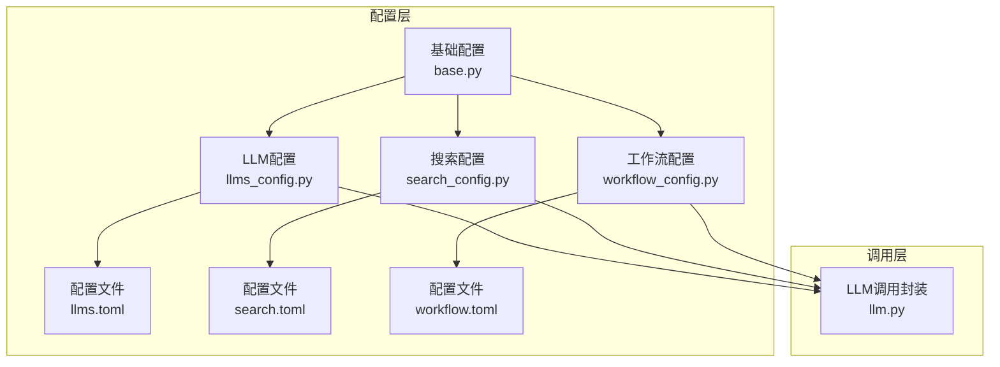
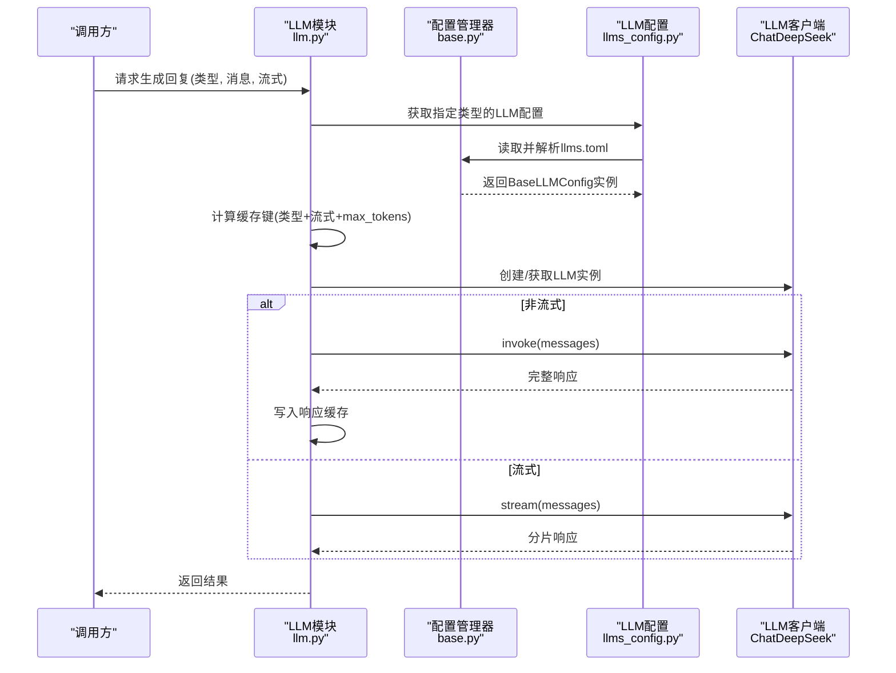
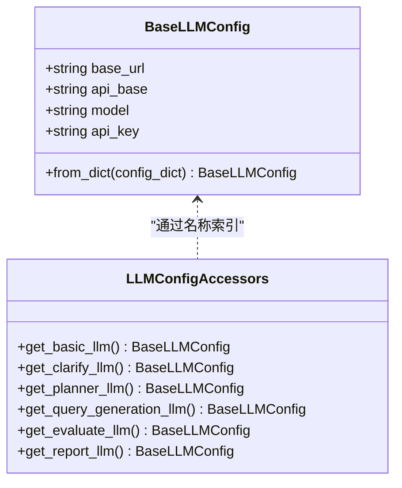
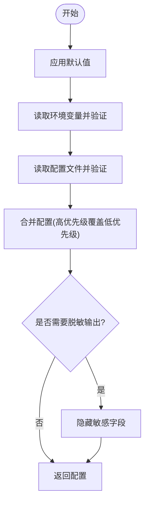
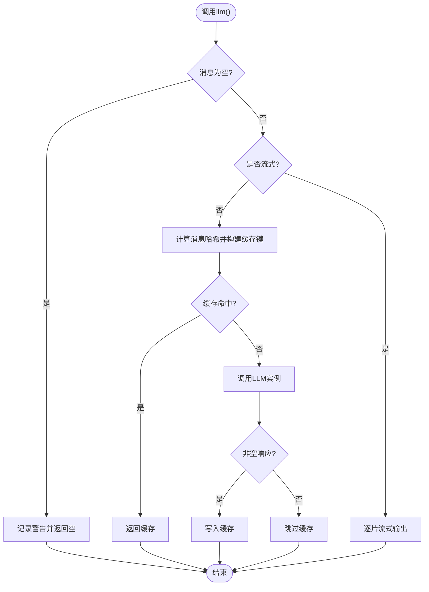
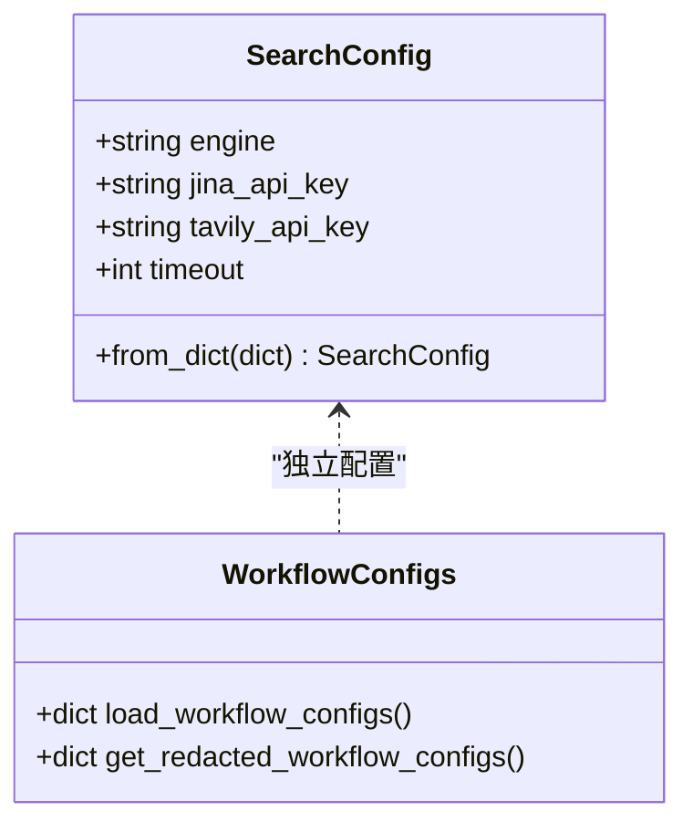
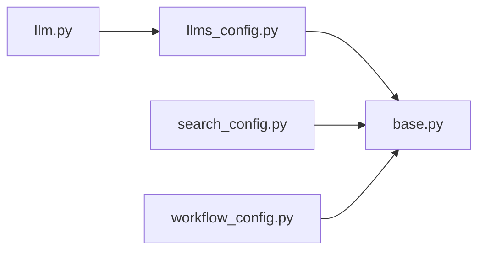

# LLM配置管理

<cite>
**本文引用的文件**
- [llms_config.py](file://src/deepresearch/config/llms_config.py)
- [base.py](file://src/deepresearch/config/base.py)
- [llms.toml](file://config/llms.toml)
- [llm.py](file://src/deepresearch/llms/llm.py)
- [search_config.py](file://src/deepresearch/config/search_config.py)
- [workflow_config.py](file://src/deepresearch/config/workflow_config.py)
- [search.toml](file://config/search.toml)
- [workflow.toml](file://config/workflow.toml)
- [test_base.py](file://tests/unit/config/test_base.py)
- [test_llm.py](file://tests/unit/llms/test_llm.py)
- [README.md](file://README.md)
</cite>

## 目录
1. [简介](#简介)
2. [项目结构](#项目结构)
3. [核心组件](#核心组件)
4. [架构总览](#架构总览)
5. [详细组件分析](#详细组件分析)
6. [依赖分析](#依赖分析)
7. [性能考虑](#性能考虑)
8. [故障排除指南](#故障排除指南)
9. [结论](#结论)
10. [附录](#附录)

## 简介
本文件面向DeepResearch LLM配置管理系统，系统性阐述LLM配置类的结构与字段定义、模型提供商选择、API密钥管理、模型参数配置、配置验证规则、默认值与环境变量映射、以及实际配置示例与最佳实践。同时说明模型选择逻辑、缓存与并发处理、以及故障排查要点，帮助开发者与运维人员快速上手并稳定运行。

## 项目结构
- 配置层位于 src/deepresearch/config，提供通用配置基类、验证器、配置管理器与便捷函数，并包含各子系统配置（LLM、搜索、工作流）。
- LLM调用层位于 src/deepresearch/llms，封装LangChain集成与缓存策略，负责模型实例化、请求与响应处理。
- 配置文件位于 config 目录，采用TOML格式，按模块拆分便于维护。
- 测试位于 tests，覆盖配置基类、LLM模块与端到端流程。

**图示来源**
- [base.py:190-590](file://src/deepresearch/config/base.py#L190-L590)
- [llms_config.py:46-115](file://src/deepresearch/config/llms_config.py#L46-L115)
- [search_config.py:56-82](file://src/deepresearch/config/search_config.py#L56-L82)
- [workflow_config.py:7-28](file://src/deepresearch/config/workflow_config.py#L7-L28)
- [llm.py:24-308](file://src/deepresearch/llms/llm.py#L24-L308)

**章节来源**
- [README.md:15-32](file://README.md#L15-L32)

## 核心组件
- 基础配置基类与验证体系：提供统一的配置加载、合并、验证、脱敏与缓存能力；支持环境变量与文件优先级覆盖。
- LLM配置类：定义通用字段（如基础URL、API基础地址、模型名、API密钥），并提供按角色的快捷访问函数。
- LLM调用封装：基于LangChain的ChatDeepSeek客户端，内置实例缓存、响应缓存与线程安全统计。
- 搜索与工作流配置：分别提供搜索引擎选择、超时与密钥管理，以及工作流参数（如检索条数）。

**章节来源**
- [base.py:190-590](file://src/deepresearch/config/base.py#L190-L590)
- [llms_config.py:12-115](file://src/deepresearch/config/llms_config.py#L12-L115)
- [llm.py:24-308](file://src/deepresearch/llms/llm.py#L24-L308)
- [search_config.py:12-82](file://src/deepresearch/config/search_config.py#L12-L82)
- [workflow_config.py:7-28](file://src/deepresearch/config/workflow_config.py#L7-L28)

## 架构总览
下图展示配置加载与LLM调用的关键交互：

**图示来源**
- [llm.py:24-308](file://src/deepresearch/llms/llm.py#L24-L308)
- [llms_config.py:46-115](file://src/deepresearch/config/llms_config.py#L46-L115)
- [base.py:479-590](file://src/deepresearch/config/base.py#L479-L590)

## 详细组件分析

### LLM配置类与字段定义
- 字段说明
  - base_url：模型服务的基础URL（用于某些提供商的兼容层或代理）
  - api_base：API基础地址（通常指向具体提供商的网关）
  - model：模型标识符（如“xdeepseekv31”、“xdeepseekr1”）
  - api_key：访问令牌（敏感信息，支持脱敏输出）
- 数据结构与复杂度
  - BaseLLMConfig为dataclass，from_dict进行字段校验与构造，时间复杂度O(n)，n为配置项数量。
- 关系与依赖
  - 通过get_llm_configs()懒加载，内部使用LRU缓存避免重复解析。
  - 提供按角色的快捷函数（basic、clarify、planner、query_generation、evaluate、report）。

**图示来源**
- [llms_config.py:12-115](file://src/deepresearch/config/llms_config.py#L12-L115)

**章节来源**
- [llms_config.py:12-115](file://src/deepresearch/config/llms_config.py#L12-L115)
- [llms.toml:1-29](file://config/llms.toml#L1-L29)

### 配置加载与验证规则
- 配置来源与优先级（高到低）
  - 代码默认值
  - 环境变量
  - 配置文件
  - 默认值
- 验证器
  - 范围验证器：确保数值在指定范围内
  - 选项验证器：大小写不敏感的可选值集合
  - 类型验证器：尝试类型转换或报错
- 脱敏与敏感键
  - 默认敏感键集合包含“api_key”、“password”、“secret”、“token”
  - 支持动态增删敏感键

**图示来源**
- [base.py:536-590](file://src/deepresearch/config/base.py#L536-L590)
- [base.py:479-511](file://src/deepresearch/config/base.py#L479-L511)

**章节来源**
- [base.py:190-590](file://src/deepresearch/config/base.py#L190-L590)
- [test_base.py:37-98](file://tests/unit/config/test_base.py#L37-L98)

### LLM调用封装与缓存策略
- 实例缓存
  - LRU缓存最大24个实例，缓存键包含类型、流式与max_tokens
  - 避免频繁创建客户端带来的资源消耗
- 响应缓存
  - 线程安全LRU缓存，最大100条
  - 缓存键由“类型:消息哈希”构成，命中直接返回
- 流式与非流式
  - 非流式：invoke，聚合完整响应
  - 流式：stream，逐片产出，支持“推理内容/正文”的双通道输出
- 错误处理
  - 对空消息、空响应、异常进行日志记录与降级处理

**图示来源**
- [llm.py:146-266](file://src/deepresearch/llms/llm.py#L146-L266)

**章节来源**
- [llm.py:24-308](file://src/deepresearch/llms/llm.py#L24-L308)

### 搜索与工作流配置
- 搜索配置
  - engine：当前支持“jina”或“tavily”
  - jina_api_key/tavily_api_key：对应引擎的API密钥
  - timeout：请求超时秒数（1~300）
- 工作流配置
  - topN：检索结果条数（示例中为5）

**图示来源**
- [search_config.py:12-82](file://src/deepresearch/config/search_config.py#L12-L82)
- [workflow_config.py:7-28](file://src/deepresearch/config/workflow_config.py#L7-L28)

**章节来源**
- [search_config.py:12-82](file://src/deepresearch/config/search_config.py#L12-L82)
- [workflow_config.py:7-28](file://src/deepresearch/config/workflow_config.py#L7-L28)
- [search.toml:1-6](file://config/search.toml#L1-L6)
- [workflow.toml:1-3](file://config/workflow.toml#L1-L3)

## 依赖分析
- 组件耦合
  - llm.py依赖llms_config.py提供的配置与类型枚举
  - llms_config.py依赖base.py的配置加载与脱敏工具
  - search_config.py与workflow_config.py同样依赖base.py
- 外部依赖
  - LangChain ChatDeepSeek客户端用于实际推理调用
- 潜在循环依赖
  - 当前模块间为单向依赖，无循环

**图示来源**
- [llm.py:17-17](file://src/deepresearch/llms/llm.py#L17-L17)
- [llms_config.py:7-7](file://src/deepresearch/config/llms_config.py#L7-L7)
- [search_config.py:7-7](file://src/deepresearch/config/search_config.py#L7-L7)
- [workflow_config.py:4-4](file://src/deepresearch/config/workflow_config.py#L4-L4)

**章节来源**
- [llm.py:14-17](file://src/deepresearch/llms/llm.py#L14-L17)
- [llms_config.py:4-7](file://src/deepresearch/config/llms_config.py#L4-L7)

## 性能考虑
- 实例缓存
  - 最大24个LLM实例，避免频繁初始化开销
  - 建议根据并发峰值调整maxsize以平衡内存与吞吐
- 响应缓存
  - 最大100条，命中率统计可用于评估复用效果
  - 对重复输入（相同消息序列）显著降低延迟
- 流式输出
  - 流式模式减少首字节延迟，适合实时交互
- 超时与重试
  - 搜索配置提供timeout参数，建议结合网络状况与SLA设置
- 并发与锁
  - 响应缓存采用线程锁保证一致性，注意在高并发下的锁竞争

**章节来源**
- [llm.py:21-266](file://src/deepresearch/llms/llm.py#L21-L266)
- [search_config.py:19-47](file://src/deepresearch/config/search_config.py#L19-L47)

## 故障排除指南
- 常见问题与定位
  - 配置缺失或字段错误：检查llms.toml中的必填字段（api_base、model、api_key），确认拼写与类型
  - 环境变量未生效：确认环境变量前缀与字段名匹配，或使用自定义前缀
  - API密钥无效：核对api_key是否正确，必要时使用脱敏输出查看当前配置
  - 空消息导致无响应：调用侧需确保传入非空消息列表
  - LLM调用异常：查看日志中的错误堆栈，确认网络连通性与服务端状态
- 验证与诊断
  - 使用测试用例验证配置加载与合并逻辑
  - 通过缓存统计接口观察命中率，判断复用效果
  - 在测试环境中开启流式输出，验证分片输出是否正常

**章节来源**
- [test_base.py:208-284](file://tests/unit/config/test_base.py#L208-L284)
- [test_llm.py:16-61](file://tests/unit/llms/test_llm.py#L16-L61)
- [llm.py:163-266](file://src/deepresearch/llms/llm.py#L163-L266)

## 结论
本配置系统以统一的配置基类为核心，结合TOML配置文件与环境变量，实现了灵活、可验证、可脱敏的多模块配置管理。LLM调用层通过实例与响应两级缓存，在保证稳定性的同时提升性能。配合搜索与工作流配置，形成完整的研究框架配置闭环。建议在生产环境中结合监控指标（缓存命中率、调用耗时）持续优化参数与部署策略。

## 附录

### 配置示例与最佳实践
- LLM配置示例（来自llms.toml）
  - basic/clarify/planner/query_generation/evaluate/report均指向同一提供商（示例中为讯飞星火）
  - 建议为不同角色配置差异化模型（如planner使用更强模型，basic使用轻量模型）以平衡成本与性能
- 环境变量映射
  - 前缀：DEEPRESEARCH_
  - 示例：DEEPRESEARCH_API_KEY、DEEPRESEARCH_MODEL、DEEPRESEARCH_TIMEOUT
- 安全配置
  - 使用脱敏输出查看配置，避免泄露敏感信息
  - 动态增删敏感键，确保最小暴露面
- 成本控制
  - 合理设置max_tokens与流式输出，减少不必要的长文本生成
  - 利用响应缓存复用相似查询结果
  - 搜索超时与重试策略需结合SLA设定，避免长时间等待

**章节来源**
- [llms.toml:1-29](file://config/llms.toml#L1-L29)
- [search.toml:1-6](file://config/search.toml#L1-L6)
- [workflow.toml:1-3](file://config/workflow.toml#L1-L3)
- [base.py:487-511](file://src/deepresearch/config/base.py#L487-L511)