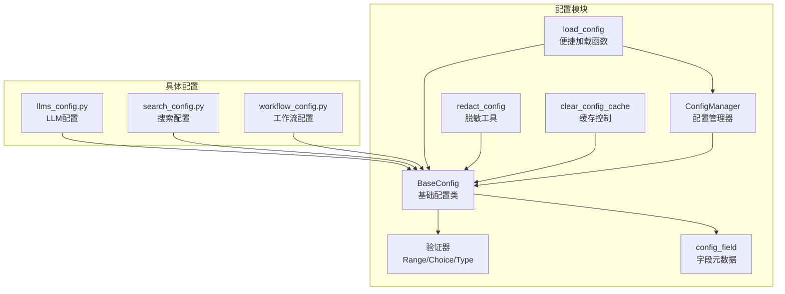
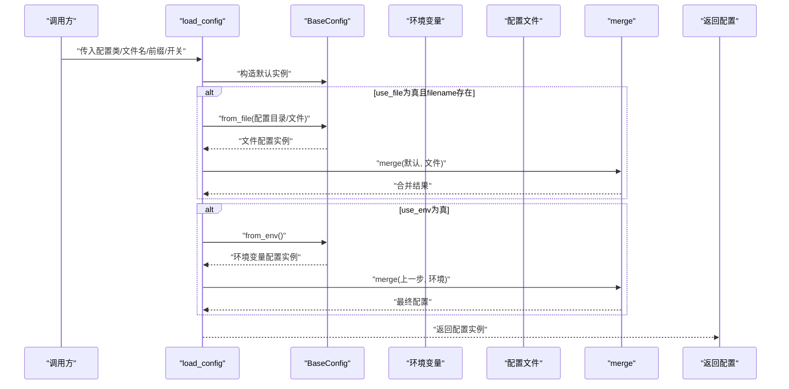
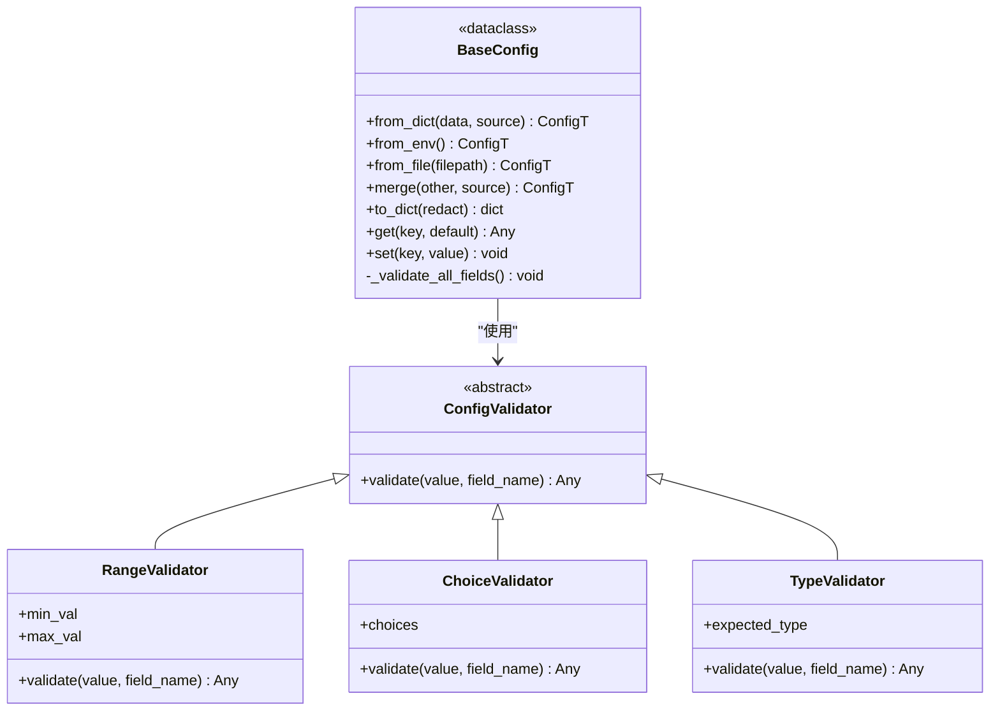
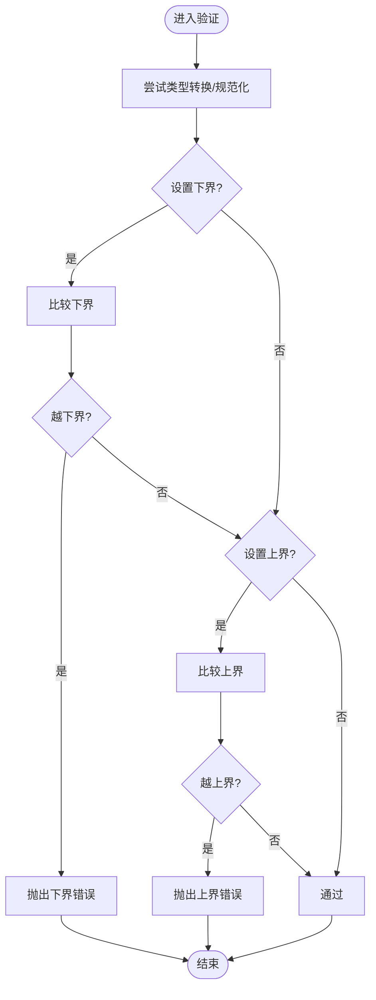
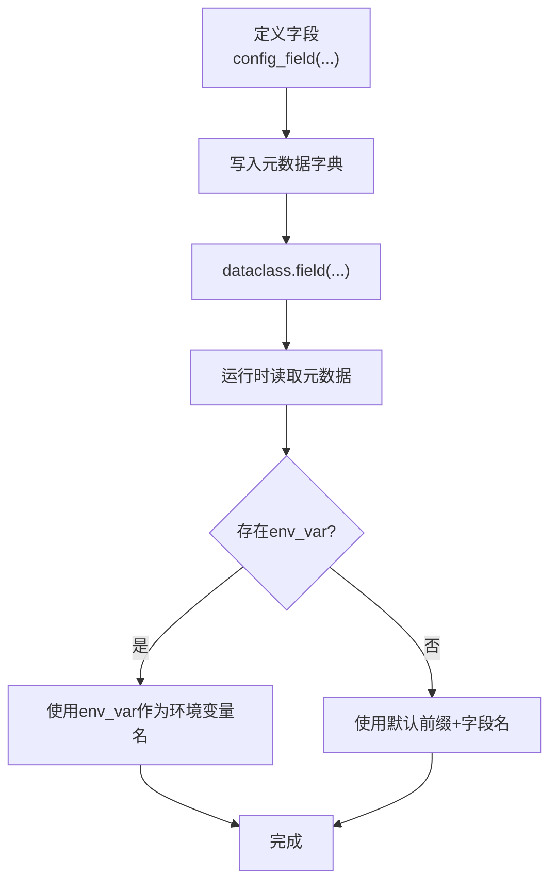
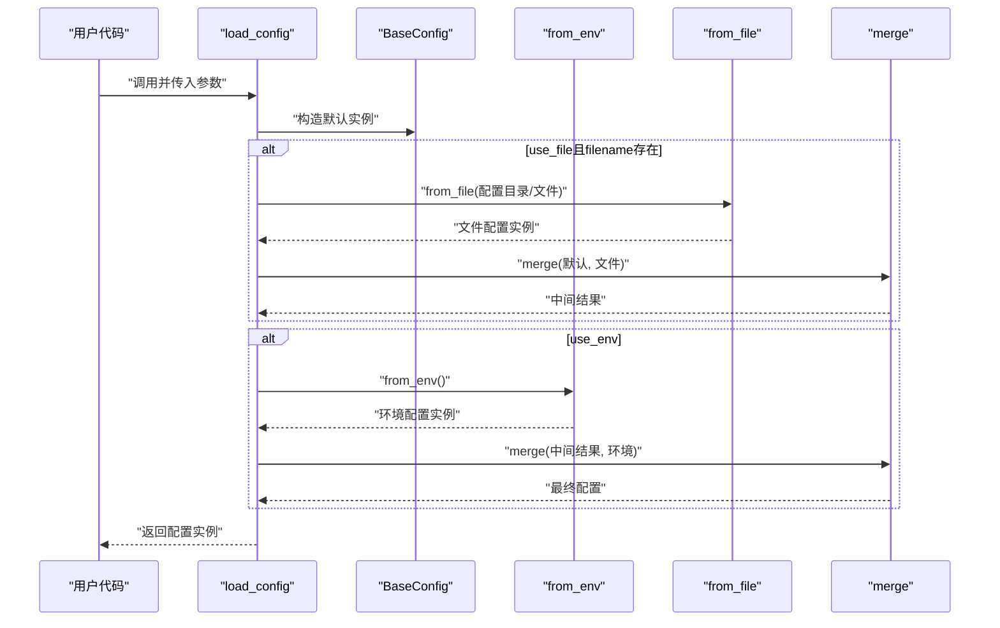
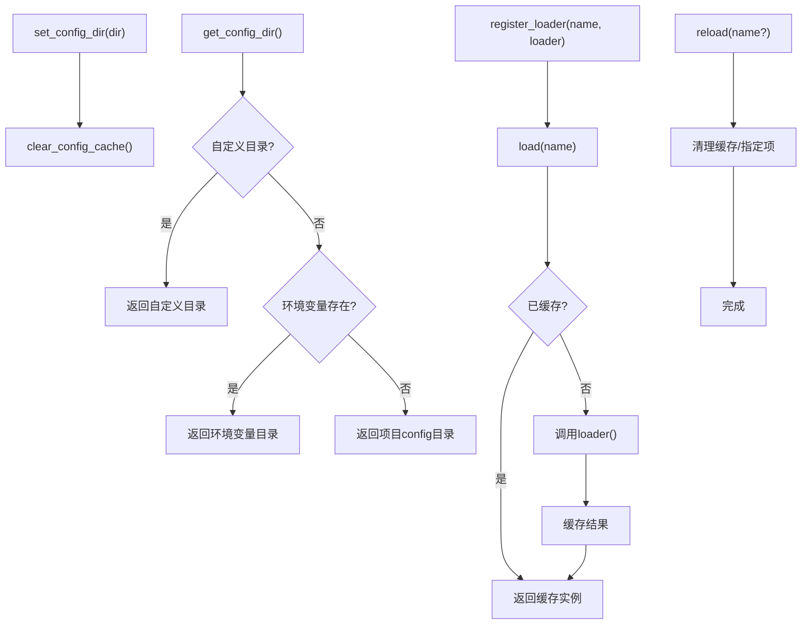
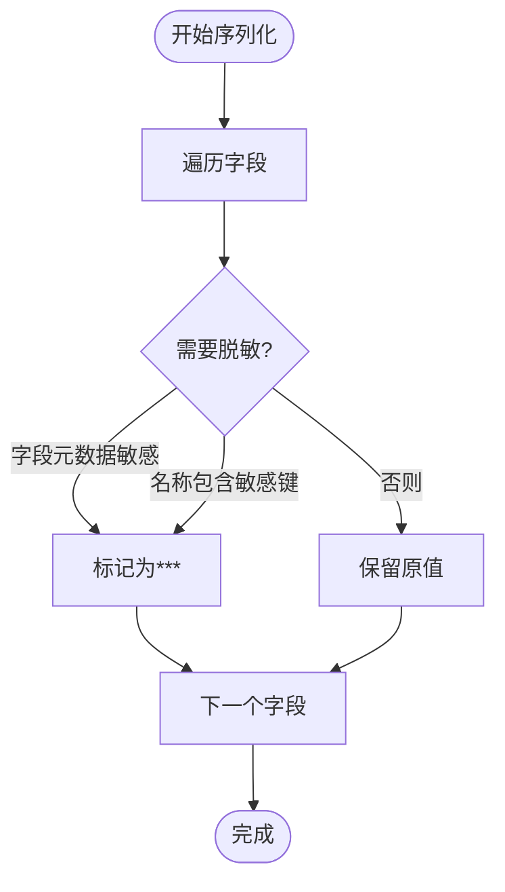
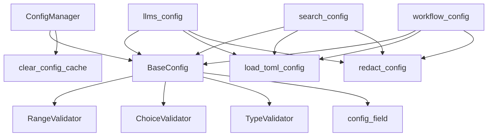

# 基础配置系统

<cite>
**本文引用的文件**
- [src/deepresearch/config/base.py](file://src/deepresearch/config/base.py)
- [src/deepresearch/config/__init__.py](file://src/deepresearch/config/__init__.py)
- [src/deepresearch/config/llms_config.py](file://src/deepresearch/config/llms_config.py)
- [src/deepresearch/config/search_config.py](file://src/deepresearch/config/search_config.py)
- [src/deepresearch/config/workflow_config.py](file://src/deepresearch/config/workflow_config.py)
- [src/deepresearch/cli/config.py](file://src/deepresearch/cli/config.py)
- [tests/unit/config/test_base.py](file://tests/unit/config/test_base.py)
- [config/llms.toml](file://config/llms.toml)
- [config/search.toml](file://config/search.toml)
- [config/workflow.toml](file://config/workflow.toml)
</cite>

## 目录
1. [简介](#简介)
2. [项目结构](#项目结构)
3. [核心组件](#核心组件)
4. [架构总览](#架构总览)
5. [详细组件分析](#详细组件分析)
6. [依赖分析](#依赖分析)
7. [性能考虑](#性能考虑)
8. [故障排查指南](#故障排查指南)
9. [结论](#结论)
10. [附录](#附录)

## 简介
本文件面向DeepResearch的基础配置系统，系统性阐述BaseConfig基类的设计理念与实现细节，包括：
- 配置字段定义与元数据系统（config_field函数）
- 验证器体系（RangeValidator、ChoiceValidator、TypeValidator）
- 配置加载机制（from_dict、from_env、from_file）的优先级与合并策略
- ConfigManager配置管理器的注册、加载与缓存机制
- 配置序列化、反序列化与脱敏处理的完整流程
- 实际使用示例与最佳实践

## 项目结构
基础配置系统位于src/deepresearch/config目录，围绕BaseConfig与ConfigManager构建，配套提供便捷函数与工具函数，同时在tests中提供了全面的单元测试覆盖。

**图表来源**
- [src/deepresearch/config/base.py:190-590](file://src/deepresearch/config/base.py#L190-L590)
- [src/deepresearch/config/llms_config.py:12-115](file://src/deepresearch/config/llms_config.py#L12-L115)
- [src/deepresearch/config/search_config.py:12-82](file://src/deepresearch/config/search_config.py#L12-L82)
- [src/deepresearch/config/workflow_config.py:7-28](file://src/deepresearch/config/workflow_config.py#L7-L28)

**章节来源**
- [src/deepresearch/config/base.py:1-590](file://src/deepresearch/config/base.py#L1-L590)
- [src/deepresearch/config/__init__.py:14-75](file://src/deepresearch/config/__init__.py#L14-L75)

## 核心组件
- BaseConfig：提供统一的配置加载、验证、合并、序列化与脱敏能力；内置环境变量前缀与敏感键集合。
- ConfigManager：集中管理配置加载器与缓存，支持自定义配置目录与按需加载。
- 验证器：RangeValidator（数值范围）、ChoiceValidator（可选值集合，大小写不敏感）、TypeValidator（类型转换与校验）。
- config_field：声明式配置字段，支持默认值、默认工厂、验证器、环境变量映射、敏感字段标记与描述。
- 便捷函数：load_config、load_toml_config、redact_config、clear_config_cache、add_sensitive_key/remove_sensitive_key等。

**章节来源**
- [src/deepresearch/config/base.py:65-183](file://src/deepresearch/config/base.py#L65-L183)
- [src/deepresearch/config/base.py:190-590](file://src/deepresearch/config/base.py#L190-L590)

## 架构总览
基础配置系统采用“声明式字段 + 验证器 + 多源加载 + 合并优先级”的设计，确保配置来源灵活可控、验证严格可靠、输出安全可控。

**图表来源**
- [src/deepresearch/config/base.py:536-590](file://src/deepresearch/config/base.py#L536-L590)
- [src/deepresearch/config/base.py:224-291](file://src/deepresearch/config/base.py#L224-L291)

## 详细组件分析

### BaseConfig：配置基类
- 设计理念
  - 通过dataclass字段与元数据实现声明式配置定义。
  - 在__post_init__中自动执行字段级验证，保证实例一致性。
  - 提供from_dict/from_env/from_file三种加载方式，并支持merge合并。
  - 支持to_dict序列化与脱敏输出。
- 关键方法
  - from_dict：过滤并构造有效字段，避免未知字段污染。
  - from_env：基于约定的环境变量命名规则或显式env_var元数据解析布尔/整数/字符串。
  - from_file：解析TOML文件，使用_lru_cache缓存以提升重复读取性能。
  - merge：以other优先级更高的策略进行字段合并，生成新实例。
  - to_dict：支持redact开关，结合字段元数据与默认敏感键集合进行脱敏。
  - get/set：提供安全的键访问与设置（非私有字段）。
- 验证流程
  - 遍历所有公开字段，读取validators元数据，依次执行validate。
  - 任一验证失败抛出ValidationError，阻止不合法配置进入系统。

**图表来源**
- [src/deepresearch/config/base.py:65-183](file://src/deepresearch/config/base.py#L65-L183)
- [src/deepresearch/config/base.py:190-371](file://src/deepresearch/config/base.py#L190-L371)

**章节来源**
- [src/deepresearch/config/base.py:190-371](file://src/deepresearch/config/base.py#L190-L371)
- [src/deepresearch/config/base.py:65-183](file://src/deepresearch/config/base.py#L65-L183)

### 验证器系统
- RangeValidator
  - 将输入转为浮点数，比较min/max边界，支持仅设最小值或最大值。
- ChoiceValidator
  - 接受集合/列表/frozenset，内部统一转为小写frozenset，验证时忽略大小写。
- TypeValidator
  - 若类型不符则尝试构造期望类型，失败抛出ValidationError。

**图表来源**
- [src/deepresearch/config/base.py:97-115](file://src/deepresearch/config/base.py#L97-L115)
- [src/deepresearch/config/base.py:117-133](file://src/deepresearch/config/base.py#L117-L133)
- [src/deepresearch/config/base.py:135-149](file://src/deepresearch/config/base.py#L135-L149)

**章节来源**
- [src/deepresearch/config/base.py:97-149](file://src/deepresearch/config/base.py#L97-L149)

### 配置字段元数据系统
- config_field函数
  - 支持default/default_factory、validators、env_var、sensitive、description等元数据。
  - 返回dataclass.field对象，便于在配置类中声明字段。
- 元数据键名常量
  - META_VALIDATORS/META_ENV_VAR/META_SENSITIVE/META_DESCRIPTION用于统一读取与处理。
- 使用建议
  - 对敏感字段（如api_key、password、token）显式标记sensitive，或依赖默认敏感键集合。
  - 通过env_var为字段提供明确的环境变量映射，避免命名歧义。

**图表来源**
- [src/deepresearch/config/base.py:152-183](file://src/deepresearch/config/base.py#L152-L183)
- [src/deepresearch/config/base.py:40-45](file://src/deepresearch/config/base.py#L40-L45)

**章节来源**
- [src/deepresearch/config/base.py:152-183](file://src/deepresearch/config/base.py#L152-L183)
- [src/deepresearch/config/base.py:40-45](file://src/deepresearch/config/base.py#L40-L45)

### 配置加载机制与优先级
- 来源枚举：DEFAULT/FILE/ENV/CODE，用于标识配置值的来源。
- 优先级（高到低）：代码传入参数 > 环境变量 > 配置文件 > 默认值。
- 合并策略：BaseConfig.merge以other优先级更高的方式进行字段替换，保留self中的默认值。
- 环境变量解析：支持布尔值（true/false/1/0/yes/no）与整数解析，其余作为字符串处理。
- 文件加载：from_file解析TOML，_load_toml_table_from_path使用LRU缓存，避免重复IO。

**图表来源**
- [src/deepresearch/config/base.py:536-590](file://src/deepresearch/config/base.py#L536-L590)
- [src/deepresearch/config/base.py:224-291](file://src/deepresearch/config/base.py#L224-L291)
- [src/deepresearch/config/base.py:459-471](file://src/deepresearch/config/base.py#L459-L471)

**章节来源**
- [src/deepresearch/config/base.py:27-34](file://src/deepresearch/config/base.py#L27-L34)
- [src/deepresearch/config/base.py:224-291](file://src/deepresearch/config/base.py#L224-L291)
- [src/deepresearch/config/base.py:292-320](file://src/deepresearch/config/base.py#L292-L320)
- [src/deepresearch/config/base.py:536-590](file://src/deepresearch/config/base.py#L536-L590)

### ConfigManager：注册、加载与缓存
- 注册与加载
  - register_loader：为配置名称绑定加载器函数。
  - load：首次加载调用加载器并缓存结果；后续直接返回缓存。
- 配置目录解析
  - 优先级：自定义目录 > 环境变量DEEPRESEARCH_CONFIG_DIR > 项目相对路径config。
- 缓存控制
  - reload：可选择清空指定配置或全部配置缓存。
  - clear_config_cache：清理TOML读取缓存，便于测试或动态更新场景。

**图表来源**
- [src/deepresearch/config/base.py:374-456](file://src/deepresearch/config/base.py#L374-L456)
- [src/deepresearch/config/base.py:459-471](file://src/deepresearch/config/base.py#L459-L471)

**章节来源**
- [src/deepresearch/config/base.py:374-456](file://src/deepresearch/config/base.py#L374-L456)

### 序列化、反序列化与脱敏
- 反序列化
  - from_dict：过滤未知字段，构造实例。
  - from_file：解析TOML并from_dict。
  - from_env：解析环境变量并from_dict。
- 序列化
  - to_dict：遍历字段，支持redact开关。
- 脱敏
  - 字段级：字段metadata中标记sensitive=true。
  - 名称级：若字段名包含默认敏感键集合（如api_key、password等），自动脱敏。
  - 工具函数：redact_config支持自定义敏感键集合，递归脱敏嵌套字典。

**图表来源**
- [src/deepresearch/config/base.py:321-348](file://src/deepresearch/config/base.py#L321-L348)
- [src/deepresearch/config/base.py:487-511](file://src/deepresearch/config/base.py#L487-L511)
- [src/deepresearch/config/base.py:185-187](file://src/deepresearch/config/base.py#L185-L187)

**章节来源**
- [src/deepresearch/config/base.py:321-348](file://src/deepresearch/config/base.py#L321-L348)
- [src/deepresearch/config/base.py:487-511](file://src/deepresearch/config/base.py#L487-L511)
- [src/deepresearch/config/base.py:185-187](file://src/deepresearch/config/base.py#L185-L187)

### 实际使用示例与最佳实践
- 声明配置字段
  - 使用config_field为字段提供默认值、验证器、环境变量映射、敏感标记与描述。
- 定义配置类
  - 继承BaseConfig，利用from_env/from_file/from_dict与merge进行组合加载。
- 加载配置
  - 使用load_config按优先级加载，或分别调用from_env/from_file后merge。
- 脱敏输出
  - 使用to_dict(redact=True)或redact_config工具函数输出安全日志。
- 管理配置目录
  - 通过ConfigManager.set_config_dir或环境变量DEEPRESEARCH_CONFIG_DIR切换配置目录。
- 动态敏感键
  - 使用add_sensitive_key/remove_sensitive_key动态增删敏感键集合。

**章节来源**
- [src/deepresearch/config/base.py:152-183](file://src/deepresearch/config/base.py#L152-L183)
- [src/deepresearch/config/base.py:224-291](file://src/deepresearch/config/base.py#L224-L291)
- [src/deepresearch/config/base.py:321-348](file://src/deepresearch/config/base.py#L321-L348)
- [src/deepresearch/config/base.py:487-511](file://src/deepresearch/config/base.py#L487-L511)
- [src/deepresearch/config/base.py:374-456](file://src/deepresearch/config/base.py#L374-L456)

## 依赖分析
- 内部依赖
  - BaseConfig依赖验证器与元数据系统；ConfigManager依赖BaseConfig与缓存函数。
  - 具体配置模块（llms_config、search_config、workflow_config）依赖load_toml_config与redact_config。
- 外部依赖
  - toml解析（tomllib）与LRU缓存（functools.lru_cache）。
  - 环境变量读取（os.getenv）与路径解析（pathlib.Path）。

**图表来源**
- [src/deepresearch/config/base.py:65-183](file://src/deepresearch/config/base.py#L65-L183)
- [src/deepresearch/config/base.py:374-590](file://src/deepresearch/config/base.py#L374-L590)
- [src/deepresearch/config/llms_config.py:1-115](file://src/deepresearch/config/llms_config.py#L1-L115)
- [src/deepresearch/config/search_config.py:1-82](file://src/deepresearch/config/search_config.py#L1-L82)
- [src/deepresearch/config/workflow_config.py:1-28](file://src/deepresearch/config/workflow_config.py#L1-L28)

**章节来源**
- [src/deepresearch/config/base.py:1-590](file://src/deepresearch/config/base.py#L1-L590)
- [src/deepresearch/config/llms_config.py:1-115](file://src/deepresearch/config/llms_config.py#L1-L115)
- [src/deepresearch/config/search_config.py:1-82](file://src/deepresearch/config/search_config.py#L1-L82)
- [src/deepresearch/config/workflow_config.py:1-28](file://src/deepresearch/config/workflow_config.py#L1-L28)

## 性能考虑
- 缓存优化
  - _load_toml_table_from_path使用LRU缓存，避免重复解析同一文件。
  - ConfigManager对已加载的配置实例进行内存缓存，减少重复构造成本。
- I/O与解析
  - TOML解析仅在首次访问或缓存清理后发生；建议通过clear_config_cache在测试或动态更新场景主动刷新。
- 验证开销
  - 验证器在__post_init__阶段执行，属于实例构造成本；可通过合理设计验证器链路降低复杂度。

[本节为通用指导，无需特定文件分析]

## 故障排查指南
- 配置加载失败
  - 检查配置文件路径与权限；确认文件为有效的TOML格式。
  - 使用ConfigManager.get_config_dir确认实际配置目录。
- 环境变量未生效
  - 确认环境变量命名符合约定（默认前缀DEEPRESEARCH_）或显式设置env_var元数据。
  - 注意布尔值解析：true/false/1/0/yes/no。
- 验证失败
  - 查看ValidationError消息，定位具体字段与验证器约束。
- 缓存问题
  - 遇到配置变更未生效时，调用clear_config_cache或ConfigManager.reload刷新缓存。

**章节来源**
- [src/deepresearch/config/base.py:459-471](file://src/deepresearch/config/base.py#L459-L471)
- [src/deepresearch/config/base.py:419-456](file://src/deepresearch/config/base.py#L419-L456)
- [tests/unit/config/test_base.py:272-284](file://tests/unit/config/test_base.py#L272-L284)

## 结论
基础配置系统通过声明式字段、可插拔验证器、多源加载与优先级合并，以及完善的脱敏与缓存机制，实现了灵活、安全、易维护的配置管理方案。配合ConfigManager与便捷函数，开发者可以快速构建可扩展的配置体系，并在不同部署环境中稳定运行。

[本节为总结性内容，无需特定文件分析]

## 附录

### 配置文件示例
- LLMs配置（llms.toml）
  - 包含多个模型配置段，每段包含基础URL、API基础URL、模型名与API密钥。
- 搜索配置（search.toml）
  - 包含搜索引擎类型、超时时间与各引擎的API密钥。
- 工作流配置（workflow.toml）
  - 包含工作流相关的参数（如搜索topN）。

**章节来源**
- [config/llms.toml:1-29](file://config/llms.toml#L1-L29)
- [config/search.toml:1-6](file://config/search.toml#L1-L6)
- [config/workflow.toml:1-3](file://config/workflow.toml#L1-L3)

### CLI配置对比
- CLIConfig（CLI层独立配置）
  - 与BaseConfig不同，CLIConfig未继承BaseConfig，而是通过from_env手动解析环境变量。
  - 提供保存路径、历史文件、主题等CLI相关参数。

**章节来源**
- [src/deepresearch/cli/config.py:15-101](file://src/deepresearch/cli/config.py#L15-L101)