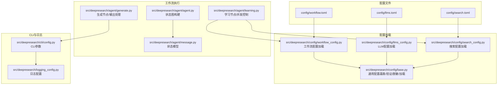
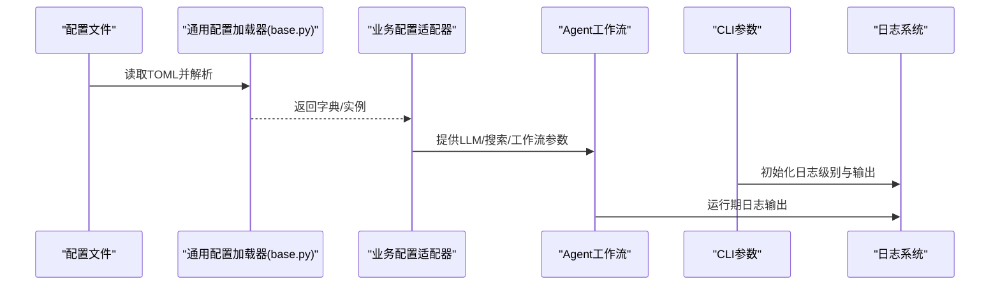
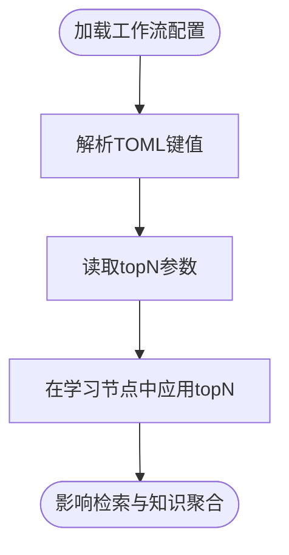
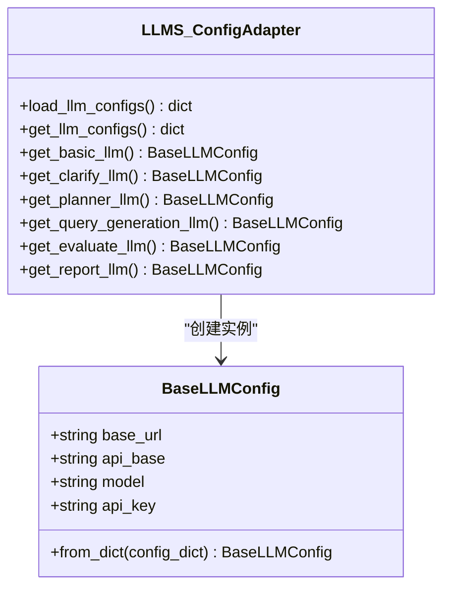
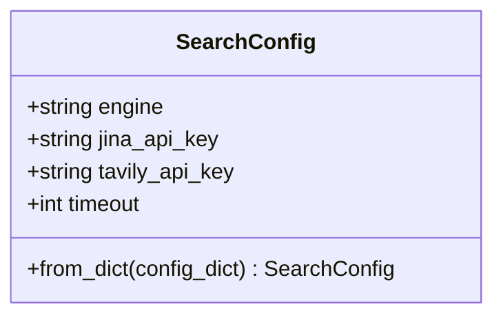
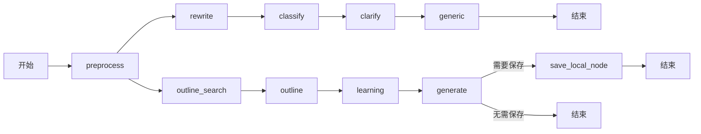
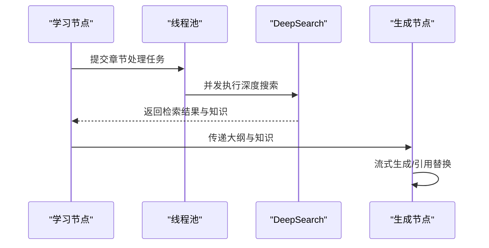
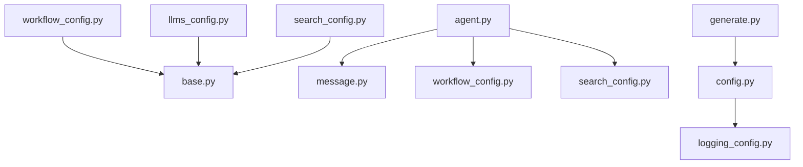

# 工作流配置管理

<cite>
**本文引用的文件**
- [workflow.toml](file://config/workflow.toml)
- [llms.toml](file://config/llms.toml)
- [search.toml](file://config/search.toml)
- [workflow_config.py](file://src/deepresearch/config/workflow_config.py)
- [base.py](file://src/deepresearch/config/base.py)
- [llms_config.py](file://src/deepresearch/config/llms_config.py)
- [search_config.py](file://src/deepresearch/config/search_config.py)
- [logging_config.py](file://src/deepresearch/logging_config.py)
- [agent.py](file://src/deepresearch/agent/agent.py)
- [message.py](file://src/deepresearch/agent/message.py)
- [learning.py](file://src/deepresearch/agent/learning.py)
- [generate.py](file://src/deepresearch/agent/generate.py)
- [config.py](file://src/deepresearch/cli/config.py)
</cite>

## 目录
1. [简介](#简介)
2. [项目结构](#项目结构)
3. [核心组件](#核心组件)
4. [架构总览](#架构总览)
5. [详细组件分析](#详细组件分析)
6. [依赖分析](#依赖分析)
7. [性能考虑](#性能考虑)
8. [故障排除指南](#故障排除指南)
9. [结论](#结论)
10. [附录](#附录)

## 简介
本文件面向DeepResearch工作流配置管理系统，系统性梳理工作流配置类的结构与参数定义，涵盖Agent节点配置、状态转换规则、执行参数设置；阐述性能优化参数（并发控制、内存管理、超时设置）；解释监控与日志配置选项（详细程度与输出格式）；说明容错机制、重试策略与错误处理；并提供不同应用场景下的配置模板与最佳实践、性能调优指南、资源监控与故障排除方法。

## 项目结构
- 配置文件位于config目录，采用TOML格式，分别定义工作流、大模型与搜索引擎参数。
- 配置加载与管理位于src/deepresearch/config，提供通用配置基类、验证器、敏感信息脱敏与多源合并能力。
- Agent工作流由langgraph状态图驱动，节点间通过条件边进行状态流转。
- CLI层提供运行期参数（日志级别、保存路径、超时、主题等），并与配置系统协同。

图表来源
- [workflow.toml:1-3](file://config/workflow.toml#L1-L3)
- [llms.toml:1-29](file://config/llms.toml#L1-L29)
- [search.toml:1-6](file://config/search.toml#L1-L6)
- [workflow_config.py:1-28](file://src/deepresearch/config/workflow_config.py#L1-L28)
- [base.py:190-371](file://src/deepresearch/config/base.py#L190-L371)
- [llms_config.py:46-86](file://src/deepresearch/config/llms_config.py#L46-L86)
- [search_config.py:56-82](file://src/deepresearch/config/search_config.py#L56-L82)
- [agent.py:19-45](file://src/deepresearch/agent/agent.py#L19-L45)
- [message.py:101-112](file://src/deepresearch/agent/message.py#L101-L112)
- [learning.py:15-94](file://src/deepresearch/agent/learning.py#L15-L94)
- [generate.py:114-160](file://src/deepresearch/agent/generate.py#L114-L160)
- [config.py:66-101](file://src/deepresearch/cli/config.py#L66-L101)
- [logging_config.py:15-67](file://src/deepresearch/logging_config.py#L15-L67)

章节来源
- [workflow.toml:1-3](file://config/workflow.toml#L1-L3)
- [llms.toml:1-29](file://config/llms.toml#L1-L29)
- [search.toml:1-6](file://config/search.toml#L1-L6)
- [workflow_config.py:1-28](file://src/deepresearch/config/workflow_config.py#L1-L28)
- [base.py:190-371](file://src/deepresearch/config/base.py#L190-L371)
- [llms_config.py:46-86](file://src/deepresearch/config/llms_config.py#L46-L86)
- [search_config.py:56-82](file://src/deepresearch/config/search_config.py#L56-L82)
- [agent.py:19-45](file://src/deepresearch/agent/agent.py#L19-L45)
- [message.py:101-112](file://src/deepresearch/agent/message.py#L101-L112)
- [learning.py:15-94](file://src/deepresearch/agent/learning.py#L15-L94)
- [generate.py:114-160](file://src/deepresearch/agent/generate.py#L114-L160)
- [config.py:66-101](file://src/deepresearch/cli/config.py#L66-L101)
- [logging_config.py:15-67](file://src/deepresearch/logging_config.py#L15-L67)

## 核心组件
- 工作流配置加载：提供工作流配置的加载与脱敏能力，当前包含搜索相关参数。
- LLM配置：集中管理各子任务（basic、clarify、planner、query_generation、evaluate、report）的大模型参数。
- 搜索配置：定义搜索引擎类型、超时与API密钥。
- 通用配置基类：提供字段验证、环境变量覆盖、文件加载、敏感信息脱敏、合并策略与缓存清理。
- Agent工作流：基于状态图的节点编排，包含预处理、改写、分类、澄清、泛化、大纲检索与生成等节点。
- CLI配置：运行期参数（日志级别、保存路径、超时、主题等），支持环境变量注入。
- 日志配置：统一的日志格式、级别与输出目标（控制台/文件）。

章节来源
- [workflow_config.py:7-28](file://src/deepresearch/config/workflow_config.py#L7-L28)
- [llms_config.py:46-115](file://src/deepresearch/config/llms_config.py#L46-L115)
- [search_config.py:56-82](file://src/deepresearch/config/search_config.py#L56-L82)
- [base.py:190-371](file://src/deepresearch/config/base.py#L190-L371)
- [agent.py:19-45](file://src/deepresearch/agent/agent.py#L19-L45)
- [config.py:15-101](file://src/deepresearch/cli/config.py#L15-L101)
- [logging_config.py:15-67](file://src/deepresearch/logging_config.py#L15-L67)

## 架构总览
工作流配置管理以“配置文件 + 通用配置加载器 + 业务配置适配器 + 执行引擎”分层设计：
- 配置文件层：定义参数键值。
- 通用配置层：提供加载、验证、脱敏、合并与缓存。
- 业务配置层：将通用配置映射为具体业务对象（LLM、搜索、工作流）。
- 执行层：Agent状态图按节点顺序与条件边执行，结合CLI参数与日志配置。

图表来源
- [base.py:479-589](file://src/deepresearch/config/base.py#L479-L589)
- [llms_config.py:46-86](file://src/deepresearch/config/llms_config.py#L46-L86)
- [search_config.py:56-82](file://src/deepresearch/config/search_config.py#L56-L82)
- [workflow_config.py:7-28](file://src/deepresearch/config/workflow_config.py#L7-L28)
- [agent.py:19-45](file://src/deepresearch/agent/agent.py#L19-L45)
- [config.py:66-101](file://src/deepresearch/cli/config.py#L66-L101)
- [logging_config.py:15-67](file://src/deepresearch/logging_config.py#L15-L67)

## 详细组件分析

### 工作流配置类与参数定义
- 当前工作流配置文件中定义了搜索相关参数，例如topN（每主题检索结果数量）。
- 工作流配置加载器提供加载与脱敏能力，便于在不暴露敏感信息的前提下查看配置。
- 在学习节点中，工作流配置被用于控制深度搜索阶段的检索条目数量，从而影响后续知识聚合与引用映射。

图表来源
- [workflow.toml:1-3](file://config/workflow.toml#L1-L3)
- [workflow_config.py:7-28](file://src/deepresearch/config/workflow_config.py#L7-L28)
- [learning.py:32-33](file://src/deepresearch/agent/learning.py#L32-L33)

章节来源
- [workflow.toml:1-3](file://config/workflow.toml#L1-L3)
- [workflow_config.py:7-28](file://src/deepresearch/config/workflow_config.py#L7-L28)
- [learning.py:32-33](file://src/deepresearch/agent/learning.py#L32-L33)

### LLM配置类与参数定义
- LLM配置类包含基础字段：base_url、api_base、model、api_key。
- 通过LLM配置适配器批量加载各任务的LLM参数，并提供按任务类型访问的方法。
- 支持从文件加载、环境变量覆盖与合并策略，确保运行期可灵活调整。

图表来源
- [llms_config.py:12-61](file://src/deepresearch/config/llms_config.py#L12-L61)
- [llms.toml:1-29](file://config/llms.toml#L1-L29)

章节来源
- [llms_config.py:12-115](file://src/deepresearch/config/llms_config.py#L12-L115)
- [llms.toml:1-29](file://config/llms.toml#L1-L29)

### 搜索配置类与参数定义
- 搜索配置类包含engine（引擎类型）、jina_api_key、tavily_api_key、timeout（秒）。
- 配置加载器校验必需字段并限制timeout范围，确保运行稳定性。
- 搜索配置作为学习节点的输入参数，决定检索行为与超时控制。

图表来源
- [search_config.py:12-53](file://src/deepresearch/config/search_config.py#L12-L53)
- [search.toml:1-6](file://config/search.toml#L1-L6)

章节来源
- [search_config.py:12-82](file://src/deepresearch/config/search_config.py#L12-L82)
- [search.toml:1-6](file://config/search.toml#L1-L6)

### Agent节点配置与状态转换规则
- Agent状态图定义了节点与边：从预处理开始，经改写、分类、澄清、泛化、大纲检索与生成，最终根据保存策略决定本地保存或结束。
- 条件边在生成节点后依据可选参数决定是否进入本地保存节点。
- 状态模型包含报告大纲、消息、主题、领域、逻辑、细节、输出、知识、最终报告与搜索ID等字段。

图表来源
- [agent.py:19-45](file://src/deepresearch/agent/agent.py#L19-L45)
- [message.py:101-112](file://src/deepresearch/agent/message.py#L101-L112)

章节来源
- [agent.py:19-45](file://src/deepresearch/agent/agent.py#L19-L45)
- [message.py:101-112](file://src/deepresearch/agent/message.py#L101-L112)

### 执行参数设置与并发控制
- 学习节点采用线程池并发处理各章节，最大并发数受章节数量与上限约束，避免过度占用LLM API。
- 生成节点支持流式输出，结合内容处理器逐步拼接与引用替换，提升交互体验。
- CLI参数提供运行期超时、保存路径、日志级别与主题等控制项。

图表来源
- [learning.py:63-82](file://src/deepresearch/agent/learning.py#L63-L82)
- [generate.py:72-111](file://src/deepresearch/agent/generate.py#L72-L111)
- [config.py:66-101](file://src/deepresearch/cli/config.py#L66-L101)

章节来源
- [learning.py:63-82](file://src/deepresearch/agent/learning.py#L63-L82)
- [generate.py:72-111](file://src/deepresearch/agent/generate.py#L72-L111)
- [config.py:66-101](file://src/deepresearch/cli/config.py#L66-L101)

### 监控与日志配置
- 日志系统支持控制台与文件双通道输出，可自定义格式与日期格式。
- CLI层提供日志级别、日志文件路径、主题等参数，便于在不同环境下调整输出详细程度。
- 建议在生产环境开启文件日志与更细粒度的日志级别，以便问题定位与审计。

章节来源
- [logging_config.py:15-67](file://src/deepresearch/logging_config.py#L15-L67)
- [config.py:15-28](file://src/deepresearch/cli/config.py#L15-L28)

### 容错机制、重试策略与错误处理
- 通用配置加载器提供错误类型与异常传播，便于在配置无效或缺失时快速失败。
- 搜索配置对timeout进行范围校验，防止极端超时导致资源浪费。
- 生成节点在保存本地报告时捕获异常并记录错误日志，避免中断整个流程。
- 建议在生产环境中增加重试策略（如指数退避）与熔断保护，以应对第三方服务不稳定的情况。

章节来源
- [base.py:15-25](file://src/deepresearch/config/base.py#L15-L25)
- [search_config.py:40-47](file://src/deepresearch/config/search_config.py#L40-L47)
- [generate.py:131-159](file://src/deepresearch/agent/generate.py#L131-L159)

## 依赖分析
- 配置文件依赖通用配置加载器，后者提供统一的加载、验证、脱敏与缓存机制。
- 业务配置适配器（LLM、搜索、工作流）依赖通用加载器与敏感键集合。
- Agent工作流依赖业务配置与CLI参数，同时通过日志系统输出运行状态。
- CLI配置与日志配置相互独立但共同影响运行期行为。

图表来源
- [workflow_config.py:4-5](file://src/deepresearch/config/workflow_config.py#L4-L5)
- [llms_config.py:7-8](file://src/deepresearch/config/llms_config.py#L7-L8)
- [search_config.py:7-8](file://src/deepresearch/config/search_config.py#L7-L8)
- [base.py:479-589](file://src/deepresearch/config/base.py#L479-L589)
- [agent.py:4-16](file://src/deepresearch/agent/agent.py#L4-L16)
- [message.py:9-16](file://src/deepresearch/agent/message.py#L9-L16)
- [generate.py:10-18](file://src/deepresearch/agent/generate.py#L10-L18)
- [config.py:10-12](file://src/deepresearch/cli/config.py#L10-L12)
- [logging_config.py:6-9](file://src/deepresearch/logging_config.py#L6-L9)

章节来源
- [workflow_config.py:4-5](file://src/deepresearch/config/workflow_config.py#L4-L5)
- [llms_config.py:7-8](file://src/deepresearch/config/llms_config.py#L7-L8)
- [search_config.py:7-8](file://src/deepresearch/config/search_config.py#L7-L8)
- [base.py:479-589](file://src/deepresearch/config/base.py#L479-L589)
- [agent.py:4-16](file://src/deepresearch/agent/agent.py#L4-L16)
- [message.py:9-16](file://src/deepresearch/agent/message.py#L9-L16)
- [generate.py:10-18](file://src/deepresearch/agent/generate.py#L10-L18)
- [config.py:10-12](file://src/deepresearch/cli/config.py#L10-L12)
- [logging_config.py:6-9](file://src/deepresearch/logging_config.py#L6-L9)

## 性能考虑
- 并发控制
  - 学习节点最大并发数受章节数量与上限约束，建议根据LLM API速率限制与本地资源情况调整。
  - 建议在高负载场景下降低并发上限，避免请求风暴。
- 内存管理
  - 大纲与知识聚合采用增量追加与引用映射，避免重复存储。
  - 生成节点使用缓冲区与流式处理，减少峰值内存占用。
- 超时设置
  - 搜索超时需在合理范围内（1~300秒），过短会导致检索不完整，过长会阻塞整体流程。
  - CLI层提供运行期超时参数，便于端到端控制。
- 输出与日志
  - 控制台与文件双通道输出，建议在生产环境启用文件日志，避免大量控制台输出影响性能。
  - 适当降低日志级别可减少I/O开销。

章节来源
- [learning.py:63-65](file://src/deepresearch/agent/learning.py#L63-L65)
- [generate.py:169-200](file://src/deepresearch/agent/generate.py#L169-L200)
- [search_config.py:40-47](file://src/deepresearch/config/search_config.py#L40-L47)
- [config.py:25-33](file://src/deepresearch/cli/config.py#L25-L33)
- [logging_config.py:33-54](file://src/deepresearch/logging_config.py#L33-L54)

## 故障排除指南
- 配置加载失败
  - 检查配置文件是否存在、格式是否正确、键名是否匹配。
  - 使用脱敏后的配置输出排查敏感信息是否被正确隐藏。
- 参数越界或类型错误
  - 搜索超时超出范围或非整数类型会触发验证错误，修正后重试。
- 生成保存失败
  - 检查保存路径权限与磁盘空间，关注异常日志中的错误信息。
- 并发过高导致响应慢
  - 降低学习节点并发上限或减少单次处理的章节数量。
- 日志过多或过少
  - 调整日志级别与输出目标，平衡可观测性与性能。

章节来源
- [base.py:15-25](file://src/deepresearch/config/base.py#L15-L25)
- [search_config.py:40-47](file://src/deepresearch/config/search_config.py#L40-L47)
- [generate.py:131-159](file://src/deepresearch/agent/generate.py#L131-L159)
- [learning.py:63-65](file://src/deepresearch/agent/learning.py#L63-L65)
- [logging_config.py:29-54](file://src/deepresearch/logging_config.py#L29-L54)

## 结论
本系统通过“配置文件 + 通用配置加载器 + 业务适配器 + 执行引擎”的分层设计，实现了工作流配置的可维护性与可扩展性。通过对并发、内存、超时与日志的精细化控制，可在不同场景下获得稳定且高效的运行表现。建议在生产环境中结合重试与熔断策略，进一步增强系统的鲁棒性。

## 附录

### 配置模板与最佳实践
- 工作流模板（workflow.toml）
  - 示例键：search.topN（建议根据LLM上下文长度与检索质量权衡设置）。
- LLM模板（llms.toml）
  - 建议为每个任务配置独立的模型与密钥，便于成本与质量分离。
- 搜索模板（search.toml）
  - engine选择：tavily或jina，按可用性与效果选择。
  - timeout建议：中小规模研究30~60秒，大规模研究60~120秒。
- CLI运行模板
  - 日志级别：开发环境DEBUG，生产环境INFO或WARNING。
  - 超时：根据任务复杂度设置，避免过短导致失败。
  - 主题：默认/最小化/彩色，按终端支持选择。

章节来源
- [workflow.toml:1-3](file://config/workflow.toml#L1-L3)
- [llms.toml:1-29](file://config/llms.toml#L1-L29)
- [search.toml:1-6](file://config/search.toml#L1-L6)
- [config.py:15-28](file://src/deepresearch/cli/config.py#L15-L28)