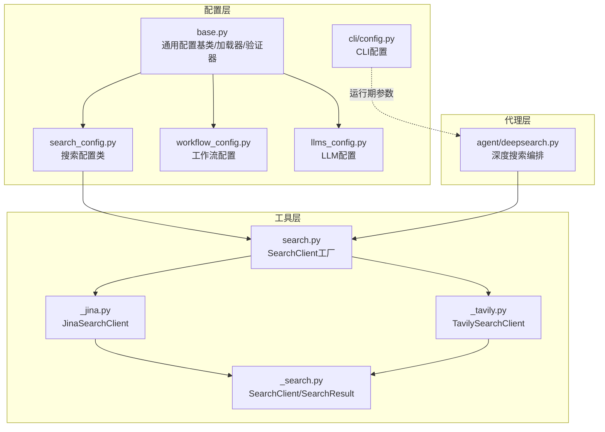
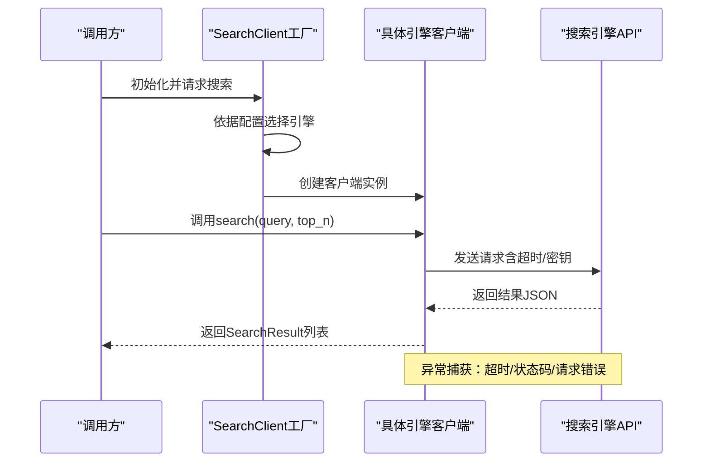
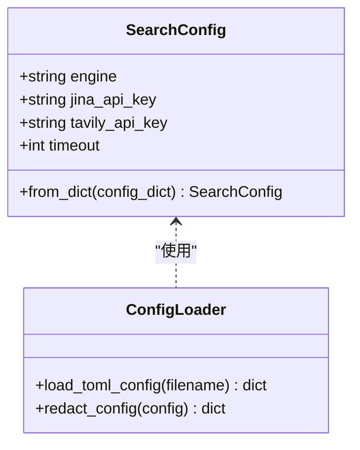
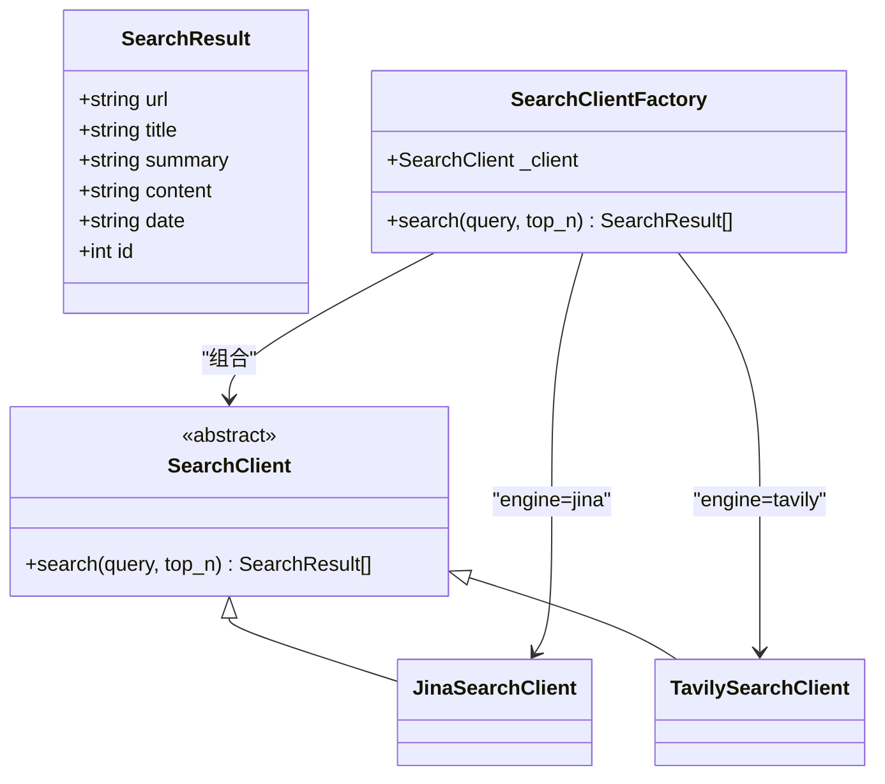
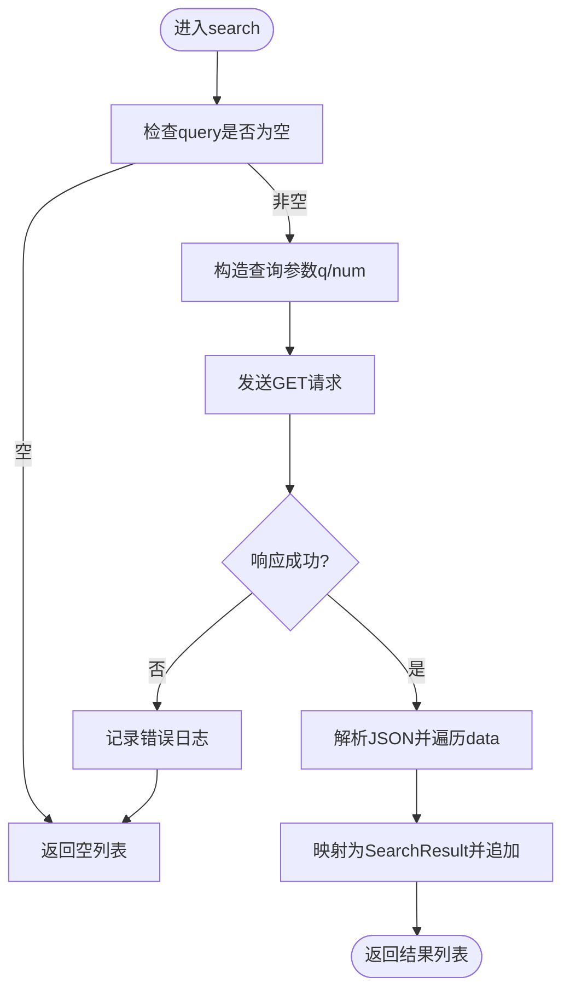
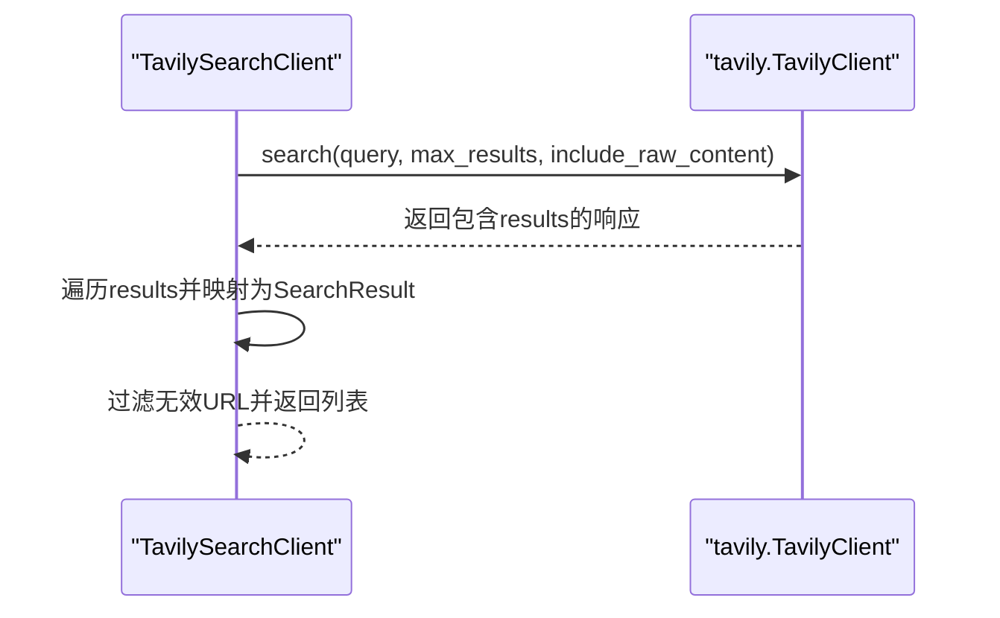
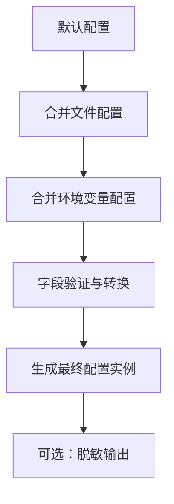
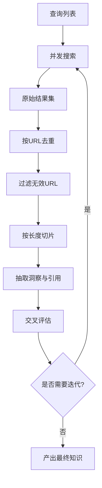
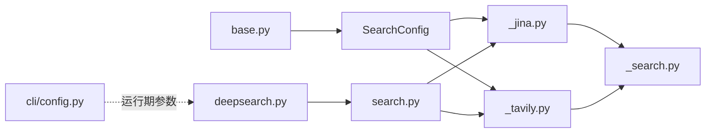

# 搜索配置管理

<cite>
**本文引用的文件**
- [search_config.py](file://src/deepresearch/config/search_config.py)
- [search.toml](file://config/search.toml)
- [_search.py](file://src/deepresearch/tools/_search.py)
- [_jina.py](file://src/deepresearch/tools/_jina.py)
- [_tavily.py](file://src/deepresearch/tools/_tavily.py)
- [search.py](file://src/deepresearch/tools/search.py)
- [base.py](file://src/deepresearch/config/base.py)
- [workflow_config.py](file://src/deepresearch/config/workflow_config.py)
- [llms_config.py](file://src/deepresearch/config/llms_config.py)
- [config.py](file://src/deepresearch/cli/config.py)
- [test_base.py](file://tests/unit/config/test_base.py)
- [test_config.py](file://tests/unit/cli/test_config.py)
- [deepsearch.py](file://src/deepresearch/agent/deepsearch.py)
- [README.md](file://README.md)
</cite>

## 目录
1. [简介](#简介)
2. [项目结构](#项目结构)
3. [核心组件](#核心组件)
4. [架构总览](#架构总览)
5. [组件详解](#组件详解)
6. [依赖关系分析](#依赖关系分析)
7. [性能考量](#性能考量)
8. [故障排查指南](#故障排查指南)
9. [结论](#结论)
10. [附录](#附录)

## 简介
本文件面向DeepResearch搜索配置管理系统，系统性阐述搜索配置类的设计与实现，覆盖搜索引擎选择（Jina、Tavily）、API密钥配置、搜索参数优化、结果处理与过滤、排序选项、频率限制、超时与重试策略、质量控制与去重、相关性评分配置，以及针对学术搜索、新闻聚合、技术文档检索等场景的最佳实践与性能调优建议。

## 项目结构
围绕“配置—客户端—工具—代理”的分层组织：
- 配置层：集中于config包，提供通用配置基类、加载器、验证器与敏感信息脱敏能力；具体配置类（搜索、工作流、LLM）在此基础上派生。
- 工具层：封装具体搜索引擎客户端（Jina、Tavily），统一对外接口SearchClient。
- 代理层：DeepSearch在高层编排中使用SearchClient进行多轮搜索、知识抽取与评估迭代。
- CLI层：提供命令行配置，含日志级别、保存路径、超时等运行期参数。

图表来源
- [search_config.py:12-82](file://src/deepresearch/config/search_config.py#L12-L82)
- [base.py:190-590](file://src/deepresearch/config/base.py#L190-L590)
- [_search.py:8-35](file://src/deepresearch/tools/_search.py#L8-L35)
- [_jina.py:15-92](file://src/deepresearch/tools/_jina.py#L15-L92)
- [_tavily.py:15-72](file://src/deepresearch/tools/_tavily.py#L15-L72)
- [search.py:12-46](file://src/deepresearch/tools/search.py#L12-L46)
- [deepsearch.py:55-489](file://src/deepresearch/agent/deepsearch.py#L55-L489)
- [config.py:15-101](file://src/deepresearch/cli/config.py#L15-L101)

章节来源
- [search_config.py:12-82](file://src/deepresearch/config/search_config.py#L12-L82)
- [base.py:190-590](file://src/deepresearch/config/base.py#L190-L590)
- [_search.py:8-35](file://src/deepresearch/tools/_search.py#L8-L35)
- [_jina.py:15-92](file://src/deepresearch/tools/_jina.py#L15-L92)
- [_tavily.py:15-72](file://src/deepresearch/tools/_tavily.py#L15-L72)
- [search.py:12-46](file://src/deepresearch/tools/search.py#L12-L46)
- [deepsearch.py:55-489](file://src/deepresearch/agent/deepsearch.py#L55-L489)
- [config.py:15-101](file://src/deepresearch/cli/config.py#L15-L101)

## 核心组件
- 搜索配置类：负责引擎选择、API密钥、超时等参数的加载与校验。
- 搜索客户端接口：统一的SearchClient抽象，屏蔽具体引擎差异。
- 引擎客户端：JinaSearchClient与TavilySearchClient分别对接HTTP API与SDK。
- 搜索工厂：根据配置动态选择具体客户端。
- 通用配置基类与加载器：提供多源覆盖（默认/文件/环境变量）、验证、脱敏、缓存与目录管理。
- CLI配置：提供运行期参数（如超时、日志级别、保存路径）的环境变量注入与范围约束。

章节来源
- [search_config.py:12-82](file://src/deepresearch/config/search_config.py#L12-L82)
- [_search.py:8-35](file://src/deepresearch/tools/_search.py#L8-L35)
- [_jina.py:15-92](file://src/deepresearch/tools/_jina.py#L15-L92)
- [_tavily.py:15-72](file://src/deepresearch/tools/_tavily.py#L15-L72)
- [search.py:12-46](file://src/deepresearch/tools/search.py#L12-L46)
- [base.py:190-590](file://src/deepresearch/config/base.py#L190-L590)
- [config.py:15-101](file://src/deepresearch/cli/config.py#L15-L101)

## 架构总览
下图展示从配置到搜索执行的关键交互流程，包括配置加载、工厂选择、客户端调用与错误处理。

图表来源
- [search.py:12-46](file://src/deepresearch/tools/search.py#L12-L46)
- [_jina.py:15-92](file://src/deepresearch/tools/_jina.py#L15-L92)
- [_tavily.py:15-72](file://src/deepresearch/tools/_tavily.py#L15-L72)

## 组件详解

### 搜索配置类设计与实现
- 字段与职责
  - engine：引擎选择（当前支持“jina”“tavily”）
  - jina_api_key/tavily_api_key：对应引擎的访问密钥
  - timeout：请求超时秒数，默认30，范围校验1–300
- 加载与校验
  - 从search.toml读取并要求存在[search]节
  - 必填字段校验与类型/范围校验
  - 提供脱敏配置输出
- 全局单例
  - 通过模块级变量暴露已加载配置，供其他模块直接使用

图表来源
- [search_config.py:12-82](file://src/deepresearch/config/search_config.py#L12-L82)
- [base.py:479-511](file://src/deepresearch/config/base.py#L479-L511)

章节来源
- [search_config.py:12-82](file://src/deepresearch/config/search_config.py#L12-L82)
- [search.toml:1-6](file://config/search.toml#L1-L6)
- [base.py:479-511](file://src/deepresearch/config/base.py#L479-L511)

### 搜索客户端接口与工厂
- 接口定义
  - SearchResult：统一承载url/title/summary/content/date/id等字段
  - SearchClient：抽象基类，定义search(query, top_n)规范
- 工厂模式
  - 根据SearchConfig.engine选择JinaSearchClient或TavilySearchClient
  - 对未知引擎抛出异常，确保配置一致性

图表来源
- [_search.py:8-35](file://src/deepresearch/tools/_search.py#L8-L35)
- [_jina.py:15-92](file://src/deepresearch/tools/_jina.py#L15-L92)
- [_tavily.py:15-72](file://src/deepresearch/tools/_tavily.py#L15-L72)
- [search.py:12-46](file://src/deepresearch/tools/search.py#L12-L46)

章节来源
- [_search.py:8-35](file://src/deepresearch/tools/_search.py#L8-L35)
- [search.py:12-46](file://src/deepresearch/tools/search.py#L12-L46)

### Jina搜索引擎客户端
- 关键行为
  - 请求头携带Authorization、Accept、X-Retain-Images、X-Timeout
  - 使用httpx.Timeout与请求参数num限制结果数量（1–20）
  - 异常处理：超时、HTTP状态码、网络错误、通用异常
- 结果映射
  - 从响应JSON提取url/title/description/content/publishedTime并封装为SearchResult

图表来源
- [_jina.py:28-79](file://src/deepresearch/tools/_jina.py#L28-L79)

章节来源
- [_jina.py:15-92](file://src/deepresearch/tools/_jina.py#L15-L92)

### Tavily搜索引擎客户端
- 关键行为
  - 使用tavily.TavilyClient，通过API密钥认证
  - 调用search接口，max_results限制在1–20范围内
  - include_raw_content=true以获取原始内容
- 结果映射
  - 从results数组映射title/url/content/raw_content等字段

图表来源
- [_tavily.py:21-60](file://src/deepresearch/tools/_tavily.py#L21-L60)

章节来源
- [_tavily.py:15-72](file://src/deepresearch/tools/_tavily.py#L15-L72)

### 通用配置基类与加载器
- 多源覆盖优先级：代码默认值 → 环境变量 → 配置文件 → 默认值
- 验证器体系：范围、选项、类型验证器，支持在字段元数据中声明
- 脱敏与敏感键：内置敏感键集合，支持动态增删
- 缓存与目录：LRU缓存TOML解析结果，支持自定义配置目录
- CLI配置：提供运行期参数（如超时、日志级别、保存路径）的环境变量注入与范围约束

图表来源
- [base.py:536-590](file://src/deepresearch/config/base.py#L536-L590)
- [config.py:15-101](file://src/deepresearch/cli/config.py#L15-L101)

章节来源
- [base.py:190-590](file://src/deepresearch/config/base.py#L190-L590)
- [config.py:15-101](file://src/deepresearch/cli/config.py#L15-L101)

### 搜索结果处理、过滤与排序
- 去重与过滤
  - DeepSearch在高层按URL集合去重，避免重复学习与评估
  - 客户端侧过滤无效URL（空URL跳过）
- 排序与截断
  - 客户端内部对top_n进行1–20范围约束
  - 代理层按内容长度分片抽取，避免LLM输入溢出
- 相关性与质量
  - 通过LLM提示词引导抽取高质量洞察与引用片段
  - 评估指标（完整性、新鲜度、多元性）驱动迭代

图表来源
- [deepsearch.py:209-239](file://src/deepresearch/agent/deepsearch.py#L209-L239)
- [_jina.py:44-70](file://src/deepresearch/tools/_jina.py#L44-L70)
- [_tavily.py:37-55](file://src/deepresearch/tools/_tavily.py#L37-L55)

章节来源
- [deepsearch.py:209-239](file://src/deepresearch/agent/deepsearch.py#L209-L239)
- [_jina.py:44-70](file://src/deepresearch/tools/_jina.py#L44-L70)
- [_tavily.py:37-55](file://src/deepresearch/tools/_tavily.py#L37-L55)

## 依赖关系分析
- 配置依赖
  - SearchConfig依赖通用配置加载器与脱敏工具
  - CLI配置独立于搜索配置，但可通过环境变量影响运行期行为
- 客户端依赖
  - JinaSearchClient依赖SearchConfig与httpx
  - TavilySearchClient依赖SearchConfig与tavily SDK
- 代理依赖
  - DeepSearch依赖SearchClient工厂与LLM服务，形成“搜索—抽取—评估—迭代”的闭环

图表来源
- [search_config.py:56-82](file://src/deepresearch/config/search_config.py#L56-L82)
- [search.py:12-46](file://src/deepresearch/tools/search.py#L12-L46)
- [_jina.py:9-12](file://src/deepresearch/tools/_jina.py#L9-L12)
- [_tavily.py:9-12](file://src/deepresearch/tools/_tavily.py#L9-L12)
- [deepsearch.py:65-66](file://src/deepresearch/agent/deepsearch.py#L65-L66)
- [base.py:479-511](file://src/deepresearch/config/base.py#L479-L511)
- [config.py:15-101](file://src/deepresearch/cli/config.py#L15-L101)

章节来源
- [search_config.py:56-82](file://src/deepresearch/config/search_config.py#L56-L82)
- [search.py:12-46](file://src/deepresearch/tools/search.py#L12-L46)
- [_jina.py:9-12](file://src/deepresearch/tools/_jina.py#L9-L12)
- [_tavily.py:9-12](file://src/deepresearch/tools/_tavily.py#L9-L12)
- [deepsearch.py:65-66](file://src/deepresearch/agent/deepsearch.py#L65-L66)
- [base.py:479-511](file://src/deepresearch/config/base.py#L479-L511)
- [config.py:15-101](file://src/deepresearch/cli/config.py#L15-L101)

## 性能考量
- 并发与吞吐
  - 代理层使用线程池并发执行多个查询，最大并发不超过查询数量与5的较小值，降低总体延迟
- 超时与重试
  - 客户端使用统一超时（来自SearchConfig.timeout），Jina客户端显式设置httpx.Timeout
  - 当前实现未内置自动重试逻辑，建议结合业务场景在上层增加指数退避重试
- 结果截断与内存
  - 客户端对top_n进行上限控制，代理层按内容长度切片，避免LLM输入过大
- 配置加载缓存
  - 通用配置加载器对TOML解析结果使用LRU缓存，减少频繁IO开销

章节来源
- [deepsearch.py:209-239](file://src/deepresearch/agent/deepsearch.py#L209-L239)
- [_jina.py:26](file://src/deepresearch/tools/_jina.py#L26)
- [base.py:459-471](file://src/deepresearch/config/base.py#L459-L471)

## 故障排查指南
- 配置问题
  - 缺少[search]节或缺失engine字段：加载时抛出异常
  - timeout不在1–300范围：校验失败
  - API密钥错误：Jina/Tavily返回HTTP错误或认证失败
- 网络与超时
  - Jina客户端捕获超时/HTTP状态码/请求错误并记录日志
  - 建议适当提高timeout或在网络稳定环境下重试
- 结果为空
  - query为空或过滤后为空：检查输入与URL有效性
  - 引擎返回空结果：调整关键词或增大top_n（受1–20限制）
- 运行期参数
  - CLI配置对max_depth/max_history/timeout等参数进行范围约束，异常输入会被修正

章节来源
- [search_config.py:35-53](file://src/deepresearch/config/search_config.py#L35-L53)
- [_jina.py:71-78](file://src/deepresearch/tools/_jina.py#L71-L78)
- [test_config.py:45-79](file://tests/unit/cli/test_config.py#L45-L79)

## 结论
本系统通过“配置—工厂—客户端—代理”的清晰分层，实现了对Jina与Tavily两大搜索引擎的统一接入与扩展。SearchConfig提供简洁可靠的参数入口，通用配置基类保障了多源覆盖、验证与脱敏能力。代理层在高层通过并发搜索、内容切片与交叉评估，构建了稳健的深度研究流程。建议在生产环境中结合业务场景补充重试与限速策略，并持续监控引擎可用性与成本。

## 附录

### 配置最佳实践（按场景）
- 学术搜索
  - 引擎：优先Tavily（更贴近学术语料）
  - 参数：top_n适度提高（受1–20限制），timeout视网络状况提升
  - 过滤：保留高权威站点（可在上游URL白名单策略中实现）
- 新闻聚合
  - 引擎：Jina（速度快，适合热点追踪）
  - 参数：top_n适中，timeout偏小以保证时效性
  - 去重：严格按URL去重，关注发布时间字段
- 技术文档检索
  - 引擎：任选，建议结合Tavily的raw_content能力
  - 参数：增大top_n，启用include_raw_content
  - 内容切片：保持LLM输入在合理长度内

### 配置性能调优要点
- 调整timeout：平衡响应时间与成功率
- 控制top_n：避免超出引擎限制与LLM输入上限
- 并发度：根据CPU/网络资源设定最大并发
- 缓存与目录：合理设置配置目录与缓存策略，减少IO

### 相关文件索引
- 配置文件示例：[search.toml:1-6](file://config/search.toml#L1-L6)
- 搜索配置类：[search_config.py:12-82](file://src/deepresearch/config/search_config.py#L12-L82)
- 通用配置基类：[base.py:190-590](file://src/deepresearch/config/base.py#L190-L590)
- 搜索客户端接口：[_search.py:8-35](file://src/deepresearch/tools/_search.py#L8-L35)
- Jina客户端：[_jina.py:15-92](file://src/deepresearch/tools/_jina.py#L15-L92)
- Tavily客户端：[_tavily.py:15-72](file://src/deepresearch/tools/_tavily.py#L15-L72)
- 搜索工厂：[search.py:12-46](file://src/deepresearch/tools/search.py#L12-L46)
- 代理编排：[deepsearch.py:55-489](file://src/deepresearch/agent/deepsearch.py#L55-L489)
- CLI配置：[config.py:15-101](file://src/deepresearch/cli/config.py#L15-L101)
- 单测参考：[test_base.py:1-546](file://tests/unit/config/test_base.py#L1-L546)，[test_config.py:1-175](file://tests/unit/cli/test_config.py#L1-L175)