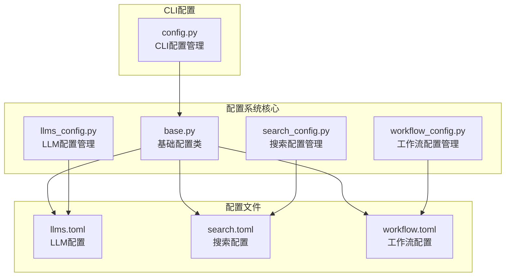
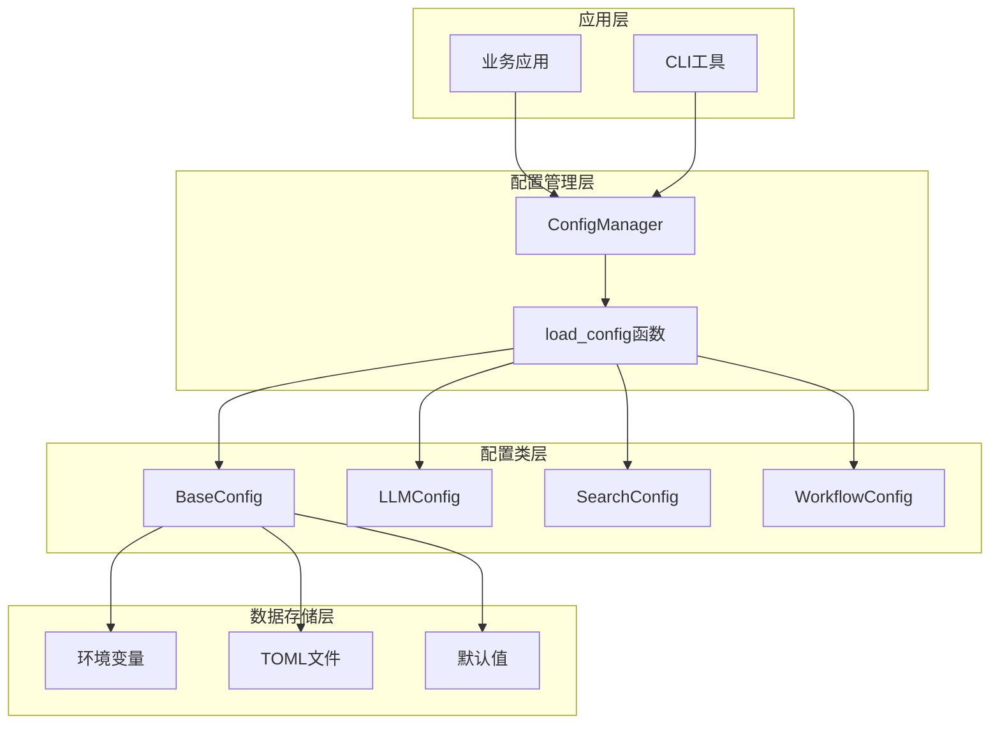
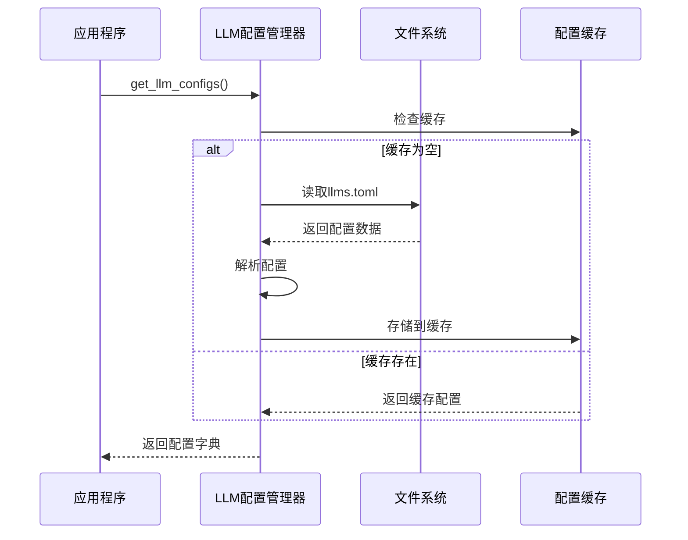
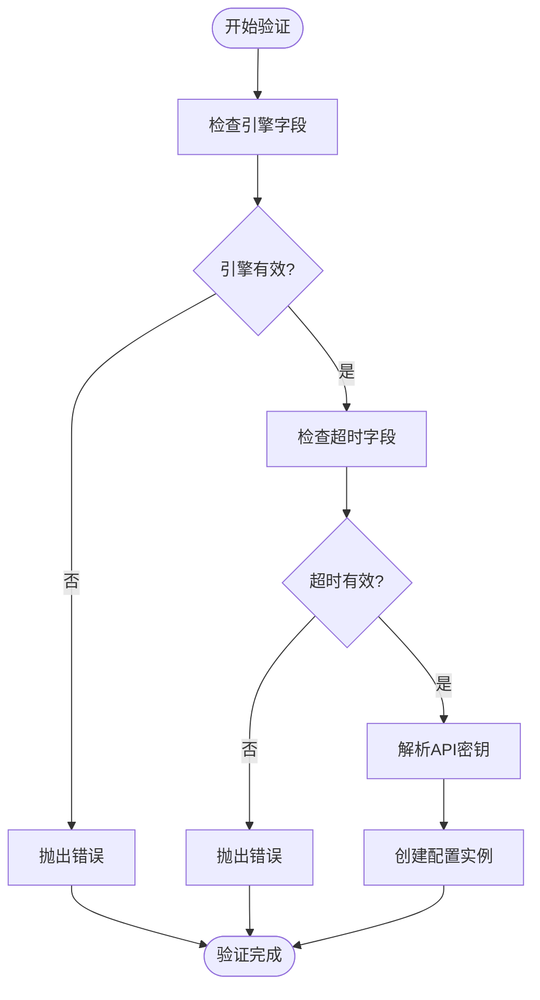
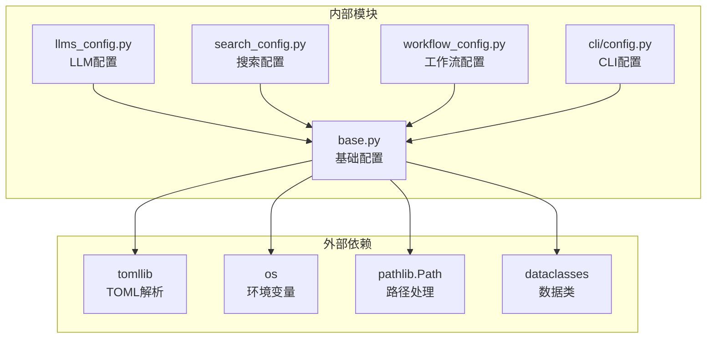

# 配置管理系统

<cite>
**本文档引用的文件**
- [base.py](file://src/deepresearch/config/base.py)
- [llms_config.py](file://src/deepresearch/config/llms_config.py)
- [search_config.py](file://src/deepresearch/config/search_config.py)
- [workflow_config.py](file://src/deepresearch/config/workflow_config.py)
- [llms.toml](file://config/llms.toml)
- [search.toml](file://config/search.toml)
- [workflow.toml](file://config/workflow.toml)
- [__init__.py](file://src/deepresearch/config/__init__.py)
- [test_base.py](file://tests/unit/config/test_base.py)
- [test_config.py](file://tests/unit/cli/test_config.py)
- [config.py](file://src/deepresearch/cli/config.py)
</cite>

## 目录
1. [简介](#简介)
2. [项目结构](#项目结构)
3. [核心组件](#核心组件)
4. [架构概览](#架构概览)
5. [详细组件分析](#详细组件分析)
6. [依赖关系分析](#依赖关系分析)
7. [性能考虑](#性能考虑)
8. [故障排除指南](#故障排除指南)
9. [结论](#结论)
10. [附录](#附录)

## 简介

DeepResearch配置管理系统是一个基于Python的数据类配置框架，提供了统一的配置管理功能。该系统支持多层级配置覆盖（环境变量 > 配置文件 > 默认值）、配置验证、敏感信息脱敏和动态配置目录等功能。系统采用TOML格式配置文件，支持多种大模型提供商和API密钥管理，以及灵活的搜索配置和工作流配置管理。

## 项目结构

配置管理系统位于`src/deepresearch/config/`目录下，包含以下核心文件：



**图表来源**
- [base.py:1-590](file://src/deepresearch/config/base.py#L1-L590)
- [llms_config.py:1-115](file://src/deepresearch/config/llms_config.py#L1-L115)
- [search_config.py:1-82](file://src/deepresearch/config/search_config.py#L1-L82)
- [workflow_config.py:1-28](file://src/deepresearch/config/workflow_config.py#L1-L28)

**章节来源**
- [base.py:1-590](file://src/deepresearch/config/base.py#L1-L590)
- [__init__.py:1-75](file://src/deepresearch/config/__init__.py#L1-L75)

## 核心组件

### BaseConfig基础配置类

BaseConfig是整个配置系统的核心，提供了统一的配置管理功能。它支持以下关键特性：

#### 配置继承机制
- 继承自`dataclasses.dataclass`，自动提供字段访问和序列化功能
- 支持`__post_init__`钩子进行初始化后验证
- 提供`merge`方法实现配置合并

#### 验证机制
- 内置多种验证器：范围验证器、选项验证器、类型验证器
- 支持自定义验证器扩展
- 验证错误通过`ValidationError`异常抛出

#### 默认值处理
- 支持默认值和工厂函数
- 自动处理环境变量映射
- 提供配置字典转换功能

**章节来源**
- [base.py:190-371](file://src/deepresearch/config/base.py#L190-L371)
- [base.py:65-150](file://src/deepresearch/config/base.py#L65-L150)

### ConfigManager配置管理器

ConfigManager提供统一的配置加载和管理接口：

- 注册和加载配置
- 动态配置目录管理
- 配置缓存机制
- 支持配置重新加载

**章节来源**
- [base.py:373-456](file://src/deepresearch/config/base.py#L373-L456)

## 架构概览

配置系统的整体架构采用分层设计：



**图表来源**
- [base.py:536-590](file://src/deepresearch/config/base.py#L536-L590)
- [config.py:66-101](file://src/deepresearch/cli/config.py#L66-L101)

## 详细组件分析

### LLM配置管理

LLM配置管理支持多种大模型提供商和API密钥管理：

#### 配置结构
- `BaseLLMConfig`: 基础LLM配置类
- 支持多个预定义的LLM配置（basic、clarify、planner等）
- 每个配置包含base_url、api_base、model、api_key字段

#### 配置加载流程


**图表来源**
- [llms_config.py:80-85](file://src/deepresearch/config/llms_config.py#L80-L85)
- [llms_config.py:46-61](file://src/deepresearch/config/llms_config.py#L46-L61)

#### 配置文件格式
```toml
[basic]
api_base = "https://maas-api.cn-huabei-1.xf-yun.com/v1"
model = "xdeepseekv31"
api_key = "sk-xxxxxxx16E165Bd"

[clarify]
api_base = "https://maas-api.cn-huabei-1.xf-yun.com/v1"
model = "xdeepseekv31"
api_key = "sk-xxxxxxx16E165Bd"

[planner]
api_base = "https://maas-api.cn-huabei-1.xf-yun.com/v1"
model = "xdeepseekr1"
api_key = "sk-xxxxxxx16E165Bd"
```

**章节来源**
- [llms_config.py:12-44](file://src/deepresearch/config/llms_config.py#L12-L44)
- [llms.toml:1-29](file://config/llms.toml#L1-L29)

### 搜索配置管理

搜索配置管理支持多种搜索引擎选择和参数配置：

#### 配置结构
- `SearchConfig`: 搜索引擎配置类
- 支持引擎选择：jina、tavily
- 包含超时时间、API密钥等参数

#### 配置验证逻辑


**图表来源**
- [search_config.py:21-53](file://src/deepresearch/config/search_config.py#L21-L53)

#### 配置文件格式
```toml
[search]
# 搜索引擎（支持"jina"或"tavily"）
engine = "tavily"
timeout = 30
jina_api_key = "jina_xxxxxxxxx-RLKa8AVEHppbFJ"
tavily_api_key = "tvly-xxxxxxxxx-l2N15UuLUq104H8X"
```

**章节来源**
- [search_config.py:12-53](file://src/deepresearch/config/search_config.py#L12-L53)
- [search.toml:1-6](file://config/search.toml#L1-L6)

### 工作流配置管理

工作流配置管理提供灵活的参数调节和性能优化选项：

#### 配置结构
- 简单的键值对配置
- 支持topN等参数设置
- 无需复杂的验证逻辑

#### 配置文件格式
```toml
[search]
topN = 5
```

**章节来源**
- [workflow_config.py:7-27](file://src/deepresearch/config/workflow_config.py#L7-L27)
- [workflow.toml:1-3](file://config/workflow.toml#L1-L3)

### CLI配置管理

CLI配置管理提供命令行界面的配置支持：

#### 配置结构
- `CLIConfig`: CLI配置类
- 支持冻结数据类（frozen=True）
- 内置范围验证和边界处理

#### 配置验证
- `max_depth`: 1-10范围限制
- `max_history`: 10-1000范围限制  
- `timeout`: 30-3600范围限制
- 日志级别使用枚举验证

**章节来源**
- [config.py:15-50](file://src/deepresearch/cli/config.py#L15-L50)
- [test_config.py:45-80](file://tests/unit/cli/test_config.py#L45-L80)

## 依赖关系分析

配置系统的依赖关系清晰且模块化：



**图表来源**
- [base.py:4-12](file://src/deepresearch/config/base.py#L4-L12)
- [llms_config.py:7](file://src/deepresearch/config/llms_config.py#L7)

**章节来源**
- [base.py:1-590](file://src/deepresearch/config/base.py#L1-L590)

## 性能考虑

配置系统在性能方面采用了多项优化措施：

### 缓存机制
- 使用`@lru_cache`装饰器缓存TOML文件解析结果
- 配置管理器缓存已加载的配置实例
- 支持动态清理缓存以适应配置文件变化

### 内存优化
- 配置字典深拷贝避免意外修改
- 敏感信息脱敏处理减少内存占用
- 惰性加载策略（如LLM配置缓存）

### 并发安全
- 配置管理器使用线程安全的数据结构
- 配置加载过程避免竞态条件
- 支持配置重新加载而不影响其他组件

**章节来源**
- [base.py:459-471](file://src/deepresearch/config/base.py#L459-L471)
- [base.py:513-515](file://src/deepresearch/config/base.py#L513-L515)

## 故障排除指南

### 常见配置错误

#### 配置文件格式错误
- **症状**: `ConfigError: 配置文件解析失败`
- **原因**: TOML文件语法错误或格式不正确
- **解决方案**: 检查TOML文件语法，确保正确的键值对格式

#### 环境变量类型错误
- **症状**: `ValidationError: 字段 'xxx' 必须是 xxx 类型`
- **原因**: 环境变量值与期望类型不匹配
- **解决方案**: 确保环境变量值符合预期类型（如整数、布尔值）

#### 配置文件缺失
- **症状**: `FileNotFoundError: [Errno 2] No such file or directory`
- **原因**: 配置文件路径不正确或文件不存在
- **解决方案**: 检查配置文件路径，确认文件存在且可读

### 调试技巧

#### 启用详细日志
- 使用`get_redacted_*_configs()`函数查看脱敏后的配置
- 利用`to_dict(redact=True)`方法检查敏感信息处理
- 通过单元测试验证配置加载逻辑

#### 配置优先级验证
- 通过设置不同层级的配置验证优先级
- 使用`load_config()`函数测试配置合并行为
- 检查环境变量前缀配置

**章节来源**
- [base.py:15-25](file://src/deepresearch/config/base.py#L15-L25)
- [test_base.py:272-284](file://tests/unit/config/test_base.py#L272-L284)

## 结论

DeepResearch配置管理系统提供了一个完整、灵活且高性能的配置管理解决方案。系统的主要优势包括：

1. **多层级配置覆盖**: 支持环境变量、配置文件和默认值的灵活组合
2. **强类型验证**: 内置多种验证器确保配置的有效性和一致性
3. **安全设计**: 敏感信息自动脱敏，支持动态敏感键管理
4. **模块化架构**: 清晰的组件分离便于维护和扩展
5. **性能优化**: 缓存机制和惰性加载提升系统响应速度

该系统为DeepResearch项目提供了可靠的配置管理基础设施，支持多种应用场景和部署需求。

## 附录

### 配置优先级规则

配置系统遵循以下优先级顺序（从高到低）：
1. **代码传入的参数** - 最高优先级
2. **环境变量** - 次高优先级  
3. **配置文件** - 中等优先级
4. **默认值** - 最低优先级

### 环境变量支持

系统支持以下环境变量前缀：
- `DEEPRESEARCH_` - 默认前缀
- 可通过`env_prefix`参数自定义
- 支持布尔值、整数和字符串类型的自动解析

### 配置文件格式规范

- 使用TOML格式
- 支持嵌套表结构
- 字段名称区分大小写
- 建议使用UTF-8编码