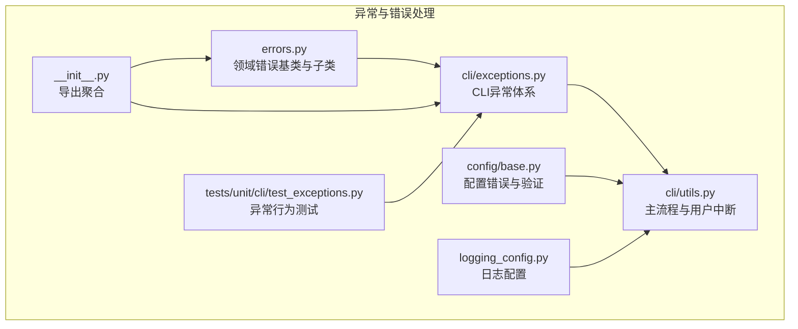
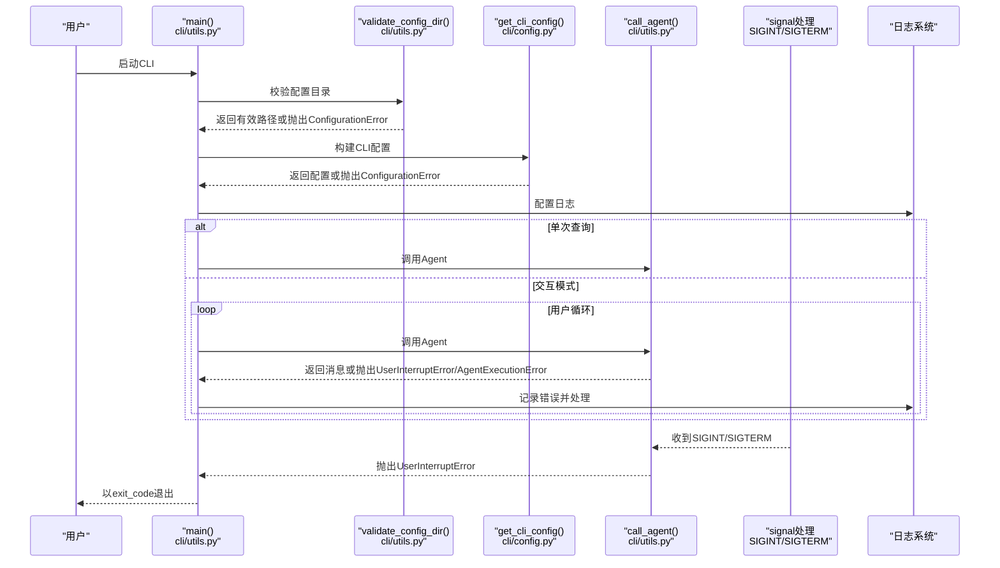
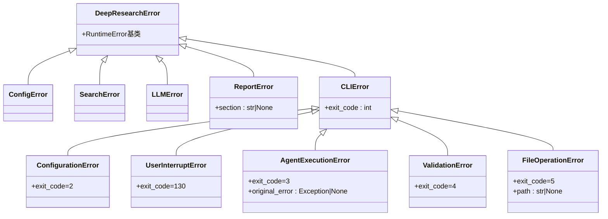
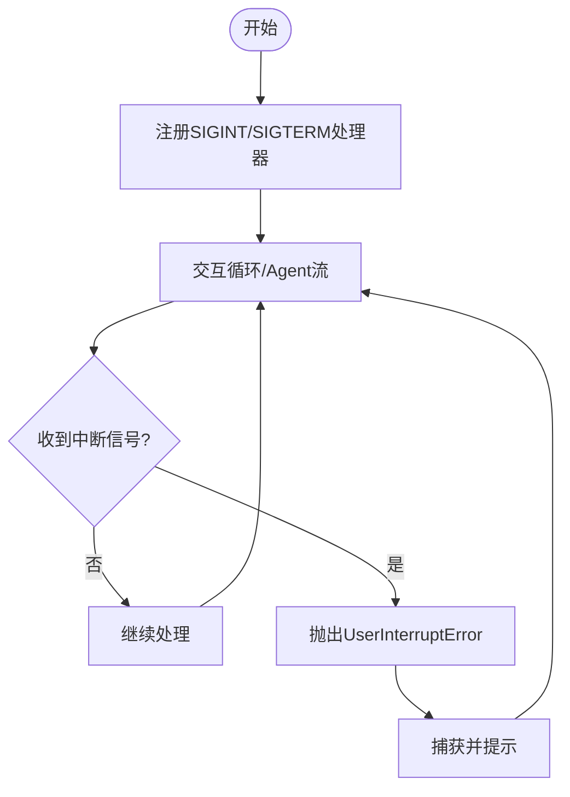
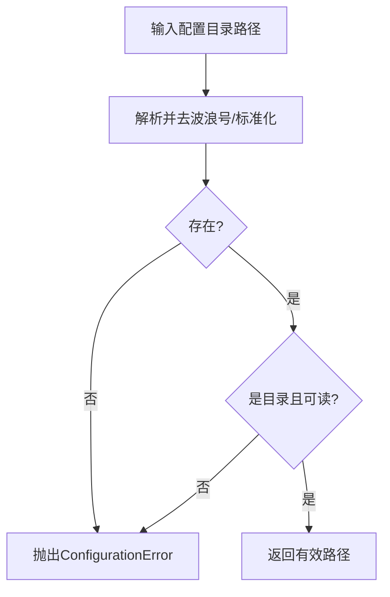
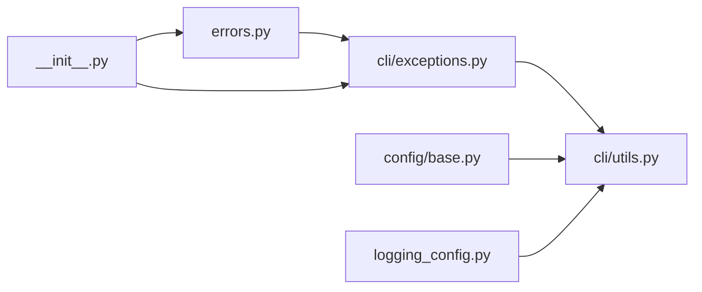

# 错误处理与异常管理

<cite>
**本文引用的文件**
- [errors.py](file://src/deepresearch/errors.py)
- [exceptions.py](file://src/deepresearch/cli/exceptions.py)
- [utils.py](file://src/deepresearch/cli/utils.py)
- [base.py](file://src/deepresearch/config/base.py)
- [__init__.py](file://src/deepresearch/__init__.py)
- [logging_config.py](file://src/deepresearch/logging_config.py)
- [test_exceptions.py](file://tests/unit/cli/test_exceptions.py)
</cite>

## 目录
1. [简介](#简介)
2. [项目结构](#项目结构)
3. [核心组件](#核心组件)
4. [架构总览](#架构总览)
5. [详细组件分析](#详细组件分析)
6. [依赖分析](#依赖分析)
7. [性能考虑](#性能考虑)
8. [故障排查指南](#故障排查指南)
9. [结论](#结论)
10. [附录](#附录)

## 简介
本文件系统化梳理 DeepResearch 的错误处理与异常管理体系，涵盖异常层次结构设计、错误分类与处理策略、用户中断机制、配置错误检测与报告、错误恢复与重试思路、降级处理方案，以及扩展自定义异常类型的开发指南。目标是帮助开发者在不深入源码的情况下，也能快速理解并正确使用异常体系。

## 项目结构
异常与错误处理相关的关键位置如下：
- 核心异常基类与领域错误：src/deepresearch/errors.py
- CLI 异常体系：src/deepresearch/cli/exceptions.py
- CLI 主流程与用户中断处理：src/deepresearch/cli/utils.py
- 配置错误与验证：src/deepresearch/config/base.py
- 日志配置与统一记录：src/deepresearch/logging_config.py
- 导出与聚合：src/deepresearch/__init__.py
- 单元测试验证异常行为：tests/unit/cli/test_exceptions.py

**图表来源**
- [errors.py:1-26](file://src/deepresearch/errors.py#L1-L26)
- [exceptions.py:1-58](file://src/deepresearch/cli/exceptions.py#L1-L58)
- [utils.py:1-575](file://src/deepresearch/cli/utils.py#L1-L575)
- [base.py:1-590](file://src/deepresearch/config/base.py#L1-L590)
- [logging_config.py:1-67](file://src/deepresearch/logging_config.py#L1-L67)
- [__init__.py:1-30](file://src/deepresearch/__init__.py#L1-L30)
- [test_exceptions.py:1-168](file://tests/unit/cli/test_exceptions.py#L1-L168)

**章节来源**
- [errors.py:1-26](file://src/deepresearch/errors.py#L1-L26)
- [exceptions.py:1-58](file://src/deepresearch/cli/exceptions.py#L1-L58)
- [utils.py:1-575](file://src/deepresearch/cli/utils.py#L1-L575)
- [base.py:1-590](file://src/deepresearch/config/base.py#L1-L590)
- [logging_config.py:1-67](file://src/deepresearch/logging_config.py#L1-L67)
- [__init__.py:1-30](file://src/deepresearch/__init__.py#L1-L30)
- [test_exceptions.py:1-168](file://tests/unit/cli/test_exceptions.py#L1-L168)

## 核心组件
- 领域错误基类与分类
  - DeepResearchError：项目通用运行时错误基类
  - ConfigError：配置相关错误
  - SearchError：搜索相关错误
  - LLMError：大模型相关错误
  - ReportError：报告生成相关错误，支持附加 section 信息
- CLI 错误体系
  - CLIError：CLI 层错误基类，携带 exit_code
  - ConfigurationError：配置错误（exit_code=2）
  - UserInterruptError：用户中断（exit_code=130）
  - AgentExecutionError：Agent 执行错误（exit_code=3），可携带 original_error
  - ValidationError：输入验证错误（exit_code=4）
  - FileOperationError：文件操作错误（exit_code=5），可携带 path
- 配置错误与验证
  - ConfigError/ValidationError：配置加载与验证错误
  - 支持范围、选项、类型等验证器
- 日志与统一记录
  - configure_logging/get_logger：统一日志配置与获取

**章节来源**
- [errors.py:4-25](file://src/deepresearch/errors.py#L4-L25)
- [exceptions.py:13-57](file://src/deepresearch/cli/exceptions.py#L13-L57)
- [base.py:15-149](file://src/deepresearch/config/base.py#L15-L149)
- [logging_config.py:15-67](file://src/deepresearch/logging_config.py#L15-L67)

## 架构总览
异常处理在 CLI 主流程中的流转如下：

**图表来源**
- [utils.py:485-575](file://src/deepresearch/cli/utils.py#L485-L575)
- [utils.py:41-67](file://src/deepresearch/cli/utils.py#L41-L67)
- [utils.py:106-193](file://src/deepresearch/cli/utils.py#L106-L193)
- [utils.py:70-79](file://src/deepresearch/cli/utils.py#L70-L79)

**章节来源**
- [utils.py:485-575](file://src/deepresearch/cli/utils.py#L485-L575)
- [utils.py:41-67](file://src/deepresearch/cli/utils.py#L41-L67)
- [utils.py:106-193](file://src/deepresearch/cli/utils.py#L106-L193)
- [utils.py:70-79](file://src/deepresearch/cli/utils.py#L70-L79)

## 详细组件分析

### 异常层次结构与分类
- 设计原则
  - 分层清晰：领域错误（errors.py）与 CLI 错误（cli/exceptions.py）分离
  - 语义明确：每类异常对应特定错误域，便于定位与处理
  - 可扩展：通过继承实现新的异常类型，保持一致的接口与退出码策略
- 关键类关系

**图表来源**
- [errors.py:4-25](file://src/deepresearch/errors.py#L4-L25)
- [exceptions.py:13-57](file://src/deepresearch/cli/exceptions.py#L13-L57)

**章节来源**
- [errors.py:4-25](file://src/deepresearch/errors.py#L4-L25)
- [exceptions.py:13-57](file://src/deepresearch/cli/exceptions.py#L13-L57)
- [test_exceptions.py:123-168](file://tests/unit/cli/test_exceptions.py#L123-L168)

### 错误分类与处理策略
- 网络/外部服务错误
  - 当前未见专门的网络错误异常类；建议在调用外部服务（如 LLM、搜索）失败时抛出 LLMError 或 SearchError，并在外层捕获后进行降级或重试
- 配置错误
  - 使用 ConfigurationError 报告配置缺失、不可读、路径无效等问题
  - 在 CLI 主流程中对配置目录与配置加载进行集中校验，保证启动阶段即发现配置问题
- 模型错误
  - 使用 LLMError 表达模型调用失败、响应格式异常等
  - 建议在调用链路中捕获并转换为 LLMError，同时保留原始异常以便调试
- 用户中断
  - 使用 UserInterruptError 表达 Ctrl+C 或系统终止信号导致的中断
  - CLI 主流程对中断进行捕获并优雅退出，避免资源泄漏

**章节来源**
- [exceptions.py:21-33](file://src/deepresearch/cli/exceptions.py#L21-L33)
- [utils.py:41-67](file://src/deepresearch/cli/utils.py#L41-L67)
- [utils.py:147-151](file://src/deepresearch/cli/utils.py#L147-L151)
- [utils.py:183-185](file://src/deepresearch/cli/utils.py#L183-L185)

### 用户中断处理机制
- 信号捕获
  - 注册 SIGINT/SIGTERM 处理器，设置全局标志位并在下一次 Agent 流程检查点抛出 UserInterruptError
- 交互式流程中的中断
  - 在 call_agent 中定期检查中断标志，遇到中断立即抛出 UserInterruptError
  - 交互模式中捕获 UserInterruptError 并提示“操作已中断”，继续等待用户输入
- 退出码
  - UserInterruptError 的 exit_code=130，CLI 主流程在 Keyboard 中断时也返回 130

**图表来源**
- [utils.py:70-79](file://src/deepresearch/cli/utils.py#L70-L79)
- [utils.py:163-165](file://src/deepresearch/cli/utils.py#L163-L165)
- [utils.py:275-277](file://src/deepresearch/cli/utils.py#L275-L277)
- [utils.py:563-566](file://src/deepresearch/cli/utils.py#L563-L566)

**章节来源**
- [utils.py:70-79](file://src/deepresearch/cli/utils.py#L70-L79)
- [utils.py:163-165](file://src/deepresearch/cli/utils.py#L163-L165)
- [utils.py:275-277](file://src/deepresearch/cli/utils.py#L275-L277)
- [utils.py:563-566](file://src/deepresearch/cli/utils.py#L563-L566)

### 配置错误的检测与报告
- 配置目录校验
  - validate_config_dir 对路径存在性、目录性、可读性进行三步校验，失败时抛出 ConfigurationError
- 配置加载与验证
  - 配置基类提供 from_file/from_env/from_dict 等加载能力，并在 __post_init__ 中统一验证字段
  - 验证器包括范围、选项、类型等，失败抛出 ValidationError
- 配置错误传播
  - CLI 主流程在构建配置时捕获 ConfigurationError 并以 exit_code=2 退出
  - 配置目录变更后触发 LLM 配置重载，确保后续流程使用最新配置

**图表来源**
- [utils.py:41-67](file://src/deepresearch/cli/utils.py#L41-L67)

**章节来源**
- [utils.py:41-67](file://src/deepresearch/cli/utils.py#L41-L67)
- [base.py:205-222](file://src/deepresearch/config/base.py#L205-L222)
- [base.py:278-291](file://src/deepresearch/config/base.py#L278-L291)
- [base.py:459-471](file://src/deepresearch/config/base.py#L459-L471)

### 错误恢复策略、重试机制与降级处理
- 现状
  - 未内置自动重试与降级逻辑
- 建议实践
  - 网络/外部服务调用失败时，捕获对应异常（如 LLMError/SearchError），根据错误类型决定是否重试
  - 对幂等请求采用指数退避重试；对非幂等请求采用一次性降级（如返回缓存结果或默认值）
  - 降级时记录日志并返回可接受的替代结果，保证用户体验
- 扩展点
  - 在调用链路中包装异常为 LLMError/ReportError，保留 original_error 便于追踪
  - 在上层捕获并实现统一的重试/降级策略

**章节来源**
- [exceptions.py:35-42](file://src/deepresearch/cli/exceptions.py#L35-L42)
- [errors.py:16-17](file://src/deepresearch/errors.py#L16-L17)

### 自定义异常类型与扩展开发指南
- 新增领域错误
  - 继承 DeepResearchError，命名语义清晰，必要时增加字段（如 ReportError 的 section）
- 新增 CLI 错误
  - 继承 CLIError，设置唯一 exit_code，必要时携带上下文信息（如 original_error/path）
- 单元测试
  - 参考 test_exceptions.py 的断言模式，验证继承关系、默认/自定义 exit_code、异常捕获与唯一性
- 日志集成
  - 使用 get_logger 记录异常堆栈与上下文信息，便于排障

**章节来源**
- [errors.py:4-25](file://src/deepresearch/errors.py#L4-L25)
- [exceptions.py:13-57](file://src/deepresearch/cli/exceptions.py#L13-L57)
- [test_exceptions.py:21-40](file://tests/unit/cli/test_exceptions.py#L21-L40)
- [test_exceptions.py:123-168](file://tests/unit/cli/test_exceptions.py#L123-L168)
- [logging_config.py:57-67](file://src/deepresearch/logging_config.py#L57-L67)

## 依赖分析
- 组件耦合
  - CLI 主流程依赖 CLI 异常与日志模块；配置错误通过配置基类与工具函数传递到 CLI
  - 领域错误与 CLI 异常解耦，便于在不同层使用合适的异常类型
- 外部依赖
  - 日志：标准库 logging
  - 配置：tomllib（TOML 解析）、环境变量读取
- 潜在环路
  - 未发现循环导入；异常模块之间通过继承关系连接，无直接循环依赖

**图表来源**
- [errors.py:1-26](file://src/deepresearch/errors.py#L1-L26)
- [exceptions.py:1-58](file://src/deepresearch/cli/exceptions.py#L1-L58)
- [utils.py:1-575](file://src/deepresearch/cli/utils.py#L1-L575)
- [base.py:1-590](file://src/deepresearch/config/base.py#L1-L590)
- [logging_config.py:1-67](file://src/deepresearch/logging_config.py#L1-L67)
- [__init__.py:1-30](file://src/deepresearch/__init__.py#L1-L30)

**章节来源**
- [__init__.py:4-29](file://src/deepresearch/__init__.py#L4-L29)

## 性能考虑
- 异常开销
  - 异常捕获与构造成本较低，但频繁抛出异常会影响性能；建议在热点路径中减少异常分支
- 日志级别
  - 生产环境建议使用 INFO 或以上级别，避免 DEBUG 过度输出带来的性能损耗
- 缓存与重试
  - 对配置文件读取使用 LRU 缓存（已有实现），避免重复解析 TOML

**章节来源**
- [base.py:459-471](file://src/deepresearch/config/base.py#L459-L471)

## 故障排查指南
- 启动阶段
  - 配置目录不存在/不可读：检查 validate_config_dir 抛出的 ConfigurationError；确认路径权限与存在性
  - 配置文件解析失败：检查 TOML 文件格式；查看 ConfigError/ValidationError
- 运行阶段
  - 用户中断：确认 SIGINT/SIGTERM 处理器是否生效；检查 UserInterruptError 的捕获与提示
  - Agent 执行失败：捕获 AgentExecutionError，查看 original_error 获取原始异常；检查模型调用与响应格式
  - 输入验证失败：捕获 ValidationError，修正输入格式或参数
- 日志定位
  - 使用 configure_logging 输出到文件与控制台，结合 get_logger 记录上下文信息

**章节来源**
- [utils.py:41-67](file://src/deepresearch/cli/utils.py#L41-L67)
- [utils.py:147-151](file://src/deepresearch/cli/utils.py#L147-L151)
- [utils.py:183-185](file://src/deepresearch/cli/utils.py#L183-L185)
- [base.py:462-471](file://src/deepresearch/config/base.py#L462-L471)
- [logging_config.py:15-54](file://src/deepresearch/logging_config.py#L15-L54)

## 结论
DeepResearch 的异常体系以领域错误与 CLI 错误分层设计为核心，配合明确的退出码策略与日志配置，实现了从启动到运行的全链路错误可见性与可控性。用户中断、配置错误与 Agent 执行错误均有清晰的处理路径。建议在后续版本中引入统一的重试与降级框架，进一步提升系统的鲁棒性与用户体验。

## 附录
- 异常与退出码对照
  - CLIError：默认 exit_code=1
  - ConfigurationError：exit_code=2
  - AgentExecutionError：exit_code=3
  - ValidationError：exit_code=4
  - FileOperationError：exit_code=5
  - UserInterruptError：exit_code=130
- 关键实现参考路径
  - 异常定义与继承：[errors.py:4-25](file://src/deepresearch/errors.py#L4-L25)，[exceptions.py:13-57](file://src/deepresearch/cli/exceptions.py#L13-L57)
  - CLI 主流程与中断处理：[utils.py:485-575](file://src/deepresearch/cli/utils.py#L485-L575)，[utils.py:70-79](file://src/deepresearch/cli/utils.py#L70-L79)，[utils.py:163-165](file://src/deepresearch/cli/utils.py#L163-L165)
  - 配置错误与验证：[base.py:15-149](file://src/deepresearch/config/base.py#L15-L149)，[base.py:459-471](file://src/deepresearch/config/base.py#L459-L471)
  - 日志配置：[logging_config.py:15-67](file://src/deepresearch/logging_config.py#L15-L67)
  - 单元测试：[test_exceptions.py:1-168](file://tests/unit/cli/test_exceptions.py#L1-L168)