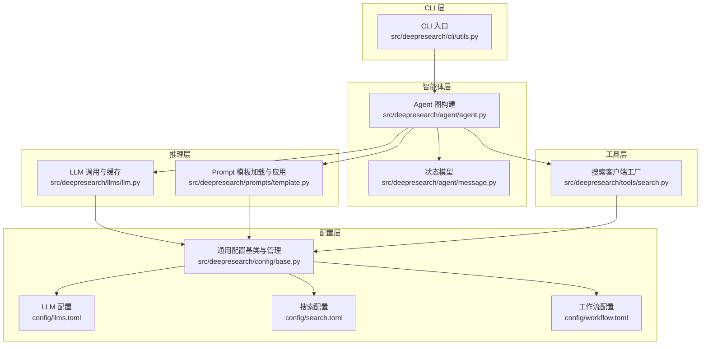
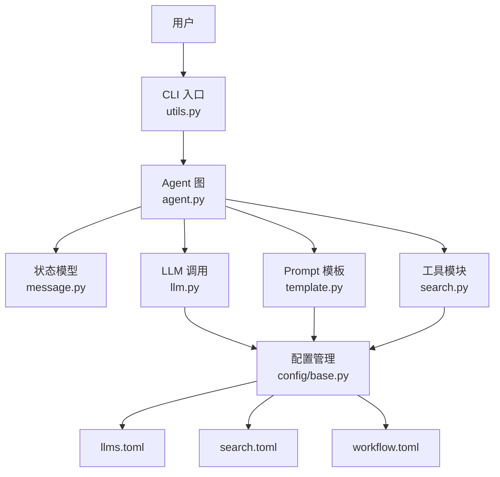
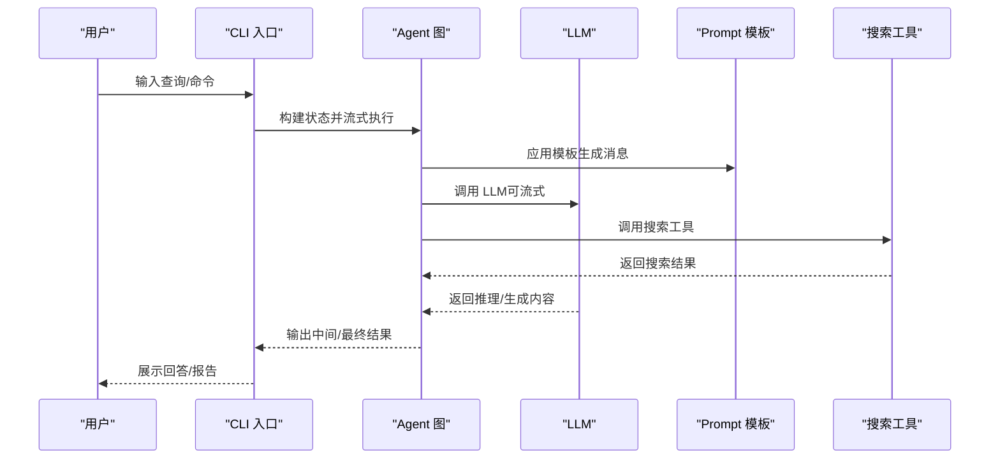
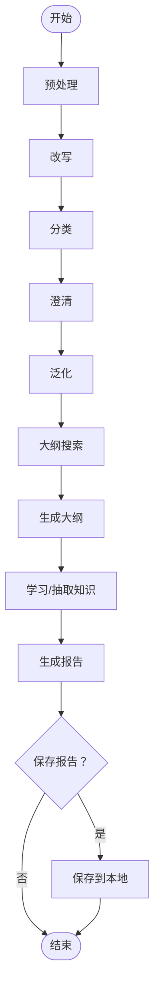
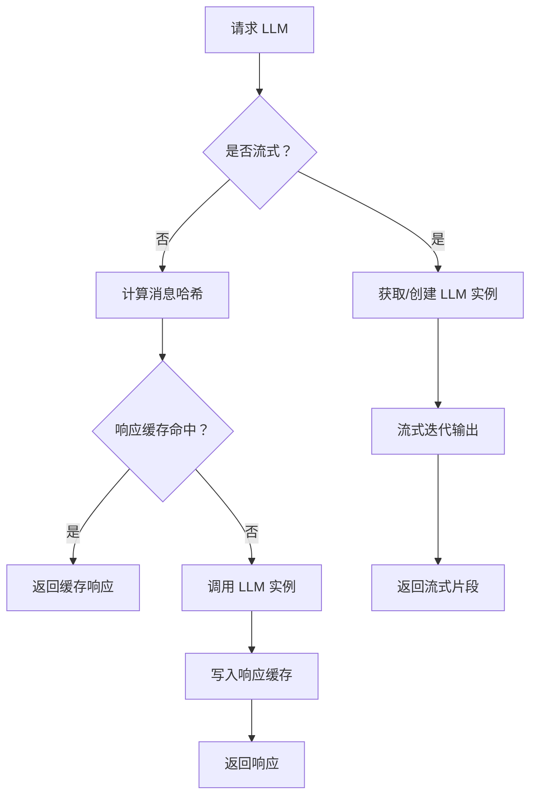
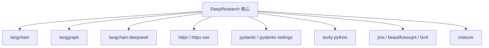

# 项目概述

<cite>
**本文引用的文件**
- [README.md](file://README.md)
- [doc/intro.md](file://doc/intro.md)
- [doc/architecture/architecture.md](file://doc/architecture/architecture.md)
- [src/deepresearch/__init__.py](file://src/deepresearch/__init__.py)
- [src/deepresearch/agent/agent.py](file://src/deepresearch/agent/agent.py)
- [src/deepresearch/agent/message.py](file://src/deepresearch/agent/message.py)
- [src/deepresearch/cli/utils.py](file://src/deepresearch/cli/utils.py)
- [src/deepresearch/llms/llm.py](file://src/deepresearch/llms/llm.py)
- [src/deepresearch/prompts/template.py](file://src/deepresearch/prompts/template.py)
- [src/deepresearch/tools/search.py](file://src/deepresearch/tools/search.py)
- [src/deepresearch/config/base.py](file://src/deepresearch/config/base.py)
- [config/llms.toml](file://config/llms.toml)
- [config/search.toml](file://config/search.toml)
- [config/workflow.toml](file://config/workflow.toml)
- [pyproject.toml](file://pyproject.toml)
</cite>

## 目录
1. [引言](#引言)
2. [项目结构](#项目结构)
3. [核心组件](#核心组件)
4. [架构总览](#架构总览)
5. [关键组件详解](#关键组件详解)
6. [依赖关系分析](#依赖关系分析)
7. [性能考量](#性能考量)
8. [故障排查指南](#故障排查指南)
9. [结论](#结论)
10. [附录](#附录)

## 引言
DeepResearch 是一个基于渐进式搜索与交叉评估的轻量级深度研究框架。其核心价值在于通过“任务规划 → 工具调用 → 评估与迭代”的智能工作流，让多个 LLM 协作完成复杂信息分析，产出可视化研究报告。项目强调无需模型定制即可获得高质量结果，支持大小模型协同以提升效率与成本控制，通过知识抽取与交叉评估降低大模型幻觉风险，并提供轻量部署与灵活配置能力。

- 关键特性
  - 高质量结果：无需模型定制即可稳定产出
  - 小大模型协同：按角色选用不同能力与成本的模型
  - 减少幻觉：知识抽取与交叉评估验证
  - 轻量部署：模块化架构与可配置参数

- 设计理念
  - 渐进式搜索：逐步加深检索与评估，避免一次性长上下文导致的注意力分散
  - 交叉评估：多轮迭代与多模型互证，提升结论可信度
  - 模块化工作流：LangGraph 状态机驱动，节点化职责分离

- 实际应用场景
  - 行业与市场全景分析
  - 技术趋势与竞品对比研究
  - 政策解读与影响评估
  - 学术综述与知识图谱构建

**章节来源**
- [README.md:15-32](file://README.md#L15-L32)
- [doc/intro.md:20-31](file://doc/intro.md#L20-L31)

## 项目结构
项目采用模块化分层组织，围绕“CLI → Agent → LLM/Prompts/Tools → 配置”展开，便于扩展与维护。

**图表来源**
- [src/deepresearch/cli/utils.py:106-193](file://src/deepresearch/cli/utils.py#L106-L193)
- [src/deepresearch/agent/agent.py:19-45](file://src/deepresearch/agent/agent.py#L19-L45)
- [src/deepresearch/agent/message.py:101-112](file://src/deepresearch/agent/message.py#L101-L112)
- [src/deepresearch/llms/llm.py:146-256](file://src/deepresearch/llms/llm.py#L146-L256)
- [src/deepresearch/prompts/template.py:25-130](file://src/deepresearch/prompts/template.py#L25-L130)
- [src/deepresearch/tools/search.py:12-37](file://src/deepresearch/tools/search.py#L12-L37)
- [src/deepresearch/config/base.py:190-590](file://src/deepresearch/config/base.py#L190-L590)
- [config/llms.toml:1-29](file://config/llms.toml#L1-L29)
- [config/search.toml:1-6](file://config/search.toml#L1-L6)
- [config/workflow.toml:1-3](file://config/workflow.toml#L1-L3)

**章节来源**
- [pyproject.toml:1-93](file://pyproject.toml#L1-L93)
- [doc/architecture/architecture.md:5-163](file://doc/architecture/architecture.md#L5-L163)

## 核心组件
- CLI 与运行入口
  - 提供交互式与单次查询两种模式，支持信号中断、日志与历史记录管理
  - 通过 LangGraph 流式执行智能体工作流，支持流式输出与命令式控制

- Agent 工作流
  - 基于状态图构建，节点覆盖预处理、改写、分类、澄清、泛化、大纲搜索与生成、保存等
  - 通过条件边实现“生成 → 保存/结束”的决策流

- LLM 推理与缓存
  - LRU 实例缓存与响应缓存，支持流式与非流式调用
  - 基于消息哈希的响应缓存键，命中即返回，显著降低重复调用

- Prompt 模板系统
  - 动态加载多目录模板，懒加载提升启动性能
  - 支持系统与用户消息模板组合，变量注入与错误提示

- 搜索工具
  - 工厂模式选择 Jina/Tavily，统一接口返回结构化结果
  - 与工作流配置联动，控制检索数量与超时

- 配置体系
  - 统一的 BaseConfig/ConfigManager，支持文件/环境变量/代码多源覆盖
  - LLM 与搜索配置分离，便于按需替换与扩展

**章节来源**
- [src/deepresearch/cli/utils.py:106-575](file://src/deepresearch/cli/utils.py#L106-L575)
- [src/deepresearch/agent/agent.py:19-45](file://src/deepresearch/agent/agent.py#L19-L45)
- [src/deepresearch/agent/message.py:101-112](file://src/deepresearch/agent/message.py#L101-L112)
- [src/deepresearch/llms/llm.py:146-308](file://src/deepresearch/llms/llm.py#L146-L308)
- [src/deepresearch/prompts/template.py:25-166](file://src/deepresearch/prompts/template.py#L25-L166)
- [src/deepresearch/tools/search.py:12-46](file://src/deepresearch/tools/search.py#L12-L46)
- [src/deepresearch/config/base.py:190-590](file://src/deepresearch/config/base.py#L190-L590)

## 架构总览
DeepResearch 采用“CLI → Agent → LLM/Prompts/Tools → 配置”的分层架构，核心通过 LangGraph 状态图驱动，形成“任务规划 → 工具调用 → 评估与迭代”的闭环。

**图表来源**
- [src/deepresearch/cli/utils.py:106-193](file://src/deepresearch/cli/utils.py#L106-L193)
- [src/deepresearch/agent/agent.py:19-45](file://src/deepresearch/agent/agent.py#L19-L45)
- [src/deepresearch/agent/message.py:101-112](file://src/deepresearch/agent/message.py#L101-L112)
- [src/deepresearch/llms/llm.py:146-256](file://src/deepresearch/llms/llm.py#L146-L256)
- [src/deepresearch/prompts/template.py:25-130](file://src/deepresearch/prompts/template.py#L25-L130)
- [src/deepresearch/tools/search.py:12-37](file://src/deepresearch/tools/search.py#L12-L37)
- [src/deepresearch/config/base.py:190-590](file://src/deepresearch/config/base.py#L190-L590)
- [config/llms.toml:1-29](file://config/llms.toml#L1-L29)
- [config/search.toml:1-6](file://config/search.toml#L1-L6)
- [config/workflow.toml:1-3](file://config/workflow.toml#L1-L3)

## 关键组件详解

### CLI 与交互流程
- 单次查询模式：接收用户问题，构建消息，调用 Agent，输出最终回答
- 交互式模式：支持帮助、清屏、历史查询、中断等命令；流式展示中间输出
- 信号处理：支持 Ctrl+C/Ctrl+D 中断，优雅退出

**图表来源**
- [src/deepresearch/cli/utils.py:106-193](file://src/deepresearch/cli/utils.py#L106-L193)
- [src/deepresearch/agent/agent.py:19-45](file://src/deepresearch/agent/agent.py#L19-L45)
- [src/deepresearch/llms/llm.py:146-256](file://src/deepresearch/llms/llm.py#L146-L256)
- [src/deepresearch/prompts/template.py:90-130](file://src/deepresearch/prompts/template.py#L90-L130)
- [src/deepresearch/tools/search.py:25-37](file://src/deepresearch/tools/search.py#L25-L37)

**章节来源**
- [src/deepresearch/cli/utils.py:195-304](file://src/deepresearch/cli/utils.py#L195-L304)
- [src/deepresearch/cli/utils.py:357-384](file://src/deepresearch/cli/utils.py#L357-L384)
- [src/deepresearch/cli/utils.py:485-575](file://src/deepresearch/cli/utils.py#L485-L575)

### Agent 工作流与状态
- 节点职责
  - 预处理/改写/分类/澄清/泛化：清洗与组织输入
  - 大纲搜索/大纲生成：构建研究结构
  - 学习：抽取与整合知识
  - 生成/保存：产出报告并持久化
- 条件边：生成完成后决定保存或结束

**图表来源**
- [src/deepresearch/agent/agent.py:19-45](file://src/deepresearch/agent/agent.py#L19-L45)
- [src/deepresearch/agent/message.py:101-112](file://src/deepresearch/agent/message.py#L101-L112)

**章节来源**
- [src/deepresearch/agent/agent.py:19-45](file://src/deepresearch/agent/agent.py#L19-L45)
- [src/deepresearch/agent/message.py:12-112](file://src/deepresearch/agent/message.py#L12-L112)

### LLM 调用与缓存策略
- 实例缓存：LRU 最多缓存 24 个 LLM 实例，避免重复创建
- 响应缓存：基于消息哈希的线程安全 LRU 缓存，命中直接返回
- 流式与非流式：统一接口，分别处理增量输出与完整响应
- 统计与清理：提供缓存命中率统计与手动清理接口

**图表来源**
- [src/deepresearch/llms/llm.py:146-256](file://src/deepresearch/llms/llm.py#L146-L256)

**章节来源**
- [src/deepresearch/llms/llm.py:47-121](file://src/deepresearch/llms/llm.py#L47-L121)
- [src/deepresearch/llms/llm.py:126-256](file://src/deepresearch/llms/llm.py#L126-L256)

### Prompt 模板系统
- 动态加载：扫描多个子目录，导入模块并提取 PROMPT/SYSTEM_PROMPT
- 懒加载：首次使用时加载，后续复用
- 组合消息：先系统后用户，支持变量注入与错误定位

**章节来源**
- [src/deepresearch/prompts/template.py:25-130](file://src/deepresearch/prompts/template.py#L25-L130)

### 搜索工具与配置
- 工厂模式：根据配置选择 Jina 或 Tavily
- 统一接口：返回结构化搜索结果，便于后续处理
- 配置项：引擎、超时、API Key 等

**章节来源**
- [src/deepresearch/tools/search.py:12-37](file://src/deepresearch/tools/search.py#L12-L37)
- [config/search.toml:1-6](file://config/search.toml#L1-L6)
- [config/workflow.toml:1-3](file://config/workflow.toml#L1-L3)

### 配置体系与验证
- BaseConfig：统一字段定义、验证器、环境变量映射、文件加载与合并
- ConfigManager：集中管理配置加载器、目录解析、缓存与重载
- LLM 配置：按角色拆分（basic/clarify/planner/query_generation/evaluate/report）
- 搜索配置：引擎与密钥

**章节来源**
- [src/deepresearch/config/base.py:190-590](file://src/deepresearch/config/base.py#L190-L590)
- [config/llms.toml:1-29](file://config/llms.toml#L1-L29)
- [config/search.toml:1-6](file://config/search.toml#L1-L6)

## 依赖关系分析
- 运行时依赖
  - LangChain/LangGraph：消息与状态图
  - langchain-deepseek：DeepSeek 兼容聊天模型
  - httpx/httpx-sse：HTTP 与 SSE 通信
  - pydantic/pydantic-settings：结构化配置与校验
  - tavily-python/jina：搜索工具
  - mistune/lxml/beautifulsoup4：内容解析与渲染
- 可选依赖
  - 文档构建：Sphinx 生态
  - 开发工具：Ruff/Mypy/Invoke
  - 测试：PyTest/Coverage

**图表来源**
- [pyproject.toml:12-26](file://pyproject.toml#L12-L26)

**章节来源**
- [pyproject.toml:1-93](file://pyproject.toml#L1-L93)

## 性能考量
- LLM 实例缓存：LRU 控制实例数量，避免频繁创建
- LLM 响应缓存：消息哈希键命中复用，显著降低重复调用
- Prompt 模板懒加载：启动阶段延迟加载，缩短冷启动时间
- 并行处理：在工具调用与评估阶段可并行执行（视实现而定）
- 流式输出：CLI 支持边生成边展示，改善用户体验

**章节来源**
- [doc/architecture/architecture.md:122-130](file://doc/architecture/architecture.md#L122-L130)
- [src/deepresearch/llms/llm.py:47-121](file://src/deepresearch/llms/llm.py#L47-L121)
- [src/deepresearch/prompts/template.py:78-88](file://src/deepresearch/prompts/template.py#L78-L88)
- [src/deepresearch/cli/utils.py:157-180](file://src/deepresearch/cli/utils.py#L157-L180)

## 故障排查指南
- 配置相关
  - 配置文件缺失或格式错误：检查 TOML 解析与路径权限
  - 环境变量覆盖异常：确认前缀与键名匹配
  - 敏感信息脱敏：注意配置输出中的脱敏行为
- LLM 相关
  - 实例/响应缓存异常：查看缓存统计与清理接口
  - 流式输出为空：检查网络与模型返回结构
- 搜索工具
  - 引擎选择错误：确认配置 engine 值
  - API Key 无效：核对密钥与配额
- CLI 交互
  - 中断与日志：使用信号处理与日志级别调整
  - 历史记录：检查历史文件路径与条目上限

**章节来源**
- [src/deepresearch/config/base.py:242-320](file://src/deepresearch/config/base.py#L242-L320)
- [src/deepresearch/llms/llm.py:258-267](file://src/deepresearch/llms/llm.py#L258-L267)
- [src/deepresearch/tools/search.py:18-24](file://src/deepresearch/tools/search.py#L18-L24)
- [src/deepresearch/cli/utils.py:70-80](file://src/deepresearch/cli/utils.py#L70-L80)
- [src/deepresearch/cli/utils.py:216-220](file://src/deepresearch/cli/utils.py#L216-L220)

## 结论
DeepResearch 通过模块化与可配置的设计，将“渐进式搜索 + 交叉评估”的研究范式落地为可复用的智能体工作流。其核心优势体现在：无需定制即可稳定产出高质量结果、大小模型按需协作以平衡成本与能力、通过知识抽取与迭代评估降低幻觉、以及轻量部署与灵活配置。对于初学者，CLI 与示例配置降低了上手门槛；对于开发者，完善的配置体系、缓存策略与扩展点提供了深入定制的空间。

## 附录
- 快速开始
  - 安装与运行：参考项目根目录与文档目录中的说明
  - 配置文件：llms.toml 与 search.toml
- 示例报告
  - 文档中提供在线报告链接，便于了解输出形态

**章节来源**
- [README.md:39-56](file://README.md#L39-L56)
- [doc/intro.md:48-141](file://doc/intro.md#L48-L141)