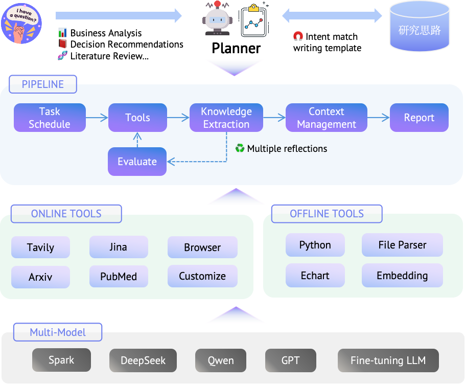

<div align="center">
  

**A lightweight deep research framework based on progressive search and cross-evaluation.**

[](LICENSE)
[](https://github.com/iflytek/DeepResearch/releases)
[](https://github.com/iflytek/DeepResearch/stargazers)
</div>

## Overview

DeepResearch is a deep research framework that enables multiple LLMs to collaborate, integrating search tools to conduct comprehensive research and generate visualized reports. It solves complex information analysis problems through an intelligent workflow of "Task Planning → Tool Calling → Evaluation & Iteration".

**Key Features:**
- High-quality results without model customization
- Collaboration between small and large models for efficiency and cost control
- Reduced hallucinations through knowledge extraction and cross-evaluation
- Lightweight deployment with flexible configuration

**Framework:**
<div align="center">
   
</div>

**Sample Reports:**

- [Deep Research Products Global and Domestic Landscape Analysis](https://deep-report-file.xf-yun.com/Deep%20Research%20Products%20Global%20and%20Domestic%20Landscape%20Analysis.html)
- [Global AI Agent Products Panoramic Analysis](https://deep-report-file.xf-yun.com/Global%20AI%20Agent%20Products%20Panoramic%20Analysis%20Core%20Capabilities%20and%20Application%20Scenarios.html)

## Quick Start

```bash
# Clone the repository
git clone git@github.com:iflytek/DeepResearch.git
cd DeepResearch

# Install
pip install -e .

# Run
deepresearch "Your research topic"
```

📖 **[Detailed Documentation (中文)](doc/intro.md)** - For complete setup instructions, configuration guide, and usage examples.

🌐 **[Online Experience](https://xinghuo.xfyun.cn/desk)** - Try "Analysis & Research" on SparkDesk.

## Contributing

We welcome contributions! See [Contributing Guide](CONTRIBUTING.md).

## Support

- [GitHub Discussions](https://github.com/iflytek/DeepResearch/discussions)
- [Issues](https://github.com/iflytek/DeepResearch/issues)

## License

[Apache 2.0 License](LICENSE)
